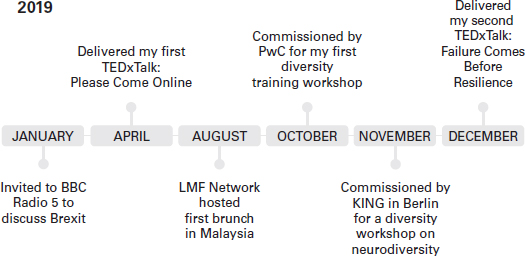
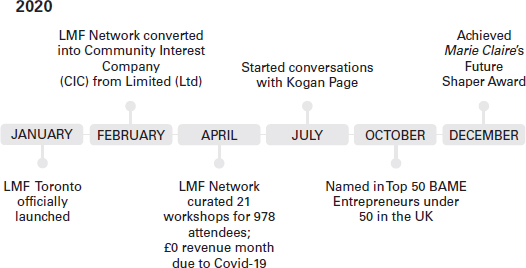
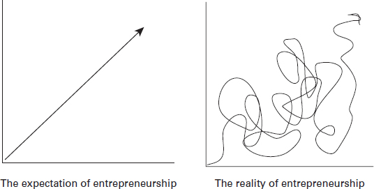

那是 2018 年春天，我正要去伦敦桥站对面我最喜欢的场所之一吃早午餐。我已经计划好我的饭菜——在吐司上捣碎鳄梨，加了肉桂的热拿铁和一大杯新鲜橙汁。这不仅仅是早午餐，而是我组织的第一次活动，这是我创建社区计划的一部分。
前一天晚上，我把我最好的衣服放在梳妆台上。我在蝴蝶中醒来，就像这是我上学的第一天。我提前 30 分钟到达，坐在每个座位上以确定哪个适合我，然后开始订购。这将是一个重要的时刻，所以我拿出我的 iPhone 开始拍摄场地和其他用餐者的照片。我想把这一刻作为我故事的一部分——大事即将发生。
四十五分钟后，女服务员好心地要了桌子回来，把账单拿了过来。
经过三周的策划和12次预订，软启动彻底失败。那是我创办企业、社区和品牌的第一次经历。

## 欢迎创业

我通过电子邮件确认了 12 份预订，后来变成了 12 份未入住。我很失望——我几乎不知道这种平淡无奇的事件会永远改变我的生活。
创业改变人生。你正在为一个想法和你自己冒险。如果这个想法失败了，它可能会令人沮丧，但不追求这个想法的想法会让人感觉更糟。很难界定创业的极限，因为可能性是无限的。放弃自己的保留并实际开始通常是最困难的部分。
踏入创业的世界感觉就像中学的第一天。一切都感觉新鲜，每个人都显得更大，更有经验。创业，建立品牌，甚至写这本书都需要付出很多努力和决心。你坐下来，准备动笔，暗地里希望思想流会开始涌现。这是你的事业，你的愿景，你的未来，你的想法在你的脑海里那么清晰，为什么一写下来，你就画了一个空白？如果像我一样，您以前多次遇到这种情况，请不要担心。这是很常见的，你会克服它。
本书将带您踏上如何发现您的业务和品牌的旅程，并为您提供成为自己老板所需的所有工具！你准备好了吗？

### 如何充分利用这本书
不要一口气读完这本书。您必须花时间反思每个章节和故事。说实话，我不明白一次性阅读自助或商业书籍的习惯，尤其是当许多需要精神上的努力并带你走上自我实现的旅程时。不用着急。创业是一场马拉松，而不是短跑。慢慢来，提出问题并享受这个过程。我在每章的末尾都包含了一个工作簿部分，供您用作笔记或思维导图。这一切都在进行中，任何想法都不应该不写。

### 成为一个偶然的企业家

企业家精神是一杯疯狂，一杯奉献，三杯战略性的飞翔，直到做出令人满意的事情。
我不禁对自己笑了，我写了一本创业书。我的想法不一定是一开始的商业想法；我从未打算成为一名企业家。我只是有一个想法，试图让我摆脱自己的“灰色地带”，这是一种表达方式，我用来描述对某事的不满，或尚未找到解决方案的沮丧（尚未） .事实上，这个糟糕的地方或灰色地带正是我开始创业之旅的理想场所。正如您将在本书中看到的，其他屡获殊荣的企业家在他们自己的旅程中也认识到了这一点。

### 一个糟糕的地方造就了一个伟大的故事

我是一个孤独且压力重重的年轻专业人士，爬上公司阶梯，每次我爬得太高时，它都会被从我下面拉下来。我觉得我周围没有社区，很难说出亲密的同事或盟友的名字，并且在想要讨论进度、薪酬和具有挑战性的工作场景时无处可去。尽管与全球有联系并住在伦敦，但我仍然感到孤独和孤立。

成为一名企业家不是我计划的事情，这对许多企业主来说都是如此。我是一个偶然的企业家，对这个新世界对我的要求毫无准备。在 18 个月内，我从在技术行业的不快乐和不满足感转变为因我的商业理念获奖、开始第二项业务、影响全球人们的生活、快速失败、每时每刻都心存感激并撰写这本书。这并不总是那么容易。
在没有真正的开始计划的情况下，我开始遵循一些基本和基本步骤，这些步骤要求我创建、测试和启动我的商业理念。
与通过制度化教育所教授的内容相反，商业计划并不是您成为企业家时创建的第一件事。在我看来，你必须有一个正式的商业计划才能创业的想法已经过时且不切实际。必须策划一个万无一失的复杂计划意味着您致力于为您的业务制定脚本，因此通常对您甚至开始时起到威慑作用。尽管我的旅程听起来很神奇，但我还是情不自禁地觉得自己在玩电子游戏；跑过火，跳过铁圈，抓住金币才意识到还有另一个更具挑战性的关卡。但只有通过开始，我才能进步并适应世界抛给我的一切。
2020 年 3 月，我们看到世界进入封锁状态。 COVID-19 危机意味着失业和迫在眉睫的衰退。在此期间，我每周都会收到数百条消息，询问我是如何开始创业的，以及我是否可以分享我的商业计划并支持人们开展自己的创业之旅。由于工作保障最低，许多公众发现自己处于自己的灰色地带，人们不可避免地会开始探索标准朝九晚五之外的其他想法，这也是我想写这本书的原因之一.
如果全球 COVID-19 大流行教会了我们什么，那就是生活在不断变化。以前无法提供远程访问的同一家公司不得不 100% 地转移他们的产品；大学被迫在线授课，我们意识到数字连接是维持生计的基础；这个新世界的真正赢家是 Zoom、Microsoft Teams 和 Google Hangouts，仅举几例。万无一失的商业计划并不能让您免于中断。让自己走出去并能够适应是推动您的业务向前发展的动力。继续阅读以了解如何为启动适应性强的业务做准备。

### 为什么必须准备成为一名企业家？
创业会震撼你的系统。没有完美的计划或最佳开始时间这样的事情。如果你一直等待，合适的时间永远不会到来。
首先关注“什么、如何和为什么”的黄金圈（Sinek，2021 年）。我们做什么？我们有什么不同？我们为什么要做我们正在做的事情？对于许多人来说，“为什么”是圈子中最重要的部分，因为它确认了您的商业精神和总体目标。按照更传统的营销方式，拥有稳固黄金圈的企业不需要去适应市场，因为他们的目标和推理是合理和稳定的。
快进到 2021 年，情况肯定不再如此。 Apple 和 Uber 等公司不得不不断发展其业务目标，以跟上消费者的需求和社会要求。这种类型的创新使这些公司得以生存，但这并不是说这些类型的业务不会时不时地滑倒。
当 Apple 在 1970 年代推出时，他们的主要目标（或他们的原因）专注于改变人们看待计算机的方式，并希望技术行业在谁可以访问设备方面更具包容性。尽管他们的目标是引领他们在全球取得成功，但在 2015 年推出 Apple Watch 时可以看出他们的失败。 据 The Verge（Duhaime-Ross，2014 年）称，最初的 Apple Watch 原型具有健身追踪功能，以健康为导向功能和无线电信，但不是经期跟踪器。这在 2019 年 Apple 发布升级版手表时得到了纠正，但由于经期追踪器自 2013 年以来一直存在，这可能被视为违背其最初商业计划目标的非包容性疏忽。
在接受 Womanthology（2017 年）采访时，Canva 的创始人 Melanie Perkins 分享说，她最初的商业计划是构建一个设计工具包，学生可以使用该工具包，而无需花钱购买昂贵的设计软件。她提到，由于缺乏经验，她在决定投资之前遭到了一些投资者的拒绝。如果她在第一次击退后停止了，那么 Canva 就不会是今天的工具。
这些故事提出了创始人旨在解决的明确问题。在每一个过程中，都需要努力工作、多次尝试和一些失败，才能成为我们今天都知道的企业和品牌。从中学到什么？如果您不确切地知道自己在做什么，那也没关系，只要您学习并准备好在此过程中改变策略，失败并面临拒绝是完全可以的。
在媒体中，通常会展示富有和享有特权的创始人的故事。你读过自己当老板的魅力，但你很少读到它有多难。很少有故事讲述可访问性、企业失败和真正的创业挑战，例如学会说不、资金管理、如何优先考虑您的幸福和克服自己的拖延症。我是一个能够建立成功企业的普通人。然而，尽管上过商学院并在电视上看过《龙之巢》之类的节目，但直到我面对自己的问题，我才能够在创业的世界中站稳脚跟。这本书旨在分享我的旅程并帮助处于类似情况的其他人。

## 失败和灰色地带：如果有需求，是什么阻碍了你？
### 数据告诉我们，创业正在兴起
根据 SmallBizGenius（Simovic，2021 年），全球估计有 5.82 亿企业家，美国境内有 3100 万企业家（Lange 等，2019 年）。在英国，FSB 的研究估计有 570 万人认为自己是企业主，其中 99% 在回答他们的调查时勾选了“小型或个体企业”框（FSB，2021）。此外，由于 COVID-19 大流行，中小企业贷款发现 64% 的英国居民希望自己创业（Rosling，2020 年），并且 Allbright 分享说，四分之三的女性想要创办自己的企业（卡里克，2020 年）。小型企业、新企业和企业家每年可为经济创造约 1.9 万亿英镑（IW Capital，2019 年）。
根据 DC Incubator 的研究（2019 年），事实是 60% 的企业在头三年内失败。就个人而言，我是失败的忠实粉丝。对我来说，失败只是被暂时打乱，不得不寻找新的路径来实现相同或相似的目标。但是，我相信，如果我们听到并理解了创始人的真实故事、企业主面临的真实挑战，并阐述了如何使用数字媒体和通信来解决这些问题，我们都能够清楚地了解如何经营成功的企业。想象一下这是一个星期五的晚上，你正准备出去吃晚饭。如果您的朋友在您离开家之前给您发短信说道路被阻塞或火车晚点，您会找到替代路线。那个单挑就是这本书。我正在通过重温我自己的经历为您的创业做好准备，并且我正在带上其他企业家。
刚开始时，我发现自己花了更多时间质疑自己的能力，而不是专注于我为企业带来了什么独特品质。
最初的 COVID-19 恐慌的后果重塑了我的创业意识、目标和成功衡量标准。我从 2020 年开始努力提升自己的老板地位，结果一夜之间损失了 75% 的收入。到 4 月（在几天无法起床之后，这将在第 8 章中讨论），我想“好吧——如果？”如果——我试过了会怎样？
如果 - 我给这个人发了消息怎么办？
如果 - 我改变了我的商业模式以符合我的价值观怎么办？
如果 - 我专注于从头开始建立我的社交存在怎么办？
如果 - 我开始为我的服务收费怎么办？
如果 - 我花点时间出去享受阳光怎么办？
如果——我写了一本书，分享平凡人做不平凡事的故事？
创业、成为创始人、称自己为企业家的方式没有对错之分。我为这本书采访过的每一位领导人都曾用这样的力量说话。这是充满同情心、社区和承诺的瞬间爆发的能量。

### 区域越灰，解决方案越简单

你有没有离开过期待至少谢谢你的谈话？认为一份好工作值得一点表扬是很正常的。 2018 年，我离开了一个长期职位，开始了我的第二份公司工作。被提供了一个新角色，甚至通过谈判获得了更高的薪水（更多关于谈判技巧的内容在第 10 章），感觉很棒。离开我现在的雇主感觉苦乐参半。在我在办公室的最后一天，我走进去期待一张卡片，或者至少是衷心的告别。以前很多同事都是这样——每个人都会签署强制性的告别卡，然后团队去吃告别午餐，并在工作日结束时礼貌地挥手让员工离开。这基本上是一种办公室传统。
取而代之的是，我独自一人吃着辣芥末汤度过了午餐时间。显然，我的经理忘记通知更广泛的团队说我要离开。好像这还不够糟糕，他们决定在我的最后一天在家工作——尽管让我进来并在办公室工作。老实说，到了下午 2 点，我在精神上已经完成了整个体验。我穿着三英寸高跟的靴子走进 HR 的办公室，递上我的笔记本电脑，我低声说“adios amigos”。仅凭那次力量行走就让我觉得自己已经从研究生成长为企业员工。
当我从办公室走到哈默史密斯地铁站时，感觉就像几个小时（实际上大约是 10 分钟），一种悲伤、内疚和孤独的感觉开始涌上我的心头。
我在那里工作了两年，并认为自己是社区的一员。然而，我独自走出去，感到沮丧。我环顾四周，看到世界从我身边掠过。在伦敦，每个人总是从一个地方跑到另一个地方。
我感到孤独和失落。那是我的灰色地带。我没有目的，所以开始计划我的新身份，因为我说服自己现在的身份不够好。

## 你是谁？

你对自己的感觉如何？你会如何向陌生人描述自己？
拥有归属感和认同感是成为伟大企业家的核心。人们会依靠你的建议和指导。在商业中，身份很重要，因为它是与潜在客户和消费者交流的第一个元素。在 Thrive Global (2018) 上发表的一篇文章中，作家、商业与生活重塑教练 Dina Marais 讨论了身份是我们如何看待自己，以及成功与失败之间最重要的因素。 “你对自己的想法和信念的总和……你的身份将决定你如何出现在你的事业、工作和生活中……它会在你的销售谈话中、你如何要钱、你如何让自己引人注目。”
为您的企业工作与为自己作为一名企业家工作一样——您必须让自己和企业不断发展，以实现双方的成功。
拥有认同感可以让你遵循明确的价值观，指导你的直觉决策的核心原则，最重要的是，你的行动或方法的理由。
在我创业的第一年，作为一个好女孩让我失去了注意力。我不得不提醒自己，我是一名企业主，可能会因为不真实而在投标、项目和服务上失败。

### 你开始的疯狂是什么？
自 2015 年毕业以来，我进入了四个不同的工作空间，每一个都比以前小——这意味着更多的工作、更多的帽子、更多的责任。在我的第一个和第二个公司角色之间，我感到迷茫和不安全。我开始担任新角色时感觉超出了我的深度，不确定该依靠谁。我带着全新的心态走进去，但又犹豫要不要离我的同事太近，以防碰巧重演上一次。我每天上下班的旅程需要 90 分钟，这给了我三个小时的额外思考时间。
有一次，当我坐在从帕丁顿到兰利的火车上时，我滚动浏览了我的 WhatsApp 聊天记录。它们有限且干燥。我的大多数朋友都是我在国外认识的那些人，他们现在住在其他大陆。我决定给我大学里的一位好朋友发消息问一下。我们已经有几年没有说过话了，但我们的友谊已经无所谓了。我提到了我的新难题，我们最终聊天并计划见面。与此同时，我开始搜索“基于伦敦的社交活动”并将它们发送给她，询问她是否可以陪我一起寻求精神支持。
2018 年春天，我们决定参加我们的第一次社交活动，这让我大吃一惊。在交流室里，正在供应小吃，谈话是渐进的，有很多老牌女企业家出席。晚上结束时，我和我的朋友交换了笔记，我们都认为这是成功的。这个特别的俱乐部在墙上挂着艺术品，洗手间用毛巾代替纸巾，图书馆里有清新的书籍气味。
我被卖给了这种生活。这种生活方式。我想进去
虽然我知道进入是有成本的，但我不认为价格会成为主要的阻碍因素。事实证明，为了找到归属感和社区感，我需要每月支付 1,500 英镑，不包括活动、活动和茶水。我尴尬地咯咯笑着，紧紧握着我的破巴克莱卡，走了出去。我不明白为什么我们会被要求支付伦敦（Numbeo，nd）每月近一半的生活费用，只是为了结识志同道合的想要成功的人，而这当然应该自然发生。
我对身份、朋友和社区如此绝望吗？
在很短的时间内，以下情绪使我成为了今天的我：

1. 震惊;
2. 愤怒;
3. 决心。

### 如果我找不到社区，也许他们找不到我？！

这既是一个问题，也是一个陈述。这就是我的生活改变的地方。
我不知道那是什么，也不知道为什么会发生，但在那一刻，我感受到了这种能量的火花，并听到一个声音说：“可能发生的最坏情况是什么？”
相信我不会感觉更糟，我决定去寻找我自己的社区。那是企业生活终结的开始，也是我创业之旅的开始。只是，当时我并不知道。
当我退出那个价格过高的社交俱乐部时，我重新激活了我的 LinkedIn 帐户并创建了现在的 LMF Network。在接下来的两周内，以下九件事迅速发生。
我继续：

1. 创建一个封闭的“职业女性”LinkedIn群组；
2. 发布有关职业、新闻和商业技巧的信息；
3. 在伦敦设计我们的第一个网络早午餐活动（因为谁不喜欢吐司上的鳄梨？）；
4. 在 LinkedIn 和 Eventbrite 上分享社交活动；
5. 我的第一次早午餐收到与会者的 12 份确认；
6. 说服自己我们做到了并推出了这个惊人的网络俱乐部；
7. 失宠，当餐厅在预订时间 45 分钟后要求返回餐桌时，因为没有人出现；
8. 点三杯热饮，两份丰盛的早餐，哭三十分钟；
9. 羞于承认没有人出现，所以我在 LinkedIn 上宣布有七个人出现。

在最初未能找到我渴望的社区后，我再次尝试。那也失败了。尝试了 3 次终于让一个人参加了早午餐。那个人就是一切——那个人让我放心，我正在做某事，我的灰色区域与其他人的阴影相似，我们需要为我们的生活带来一些色彩。
慢慢但肯定地，社区开始在线连接并在线下见面。我们从夏季早午餐过渡到冬季社交。我们将我们的 LinkedIn 内容带到 Instagram 并建立了一个网站。整个运动很快被渴望建立社区论坛的公司和希望与其他人见面讨论职业、信心和能力的个人所接受。寻找更多信息的努力变成了谈论、分享和大喊我们的故事的机会。这个故事俘获了人心并建立了社区。该业务从一个激情项目转变为一家有限公司，并很快成为一家非营利组织。我们的使命过去是、现在是并将继续是减少不平等、建立信心和加速职业发展。
我们来了。让我们回到这一切是如何开始的。我没有出去寻找业务或想建立自己的品牌，也从未考虑过自己当老板。
我觉得自己像一个偶然的企业家。我不得不承认，有时我仍然有这种感觉，但现在我知道这很大程度上是冒名顶替综合症。成就感和欺诈行为的混合感——我知道我配得上这里，但有时我还是忍不住要和别人比较。
虽然我们将在第 7 章深入讨论冒名顶替综合症，但每当我觉得这是一场意外时，我都会提醒自己那一刻是如何让我的生活变得更好的。与任何事故一样，您自然毫无准备，因为您认为它不会发生。
Like Minded Females，也被称为 LMF 或 LMF Network，是我创立的第一家公司。这是我的创业宝宝——一个我没有要求的宝宝，我有时买不起，但我答应照顾。

### 什么时候副业不再是副业？
到 2019 年，我平衡了（有时不是很好）将 LMF 构建为一个充满激情的项目并开始了新的职业旅程。这是我的第三个公司角色，我以新的信心追求了这个角色。 LMF 正在有机地发展，甚至有一个志愿者团队在幕后工作。我感到既不知所措又兴奋。未来是强大的。天很亮。这很干净。
随着我对 LMF 的热爱越来越多，我对企业环境的热爱越来越少。我不再受到西装、领带和金钱的激励。我想创造社会正义，发起关于多样性的运动，并帮助人们建立他们梦想中的职业。
我继续开发 LMF 网络作为一个“副业”和激情项目。每当一个想法出现时，我和团队都会想办法将这个想法变成现实。我们围绕职业发展、金融知识和信心创建了计划。我们设计了一个全球指导计划，有 200 多人在 18 个国家/地区注册。我们策划了我们的第一个电影节。不知不觉中，我们已经与世界各地成千上万的人进行了接触。在多伦多和我们的第一个加拿大大学社团成立了一个社区基地。到 2019 年 10 月中旬，我在我的新社区中找到了自我意识，但在我的公司角色的推动下，联系越来越少。
因此，在 2019 年 11 月，我决定跨越式发展，将业务和品牌作为我的主要活动。
老实说，我不知道创办或经营企业的第一件事。我的意图是什么，以什么顺序？尽管在大学攻读商科学位时花了 40,000 英镑，但我并没有教我如何完成纳税申报表。我们所学的大部分内容都是理论性的——我们必须在尝试之前阅读。我的座右铭是你必须尝试失败，然后再做决定。

## 我的战略双翼之年（SWI）
从 2019 年到 2020 年，我将这一年定义为我的“战略布局”之年。
在传统意义上，“随心所欲”就是不经过任何实践就去做某事。我的心态转变更多是关于为这种新发现的力量制定一个过程。权力是说“是”。被骂太吵后，流程如下：
记下你的五个原则——如果你只知道或与五件事相关联，他们会是什么？
确定你的数字——我的数字是 60。意思是，如果我认为我可以做至少 60% 的事情，我会说是的，好吧，“翼”剩下的。
从每一次经历中学习——盘点并反思每一个是的时刻。你做的好吗？你能改进什么？
图 1.1 和 1.2 列出了我在战略上取得的一些最重要的成就，这些成就让我走到了这里；写一本书，分享我的故事，为你创业做准备。
我最大的惊喜是能够在六个月的时间内完成两次 TED 演讲；每年有 2,500 人登上 TED 舞台，我上过两次。
图 1.1 2019 年战略布局

2020 年战略支持

2021 年，我启动了 LMF Network 的指导计划，该计划在媒体上被强调为“由慈善组织发起的最大的虚拟指导计划”，有来自 14 个国家/地区的 600 名参与者。 除了这一成功，我们还获得了 9,000 英镑的赠款，为此我们被拒绝了 3 次，我被 Monki 选中参加国际妇女节活动，并入围福布斯欧洲 30 岁以下 30 人名单。
我不是来自财富。 我是巴基斯坦血统，是我家中第一个上大学的人。 我在一个相当有工作的中产阶级家庭长大，四岁时移民到英国。 那个世界不是为我成功而建立的，但我把事情掌握在自己手中，并创造了一个对我有用的世界。 我给自己一个机会。

## 可能发生的最坏情况是什么？
没有人在等你或足够关心你定义你的身份、想法和信仰。 全靠你了！ 准备成为一名企业家首先要确定你是谁，你的灰色地带和挫折程度。 然后它会转变您的思维方式，为自己冒险并为成功做好准备。
图 1.3 显示了我希望企业家如何渡过难关，假设这个过程简单明了。 然而，实际上，旅程要复杂得多，而且令人振奋。 你永远不知道障碍是什么，但你会跳过足够多的东西，知道你可以跳过另一个。

话虽如此，接下来的几章可能会很坎坷。 有时您会想要休息一下。 这是可以的，值得鼓励。 这是一场马拉松，而不是短跑。
留在我身边，让我们一起创造魔法。
**你准备好了吗？**

> 练习
> 本章是对创业的介绍，我希望我在其中告诉你，如果我能做到这一点，你也能！ 在我们进入第 2 章之前，花点时间记下您今天的生活，然后设想 12 个月后的生活。 制作图表并记下您希望看到的进度。 您正在旅途中，因此了解您的起点和计划去哪里很重要。

WORKBOOK
______________________________________________________________________________________________________________________
______________________________________________________________________________________________________________________
______________________________________________________________________________________________________________________
______________________________________________________________________________________________________________________
______________________________________________________________________________________________________________________
______________________________________________________________________________________________________________________
______________________________________________________________________________________________________________________
______________________________________________________________________________________________________________________
______________________________________________________________________________________________________________________
______________________________________________________________________________________________________________________
______________________________________________________________________________________________________________________
______________________________________________________________________________________________________________________