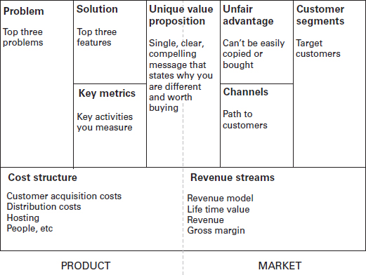
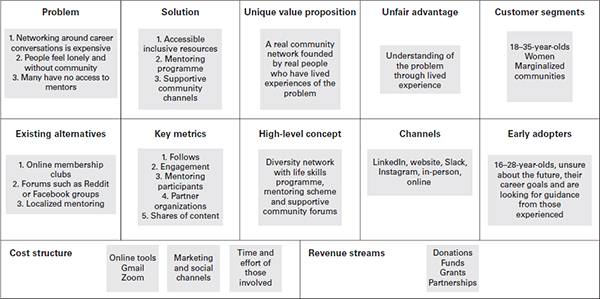
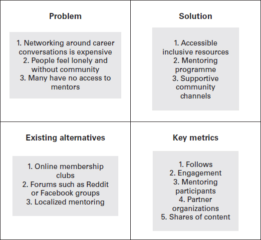
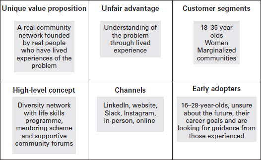
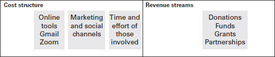

作为一个蹒跚学步的孩子，我会让我的祖父担心，站在我的婴儿车里，走在人行道的边缘，去我能去的每一个游乐场，这样我就能看到更高的地方。我太小了，无法从我所在的地方看世界，所以我会尝试攀登并获得新的视角。这是我的问题的创造性解决方案 - 跳到壁架上，以便我有更好的视野。
我使用创造性的方法来寻找解决方案，并决心让它们发挥作用。这种决心一直延续到成年，并推动了我的创业之旅。
创造力是创业成功的关键。以下三个问题可以让你思考创业：

- 你为什么对创业感兴趣？
- 你记得小时候想要解决的一个问题是什么？
- 如果你现在能解决这个问题，你会怎么做？

我在议会庄园长大，对世界知之甚少。我的父亲每天都忙忙碌碌，我的母亲在经营家庭的同时抚养四个孩子。电视总是在我家里开着，通常在迪斯尼频道。每个节目的家庭动态似乎都非常协调和平衡，有大房子和维护精美的草坪。我试图与之建立联系的角色总是拥有最好的衣服和最新的玩具。他们经常去看电影，参加棒球比赛，在商场购物或点外卖（这在我家是一种真正的享受）。电视节目从不代表我的现实，但它们激励我做得更好。在这里，疯狂开始了。
我妈妈在我们小学的操场上遇到了她最好的朋友，当时我带我和弟弟去上学。我哥哥和我和她的孩子们成为朋友，每周我们都会聚在一起制作游戏来玩。我经常让我的想象力疯狂来解决挑战。我们没有花园滑梯，所以我们会拿一张床垫到楼梯的顶端，坐在上面，然后滑下去，就像我们在游乐场一样。
儿童的这种创新精神类似于成年人的创业精神。同样的精神不应该在比较、竞争或对失败的恐惧中消失。
在我看来，企业家不是天生的，而是后天培养的——通常是通过释放他们的创造性思维，在不断发展的环境中形成解决方案。这是一种令人抓狂的生活方式，但对我们许多人来说，这是唯一的选择。不知不觉中，我从很小的时候就开始锻炼我的创业肌肉，从来没有给它贴上小孩子的标签。
本章将重点介绍您是哪种类型的企业家，哪些创造性练习将有助于您制定商业理念，以及如何将这一理念转变为切实可行的商业模式。

## 你是否正在释放你的创业风格？

我花了几个月的时间才体会到我的创业风格。这种风格、天赋和激情是新的和不舒服的。我不知道我是什么样的企业家，我没有为物流做好准备，而且我的商业模式还远未完成。对于许多创始人来说，商业模式随着他们的成长而发展。建立您的创业风格是保持业务创新的关键——否则，您可能会失去激情、动力和风格。
最初，当我决定创建 LMF 网络时，我与一位朋友合作，设想了一个全球非营利模式，专注于减少女性和边缘化社区在技术、数字和创业方面面临的不平等。我们的主要主题包括积极变革、社会公益和社会流动。
2019年，我决定离开有毒的企业界，建立梦想的生活。经过 12 个月的从一个想法过渡到一个激情项目，再到副业，再到我为自己设想的梦想生活，我以为我会快乐和充实。事实证明，我在第三个月感到无聊和沮丧。
但为什么？我开始追逐金钱，并根据财务状况做出每个决定。这个想法不是正在形成的金字塔计划，也不是可以维持增长的业务。在成为“企业家”后的三个月内，我将注意力转移到了金钱上。在我读过的所有书籍和听过的播客中，我找不到任何关于这么早就失去激情的内容。我记得我感到很迷茫，并且很高兴想到要关闭。
幸运的是，英国为“社会影响力”公司开设了商业加速器课程。他们给了我一个位置。这是我第一次听说这样的事情。我在第一天作为一家有限公司走进去，并在同一天作为一家社区利益公司 (CIC) 离开。我花了八个小时的努力工作，没有技术，才回到业务的核心目标。
我重新确定了我的创业风格：骗子和社会企业家的结合。一旦我能够定义我的创业风格和商业模式的方向，其他商业领域就变得更加精确、相关且更容易导航。

## 创业风格
我们应该考虑五种创业风格：

1. 创新的;
2. 骗子；
3. 社会的;
4. 模仿者；
5. 内部企业家。

创新型企业家是不断提出新想法和发明的人。他们通常旨在改变人们的思维方式或生活方式。这些人充满动力、热情和痴迷。让创新者脱颖而出的是他们想法的独创性。
一个骗子企业家正在不断地朝着更大的方向努力。他们通常从小处着手，努力用自己的资源解决问题，而不是筹集资金，并以创造性的方式汇集资源以满足他们的需求。通常情况下，推动他们雄心壮志的是缺乏某种东西。
社会企业家是想用他们的产品或服务解决社会问题的人。他们的目标是推动世界发生积极的变化，而不是获得巨额利润或财富。这些企业家倾向于创办非营利组织或慈善公司，并致力于社会公益。
模仿型企业家使用现有的商业理念并致力于改进它们。他们的目的是确保产品和服务更好，更有利可图。这位企业家是创新者和骗子的结合。他们最终是用一个已经存在的原型来解决问题。模仿者自信、果断并从他人的错误中吸取教训。
内部企业家为大型组织培养企业家的特征，以创造和领导改进以提高盈利能力。这个人有薪水的保障、知名品牌的支持以及创新服务或产品的自由。 Gifford Pinchot 于 1973 年创造了内部创业这个词。在他 2017 年的博客中，他分享了另外四种定义内部创业者的方式：做梦的人；好的和自封的新想法总经理的变革驱动因素”。这种创业风格是必不可少的突出。这是独立创业的可行替代方案，特别是如果您在阅读本书后得出结论，您还没有准备好建立自己的企业。
这五种类型并不刻板——创业没有对错之分。但是，重要的是要让自己在建立业务时进行创造性思考。

## 你上一次有商业想法是什么时候？
根据 Tseng 和 Poppenk (2020) 的说法，人类平均每天有 6,200 个想法。想象一下，在所有这些想法中，其中一个想法可能是您当前生活和未来生活之间的差异。会是哪一个？为什么？
我的思绪容易游荡和做白日梦。我甚至可以将最小的事物断章取意，并将其概念化为其他事物。在我在企业部门的生活中，这项技能不被认为是有利的。作为一名企业家，它让我保持警觉和活跃。
当我意识到 LMF Network 永远不会让我变得富有（或在某种程度上财务稳定）时，我想到了我的咨询业务背后的想法。到 2020 年 3 月，我发现自己拥有两项新业务——商业盈利模式和社区主导的社会企业。它养活了我的另一个自我——社会慈善家做出改变，而富有的社交名媛带来现金。
我在 2019 年在 LinkedIn 上进行的一项主要研究调查发现，78% 的企业家不创业是因为他们不知道从哪里开始，但实际上，你只需要一个想法。我鼓励您在手机、记事本或便利贴上记下所有想法或潜在概念，然后将其放入冰箱！
考虑以下问题：

- 你最后的想法是什么？
- 你是在什么情况下形成这个想法的？
- 你对这个想法做了什么？

如果我们回到年轻的自己，我们很擅长把事情拼凑在一起来娱乐自己，有时会放弃我们被赋予的选择来创造新的选择。我的侄女宁愿玩一张纸或把她的食物扔在地板上也不愿弹我给她买的钢琴。孩子们尝试新事物的天真，例如假装他们的楼梯是滑梯，是可以导致创新的想象力类型。作为企业家，我们必须保持这种心态。它可以帮助我们识别我们的灰色区域、清晰的解决方案和原因——所有重要的第一步。
我清楚地记得，直到几年前，我才把好的商业想法藏在地毯下，因为我认为它们不适合“模式”。这些想法包括一个送货上门的盒子，里面装着能让你在心情不好的时候振作起来的好东西，一个支持合作伙伴为另一半购买礼物的数据主导平台，以及一个名为womanish的博客，涵盖了作为一个人的日常生活。非刻板印象）女人。我什至买了博客域，然后吓坏了自己，把它推到了地毯下。
没有适合建立企业的“模具”或“性格”这样的东西。任何人都可以成为企业家。建立一个企业不是为了完美，而是围绕你的假设创造一些东西。

## 我没有经营理念

正如乔瓦尼·科拉扎 (Giovanni Corazza) 在 2014 年的 TEDxRoma 演讲中所暗示的那样，创造一个想法是开箱即用的。他问：“你为什么要开箱即用来创造一个想法？”这个盒子是安全、舒适和滋养的。这种从已知到未知的转变使我们与朝九晚五的人区分开来。想想我们周围的所有事情，这些事情一开始只是一个想法。谁想到将面粉和水混合制成面团？在社交媒体上形成“喜欢”功能，让我们即时满足？从前置摄像头拍摄照片并将其称为“自拍”？
在过去的几十年里，科学家们一直在研究这样一种理论，即创造力是由于大脑的各种网络连接起来并作为一个团队一起工作。大脑有三个不同的网络：

1. 默认网络 - 非活动模式。
2. 执行网络——决策和情感中心。
3. 显着性网络——这决定了你注意到什么和你没有注意到什么。

Grant Brenner 博士在 2018 年《今日心理学》杂志的一篇文章中建议，“三个网络必须作为一个团队运作”，以促进创造力。他解释说，“默认模式网络产生想法，执行控制网络评估它们，显着性网络帮助确定哪些想法被传递到执行控制网络”。
创造力不是与生俱来的，而是一种可以通过日常经验加强的技能。看电影、读书和写东西可以锻炼你的创造力。从今天开始养成可以练习的新习惯：你能想出一种新的方式来完成日常任务吗？玩“为什么”游戏并在所有事情上问为什么，直到你再也不能了，怎么样？

## 创业狂的方法！
我推荐您使用的方法由四个简单的步骤组成：

1. 确定您的问题。
2. 形成一个想法来解决这个问题。
3. 提出一个快速、精益的商业计划。
4. 证明您的解决方案是正确的、不相关的或需要改进的。

所有企业家的一个共同特征是，大多数企业家都是通过发现问题开始他们的旅程。重要的是找到你的灰色区域，然后用你最喜欢的阴影给它上色。
我逐渐意识到，作为一名企业家，要想脱颖而出并生存下去，你的想法必须让你兴奋并渗透到你的梦想中。这个想法可能会接管你的生活，但会如此强烈，以至于你会不惜一切代价尝试一下。 “试一试”的心态是疯狂创业的根本方法。

## 你如何表达你的想法？

将您的想法变为现实可能很困难，但将其清晰地表达出来就更难了。特别是如果您已经有了“某种商业理念”，但不太确定如何定义它。阐明想法的主要驱动因素是目的和实质。我以亲身经历告诉你，作为一个失败多于成功的人，没有实质是不行的。
在我们开始之前，请确保您已准备好以下各项：

- 一张纸或一些便利贴，和一些笔；
- 与互联网的良好连接，没有干扰。

我的建议是尝试以下所有方法——你没有什么可失去的。
写下你能想到的对以下问题的尽可能多的答案：

- 您要解决的问题是什么？
- 是谁的问题？
- 为什么会困扰你？

现在，将同样的能量运用到以下两个练习中，你可以用它们来充实你的想法。

### 选择你的疯狂方法

#### *积极的思维导图（找到最好的想法）*

思维导图是团队用来在受控环境中产生想法和自由思考的一种设计方法。有一些限制，例如时间。思维导图是一种非判断性、开箱即用的练习，可确保从各个角度涵盖所有解决方案。
***创建有价值的思维导图会议的六个步骤***

1. **设定时间限制**——番茄工作法是一种行之有效的技术，用于在完成任务时提高生产力（Cirillo，2020 年）。你为自己设定一个明确的时间限制，不要分心，只有在完成这块工作后才休息。建议留出时间为 20 分钟。
2. **将讨论带入生活**——选择能让创意源源不断的材料。这可能包括以下内容：白板和彩色笔、便签和纸，或笔记本电脑的油漆功能。你想离开时感到鼓舞和动力。
3. **数量胜过质量**——尽可能多地在纸上写下可能的解决方案。
4. **奇怪就是美妙**——想法越奇怪，就越独特。独特的销售主张是使出色的创业理念变为现实的核心要素。
5. **定义你的假设**——假设是你的解释或建议，但证据有限。这就是你最初的想法存在的原因，或者它正在解决什么。例如，这本书存在的原因是因为我的假设是“那里没有足够的可访问的商业故事”。我厌倦了在网上看到同样的人告诉我他们如何开始他们的业务（没有分享任何真正的见解）。
6. **完成过滤** - 一旦计时器完成，停止。研究每个想法并将它们归入类似的“保护伞”。这将允许您将它们过滤到“桶”中，并最终将它们从许多缩小到少数。

在六个步骤结束时，你应该得到一个轻拍！你的思维导图会议（希望如此！）是一次疯狂的旅程，以一个你可以考虑推进的想法（或几个）结束。

#### *负面思维导图（找到最坏的想法）*

这是思维导图颠倒了，因为我们不是从最好的想法开始，而是从最坏的想法开始。有时，知道什么不起作用比知道什么更容易。
***找出最坏想法的七个步骤***

1. **定义你的问题陈述**——找到一个你可以解压的可靠的“问题”陈述。例如，“我感到孤独，没有人可以谈论职业发展”。
2. **设定时间限制**——如上所述，考虑到番茄工作法，我建议留出 20 分钟。
3. **控制叙述**——列出你的问题陈述的所有可能的解决方案，用最少的细节，你可以在给定的时间范围内想到。
4. **详细说明糟糕的想法**——对于每个“糟糕的解决方案”，写下解决方案背后的逻辑。例如，建立一个社区小组，每次活动收费 100 英镑。
5. **考虑相反的情况**——对于每个坏主意，写下积极或相反的品质。例如，拥有一个可访问的社区组。
    不要担心接下来两个步骤的时间：
6. **交换解决方案** - 将每个不良特征交换为更好的解决方案。
7. **混搭** – 将此解决方案视为您自己的个人混搭，以找到与好主意相辅相成的东西。

在本练习结束时，您应该能够产生可能成为未来潜在商机的想法。
让想法或可能的解决方案酝酿几个小时。当你用新的能量重新审视它时，试一试水，看看感觉如何。解决方案是否仍然切实可行？
如果在团队中工作，请记住让每个人都参与到流程中，因为这会带来不同的观点。不同的个性风格可能会主导谈话，重要的是通过提出问题或邀请安静的同事分享不同的想法。我们将在第 7 章介绍领导风格。

## 将您的想法变成行动计划
一旦你找到了你的想法，就该深入了解细节并考虑所有其他元素。作为一名企业家，您可以做的最重要的事情是将您的想法从头脑中拿出来，并转化为一种有形的格式，以了解您业务的每个要素。最简单的方法是使用商业模型画布或精益画布模型。这两个模型都可以在网上找到。

### 什么是商业模式画布？

商业模式画布是一种在线商业工具，用于可视化创业所需的九个构建块。它由瑞士企业家亚历山大·奥斯特瓦尔德 (Alexander Osterwalder) 创建，是记录客户、价值主张、财务等的模板。它直观地展示了组织如何创造、交付和获取价值。商业模式画布被广泛使用。但是，我们将使用 Lean Canvas 模型，这是作者 Ash Maurya 创建的更高效和精简的版本。

## 精益画布模型
精益方法的一个基本因素是消除浪费。 这种浪费包括但不限于时间、流程、库存和恐惧。 精益画布模型使用与商业模型画布相同的九个块，但经过修改以提供价值并不断完善想法。 精益创业模型通过持续的构建-测量-学习反馈循环来验证学习，如图 2.1 所示。

图 2.1 详情
该模型的详细信息如下：
最上面的框架，从左边开始显示问题，前3个问题； 解决方案的前 3 个功能； 关键指标，您衡量的关键活动； 独特的价值主张，单一、清晰、引人注目的信息，表明您与众不同且值得购买； 不公平的优势，不能轻易复制或购买； 渠道、客户路径； 客户细分，目标客户。 问题、解决方案、关键指标和产品端的独特地位的一半，另一个是在市场端。 底部左侧的框架显示了产品方面的成本结构、客户获取成本、分销成本、托管、人员等，以及市场方面的收入流、收入模型、生命周期价值、收入和毛利率。

### 精益画布上的块是什么？
每个精益画布块都在下面解释，按照它们应该填写的顺序：

1. **问题**: 每个企业解决一个问题。如果没有问题需要解决，您就没有产品/服务可以提供。在此框中，列出三个高优先级问题。
2. **客户细分 (CS)**: 问题和客户群有着内在的联系——没有 CS，你就没有问题。您的客户群只是您的理想或目标客户，您认为此业务解决方案会对他们有所帮助。我们将在第 3 章中更详细地讨论这个问题。
3. **独特的价值主张 (UVP)**: 独特的价值主张是对交付价值的承诺。这是潜在客户应该向您购买的主要原因。解决这个问题的一种方法是思考为什么您和您的企业与其他企业不同，以及为什么您的客户服务人员应该为您购买/投资时间。我们将在第 5 章中更详细地介绍品牌价值和认知度。
4. **解决方案**: 找到解决方案将使您获利！找到解决方案才能让您保持活力！但是，您可能不会第一次就做对。没关系。在创新、失败和重试之后，正确的解决方案会随着时间的推移而出现！
5. **频道**: 渠道是您接触客户的方式。您的主要渠道应该在线。有关更多信息，请参见第 4 章。
6. **收入来源**: 只有在您能够以可持续的方式长期创收的情况下，才能经营一家企业。收入流是您的企业获得和维持现金流的多种不同方式。有关更多信息，请参见第 9 章和第 10 章。
7. **成本结构**: 考虑所有成本，例如网站建设、社交媒体内容、技术软件和日常业务支出。
8. **关键指标**: 关键指标监控性能。这些可能包括每位客户/会员的收入、客户保留率和利润率，仅举几例。
9. **不公平的优势**: 不公平优势的一个很好的定义是“真正的不公平优势是您的竞争对手无法轻易复制或购买的东西”（Maurya，2021 年）。你有什么别人没有的？是什么让你与众不同和特别？

## LMF 精益画布模型
我写这本书的原因之一是因为我自己的陷阱。 在创业初期，我坚信自己可以做点什么，只是不知道如何开始。 我还没有开始创业，所以有计划的方法不是我的优先事项。
没有明确我的商业模式或真正的目的，我没有吸引任何最初的社区成员，几乎失去了我的热情。 商业模式花费的时间比它应该的要长得多，因为我太害怕坐下来写下我真正想要的东西。
写这本书让我踏上了我的事业和我自己的旅程。 企业家的力量已经转变为有形的东西。 生活的运作方式很奇怪。 随着我们的整个模型转移到网上，收入减少了，但获得了很多观点。 我们在 18 个月内从无到有。
图 2.2 展示了我们的精益画布模型。
图 2.2 应用于 LMF Network 的 Lean Canvas 模型

图 2.2 细节
该模型的细节如下： 问题，1，围绕职业对话的网络是昂贵的； 2、人感到孤独，没有社区； 3、很多人没有机会接触到导师；解决方案，1、可访问的普惠资源； 2、师徒计划； 3、支持社区渠道；独特的价值主张；一个真正的社区网络，由真正有过问题经历的人建立；不公平的优势，通过生活经验了解问题；客户群，18 至 35 岁，女性边缘化社区；现有的替代方案，1、在线会员俱乐部； 2、Reddit或Facebook群组等论坛； 3、本土化辅导；关键指标，1，如下； 2、订婚； 3、辅导学员； 4、合作机构； 5、分享内容；高级概念、多元化网络与生活技能计划、指导计划和支持性社区论坛；渠道、LinkedIn、网站、Slack、Instagram、面对面、在线； 16 至 28 岁的早期采用者，对未来和职业目标不确定，正在寻求有经验的人的指导；成本结构、在线工具、Gmail、Zoom；营销和社交渠道；相关人员的时间和精力；收入来源、捐赠、资金、赠款、伙伴关系。

我将把这个完整的 Lean Canvas 模型分解成单独的快照，并引导您完成每个快照。
第一个快照查看问题、解决方案、现有替代方案和关键指标部分，如图 2.3 所示。 确定的关键问题是全球范围内可访问和包容的职业对话网络资源有限。 解决方案是通过整合的指导计划建立这个社区，并从其他人那里获得建议。 现有的替代方案包括昂贵的会员俱乐部和本地化的指导论坛，这些都没有考虑到当前劳动力的全球化。
图 2.3 精益画布模型的快照

图 2.3 细节
该模型的细节如下： 问题，1，围绕职业对话的网络是昂贵的； 2、人感到孤独，没有社区； 3、很多人没有机会接触到导师； 解决方案，1、可访问的普惠资源； 2、师徒计划； 3、支持社区渠道； 现有的替代方案，1、在线会员俱乐部； 2、Reddit或Facebook群组等论坛； 3、本土化辅导； 关键指标，1，如下； 2、订婚； 3、辅导学员； 4、合作机构； 5、分享内容。

图 2.4 详情
该模型的具体内容如下： 独特的价值主张； 一个真正的社区网络，由真正有过问题经历的人建立； 不公平的优势，通过生活经验了解问题； 客户群，18 至 35 岁，女性边缘化社区； 高级概念、多元化网络与生活技能计划、指导计划和支持性社区论坛； 渠道、LinkedIn、网站、Slack、Instagram、面对面、在线； 16 至 28 岁的早期采用者，对未来和职业目标不确定，正在寻求有经验的人的指导

第二个快照涵盖了独特的价值主张、不公平优势、客户细分、高级概念、渠道和早期采用者，如图 2.4 所示。
我不公平的优势是我经历了这个问题。我了解这将成为问题或导致不利后果的原因。提议的客户是一名 18-35 岁的女性，她来自边缘化社区。实际上，早期采用者是 16 至 28 岁的人，他们感到迷茫并寻求指导。高层次的概念是成为一个多元化的网络，通过 LinkedIn、Instagram 和网站共享一个指导计划。很快，我们意识到最好专注于一两个渠道。
最后，图 2.5 所示的第三个快照包括成本结构和收入流。一开始的基本成本是在线工具、营销材料和相关人员。提议的收入来源是捐赠、赠款和合作伙伴关系。实际上，这三个收入流都很难获得，因为我无法预测更长时期内的财务预测，而且由于 COVID-19，这些提议的收入流有额外的障碍。
图 2.5 精益画布模型的快照

图 2.5 细节
模型细节如下：成本结构、在线工具、Gmail、Zoom； 营销和社交渠道； 相关人员的时间和精力； 收入来源、捐赠、资金、赠款、伙伴关系。
精益画布模型有助于将您最初的想法写在纸上，看看它们是否有意义。 成为一名企业家就是要理解你的想法并能够表达它，就像它正在发展业务一样。

## 用一种方法拥有你的疯狂
这本书最好分阶段使用。 花时间反思。
到本章结束时，您应该已经了解基本的业务模型和概念，并学会了如何使用思维导图和构建自己的业务模型。 您可能会感到筋疲力尽或精神振奋。 无论情绪如何，祝贺自己走到这一步。 我们在这里玩长期游戏。 在龟兔赛跑之间，稳扎稳打总能胜出。

#### 案例研究大卫·萨维奇
2015 年，David Savage 创立并开始制作欧洲最大的技术播客之一，名为 Tech Talks。在日常工作中，David 在招聘公司 Harvey Nash 工作。他了解招聘市场，并希望对其进行改造。他决定创建与客户交谈并激发其活力的内容。最初，他的雇主不愿意支持这个项目，所以大卫决定自己做。快进六年，Harvey Nash 为 Tech Talks 提供了自己的网站、平台、实体、预算和方向。大卫的座右铭是“请求宽恕，而不是许可”。您可以在我的个人网站上的“书籍”部分下在线找到他的商业模式画布以供参考。
**你想通过 Tech Talks 解决什么问题？**
作为招聘人员，您会发现自己提供的产品与其他人相同。在客户面前是具有挑战性的。最初，这是为了在潜在客户面前展示，让他们兴奋地花时间与我见面；甚至可能改变流程并让潜在客户要求与我见面。这是为了让他们对技术行业感到兴奋，并将他们从好奇的客户转变为潜在客户。
**你是如何确定你的受众和价值的？**
我在 Harvey Nash 的角色已经定义了市场（技术招聘）。然而，我从我参加的活动中感觉到，有一群观众在寻找洞察力，但没有获得最好的信息和价值！那是灰色地带——甜蜜点！
人们希望与他们的同龄人社区交谈并从他们那里获得有效性。

**您为什么使用播客格式而不是其他产品或服务？**
这是一个非常低的进入门槛，是一种我能够相对轻松地提升自己技能的媒介。它的成本并不高，在英国市场上也没有今天那么突出。第一个播客是在我的手机上录制的，并通过免费软件 (Audacity) 进行编辑。我向客户明确表示录音不是最终产品，而是与他们讨论了整个过程以及我想要实现的目标，他们对此表示赞赏。
**你遇到了哪些挑战？**
在播客、托管或创建内容方面缺乏跟踪记录或任何真实经验。最初也缺乏观众，特别是因为它是一个新想法并且仍在验证中；它是在与 Harvey Nash 集团不同的品牌下创建的，并由我领导。内容的可信度通常是通过一致性来提供的，这需要时间。
**你做错了什么，如果有的话？**
播客的长度太长，没有真正的重点。我无法当场编辑，我不一致，我担心节目应该是什么——商业播客？需要时间让它找到自己的声音。品牌和企业都有自己的身份，需要时间来寻找，服务或产品也是如此。
**您是如何将公司的想法从不愿意转变为支持的？**
作为一家企业，主要的 KPI 之一是利润，播客让我离开了我的日常工作，没有立即获得投资回报 (ROI)。我在一个销售周期很短的销售组织工作，其活动有明确的结果，但这并没有那么明确的定义。我相信它会推动价值，但我需要时间来证明这一点。最后，我策划了几集，我能够与他们分享。我知道这不是关键业务，因此在工作时间之外处理播客。
**您为什么使用播客格式而不是其他产品或服务？**
这是一个非常低的进入门槛，是一种我能够相对轻松地提升自己技能的媒介。它的成本并不高，在英国市场上也没有今天那么突出。第一个播客是在我的手机上录制的，并通过免费软件 (Audacity) 进行编辑。我向客户明确表示录音不是最终产品，而是与他们讨论了整个过程以及我想要实现的目标，他们对此表示赞赏。
**你遇到了哪些挑战？**
在播客、托管或创建内容方面缺乏跟踪记录或任何真实经验。最初也缺乏观众，特别是因为它是一个新想法并且仍在验证中；它是在与 Harvey Nash 集团不同的品牌下创建的，并由我领导。内容的可信度通常是通过一致性来提供的，这需要时间。
**你做错了什么，如果有的话？**
播客的长度太长，没有真正的重点。我无法当场编辑，我不一致，我担心节目应该是什么——商业播客？需要时间让它找到自己的声音。品牌和企业都有自己的身份，需要时间来寻找，服务或产品也是如此。
**您是如何将公司的想法从不愿意转变为支持的？**
作为一家企业，主要的 KPI 之一是利润，播客让我离开了我的日常工作，没有立即获得投资回报 (ROI)。我在一个销售周期很短的销售组织工作，其活动有明确的结果，但这并没有那么明确的定义。我相信它会推动价值，但我需要时间来证明这一点。最后，我策划了几集，我能够与他们分享。我知道这不是关键业务，因此在工作时间之外处理播客。
**成为内部企业家有什么好处？**
薪水的安全性，在您周围的组织中可以依靠的专业知识（如果您有可以利用这些知识的关系），可以建立的品牌或平台。我发现内部创业对我有用，因为它让我能够成为一名企业主，建立一个品牌并承担风险，而另一个品牌的舒适度就像一条安全毯。播客现在被认为是拥有预算的自己的业务部门，其品牌也完好无损。
**您会给开始类似业务或冒险的人提供什么建议？**
您所做的任何事情的前 10 次尝试都不会很好。没关系。继续前进，提醒自己您正在解决的问题、您发现的灰色区域以及为什么这很重要！始终进行开放、透明的对话，让您的客户、客户或公司与您一起踏上旅程，永远不会感到孤单。此外，我进行了精益画布活动并发现它非常有帮助，既可以让我重新思考我为什么开始并提醒我最终目标——我建议每六个月做一次类似的练习来跟踪你的进步并保持动力。
**这个想法带来了哪些机会？**
我现在被广泛认为是行业专家和有能力的活动/小组主持人/采访者。这意味着我被安排在一个房间里，有各种各样的人，五年前，我做梦也想不到我会以同龄人的身份与之交谈。这是一种完全不同的动态，它从根本上改变了我的职业轨迹。内部创业使我能够在公司的安全下为自己建立品牌、业务和名称，并带领他们踏上旅程。
薪水的安全性，在您周围的组织中可以依靠的专业知识（如果您有可以利用这些知识的关系），可以建立的品牌或平台。我发现内部创业对我有用，因为它让我能够成为一名企业主，建立一个品牌并承担风险，而另一个品牌的舒适度就像一条安全毯。播客现在被认为是拥有预算的自己的业务部门，其品牌也完好无损。
**您会给开始类似业务或冒险的人提供什么建议？**
您所做的任何事情的前 10 次尝试都不会很好。没关系。继续前进，提醒自己您正在解决的问题、您发现的灰色区域以及为什么这很重要！始终进行开放、透明的对话，让您的客户、客户或公司与您一起踏上旅程，永远不会感到孤单。此外，我进行了精益画布活动并发现它非常有帮助，既可以让我重新思考我为什么开始并提醒我最终目标——我建议每六个月做一次类似的练习来跟踪你的进步并保持动力。
**这个想法带来了哪些机会？**
我现在被广泛认为是行业专家和有能力的活动/小组主持人/采访者。这意味着我被安排在一个房间里，有各种各样的人，五年前，我做梦也想不到我会以同龄人的身份与之交谈。这是一种完全不同的动态，它从根本上改变了我的职业轨迹。内部创业使我能够在公司的安全下为自己建立品牌、业务和名称，并带领他们踏上旅程。

## 事后的想法
大卫对精益画布方法的反思揭示了拥有清晰愿景和计划的重要性，即使是在困难时期回顾过去。 内部创业感觉像是最近的商业发展，尽管它是许多创业企业的基础。 大卫的经历提醒人们，创业不一定是一个人。 您可以保持就业安全，并建立新的东西。

WORKBOOK
______________________________________________________________________________________________________________________
______________________________________________________________________________________________________________________
______________________________________________________________________________________________________________________
______________________________________________________________________________________________________________________
______________________________________________________________________________________________________________________
______________________________________________________________________________________________________________________
______________________________________________________________________________________________________________________
______________________________________________________________________________________________________________________
______________________________________________________________________________________________________________________
______________________________________________________________________________________________________________________
______________________________________________________________________________________________________________________
______________________________________________________________________________________________________________________
______________________________________________________________________________________________________________________