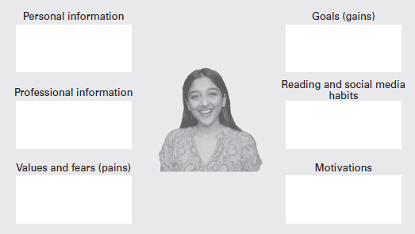

过去，我发现向他人阐明我的价值、技能和优势具有挑战性。我一直试图通过模仿他人或适应我的环境来适应——经常在这个过程中迷失自我。
企业家精神告诉我，你不仅要说服某人购买你的企业，还要让他们相信你、你的价值观和你的故事。消费者想知道是什么让您的企业与众不同。作为企业家，您的主要独特卖点是您自己。这是使您的公司/业务/品牌与竞争对手不同的原因。
本章将通过介绍识别核心客户的练习来介绍价值主张概念，同时介绍阅读、翻译和执行收集到的数据的多种方式。

## 正视自己

### 您的价值主张是什么，谁会对此感兴趣？

您的价值主张是您业务的基本组成部分。正是这种叙述告诉您的客户为什么他们应该选择您而不是竞争对手。想想看：为什么有人选择三星而不是苹果，耐克而不是阿迪达斯，或者 Uber Eats 而不是 Deliveroo？这些公司有非常相似的产品、设计和数据库。但是，它们吸引了不同的客户。
CXL Marketing (2019) 的创始人 Peep Laja 分享说，“一个好的价值主张可以在五秒内阅读”。

### 什么是价值主张？

价值主张是一个简明的陈述，强调产品如何解决问题或改善客户的情况。这是一个清晰的标题，吸引了合适的潜在客户，提高了潜在客户的质量并提供了关于消息传递的清晰度。最后，它传达了为什么您的客户应该关心您的业务、产品或服务。根据 Investopedia (2020) 的 Alexandra Twin 的说法，“客户价值主张是企业向客户提供的潜在价值的承诺，本质上是客户选择与企业互动的原因”。一个好的价值主张应该包括：

- 你的业务是什么？
- 它为什么存在？
- 您的企业解决了什么问题？

### 什么是不良价值主张？

以下不是价值主张的一部分：

1. **激励**：“激励”一词被定义为“积极的激励影响”，旨在促使访客立即采取行动。激励不是价值主张。
2. **标语**：通常被称为口号或标语，Shukairy（2019 年）在 Invesp 上建议“标语是一小组词，以特殊方式组合以识别产品或公司”。这些通常是吸引人的和令人难忘的。
3. **定位声明**：定位声明是对特定产品、服务或品牌如何以竞争对手无法满足的方式满足特定消费者需求的表达。定位陈述是价值主张的一个子集，但它不是一回事。
    建立良好的价值主张可能需要调整和时间，但这是您成功的关键。

## 不断发展以满足客户的需求

如果我让你闭上眼睛想象你的理想客户，他们会是谁？现在，打开它们并写下你看到的人。
无论您是营利性企业还是非营利性企业，客户对所有企业都至关重要。如果您停止与客户互动或无法让他们了解您如何满足他们的需求，您的业务就会失败。
我以前每周都会和父母一起去 Blockbuster 租一张 DVD。这是一个孩子的天堂，所有最新的电影和视频游戏都在一个又一个的过道上。 Reed Hastings 向 Marketplace (2020) 讲述了他的新书 No Rules Rules（Hastings 和 Meyer，2020 年）中的一则相关轶事，其中概述了 Netflix 的故事。他分享说，在 1990 年代初期，作为 DVD 租赁领域的新人，“Netflix 要求 Blockbuster 以 5000 万英镑的价格收购该业务”。这个提议被 Blockbuster 拒绝了，黑斯廷斯接着说，那天晚上他上床睡觉了，“我看到所有六万名 Blockbuster 员工都因为我们提议的荒谬而大笑起来”。多年后，Blockbuster 未能跟上消费者的数字需求，Netflix 成为首选的流媒体平台和家喻户晓的名字。 2021 年，Gail Kellner on Go Banking Rates 报告称，Netflix 的估计净资产为 300 亿美元。
这个故事说明：

1. **适应创新步伐**。技术正在彻底改变我们做事的方式，但这取决于您和您的企业来调整。一个很好的例子是短视频生成内容平台 TikTok。 2020 年初，TikTok 在英国还是一个相当新的应用程序，但很快成为使用的社交平台。短视频内容改变了社交媒体的叙述，很快 Instagram 发布了自己的版本。如果 Instagram 没有调整其模式，它可能会失去客户并降低其价值。
2. **使用数据来推动您的决策**。今天创业的好处在于，有很多技术可以帮助您了解客户的需求。可以通过进行调查和 Instagram 民意调查以及使用 Google 趋势来收集数据。
    您理想的客户关心您的产品、解决方案和业务。他们正等着你进入他们的世界，带他们去旅行。同时，关心客户并确保通过真正了解他们的需求来满足他们的需求至关重要。这意味着进行研究，照顾他们的需求并了解趋势。

## 让我们找到您的客户
您做出的每个决定都应该考虑到您的客户。
在计划下一步行动时，请考虑以下问题：

- 这将如何使我的客户受益？
- 这将如何吸引新的潜在客户？
- 我的解决方案会解决他们的问题吗？

### 如何创建客户角色

客户角色是对理想客户的高级描述。它包括假定的特征，具有明显的痛点和收益点，例如 20-30 岁的年轻城市女性。痛点是您的客户面临的问题，而收益点是您的企业将如何解决这些问题。通过定义您的客户角色，您可以创建更好的产品来解决他们的问题，策划营销以支持您的品牌增长并考虑特别优惠以建立忠诚度。虽然当您开始考虑您的业务时，您可能没有明确的客户角色，但您至少应该首先了解您希望客户成为什么样的人。
按照下面的练习来创建客户角色。您可能会考虑拥有多个目标客户角色，企业通常就是这种情况。如果是这样，我鼓励您考虑三个（最多）。任何更多可能会损害您的商业模式。

- 创建客户角色的三个步骤是：
- 确定您的企业正在解决的问题。
- 了解谁需要此解决方案。
- 在一页模板上创建他们的角色。我在图 3.1 中包含了一个模型。

### 你应该包括哪些信息？

- **个人信息**——姓名、年龄、社会经济和教育背景。
- **专业信息**——行业、角色、就业状况、地点。
- **痛苦**——他们有什么问题？
- **收益**——您的产品或服务将提供什么解决方案？你会帮助他们达到他们的哪个目标？
- **阅读和社交媒体习惯**——他们使用哪些数字平台？他们消费什么样的内容？
- **动机**——这个人的动机是什么？是什么驱动了他们的热情？

在我创业之初，我没有考虑客户是谁。 我花了 3 次尝试才把这件事做好，即便如此，它也不是完美的。 最初，我认为我的客户看起来像我。 然而，事实证明，我的理想客户是任何经历过类似经历和痛点的人，而不是那些自认为是 20 多岁女性的人。 这些偏见和假设意味着当事情没有按计划进行时，我不得不重新开始。
您可以将您提供的客户档案视为您打算通过市场研究和验证来证明或反驳的假设。

## 你如何验证你的客户？
市场验证是确定您的产品、服务或品牌是否对您的客户和目标市场感兴趣的过程。有几种技术可用于评估市场兴趣，我们将对此进行讨论。
在进入批量生产之前验证您的产品具有成本、资源和时间效益。

### 您如何创建和验证您的市场研究？

在成为企业家之前，市场调查让我感到害怕。这似乎是一项无法完成的艰巨任务，花费的钱比回报的要多。然而，像大多数其他人一样，我把这个概念过于复杂了。如果您是一家小型企业或新企业，您不能指望立即收到数以千计的回复。市场研究和验证是相关的、清晰的并获得您可以使用的代表性样本。在进行市场研究时，您可以使用一些不同的数据点。
**定量数据**回答了“谁”、“什么”、“哪里”、“如何”和“何时”。它是基于数字的，线性数字代表人们的感受或想法，例如，“在 1-5 的范围内，您关注我们品牌的可能性有多大？”定性数据包括感受、意见和书面文字。这通常更难衡量，尽管很重要，因为它回答了“为什么”。例如，这可以是“您更喜欢哪个社交平台，为什么？”
可用的不同形式的数据包括原始数据和次要数据。主要数据是您自己进行研究时获得的数据。二手数据已经存在，可以通过报告、公共论坛或其他在线资源找到。一种方法是通过建立案例研究或将其用作参考点，使用二手数据来证明或反驳您的大部分假设。主要数据可用于整理额外或新的见解，这些见解可能特定于您的品牌或业务。例如，2021 年，LMF 网络围绕工作场所的多样性和包容性进行了一项研究。不是仅基于原始数据生成完整的报告，而是使用辅助数据来构建前提和故事，同时提供初步数据以反驳或同意原始发现。使用这两个数据集有利于您的研究，并使其万无一失。

### 有哪些不同的获取数据方法？
- 调查;
- 民意调查；
- 面试；
- 专门小组。

**调查**是发送给客户填写的在线或面对面的基于问题的表格。您可以在调查中提出的问题数量没有限制。但是，我建议保持简洁明了，以鼓励更多人填写。面对面调查让您可以选择与对方面对面交谈，这有时对您有利。 2019 年，我帮助一家总部位于伦敦的初创公司通过鼓励他们走上街头来收集市场研究。在一小时内，他们采访了 100 名参与者，这有助于指导他们最初的网站设计。
鉴于我们中有 46.6 亿人可以访问互联网（Statista，2021 年），数字调查通常更容易访问。使用在线免费工具，例如 Google Forms、Qualtrics 或 Typeform，您可以创建一个简短的调查并通过在线渠道将其发送到您的网络。
民意调查是用于通过投票系统了解人们需求的工具。现在大多数社交媒体平台都可以使用民意调查，而且通常可以免费使用。您可以创建一个民意调查，通过您的社交帐户和他们的帐户了解您的客户的需求。 Twitter 和 LinkedIn 上的民意调查最多可以持续 7 天，而 Instagram 民意调查仅在故事功能中存在 24 小时。联合国妇女署就是一个帐户的例子，该帐户经常使用民意调查来了解其追随者对暴力、安全和性别不平等等复杂话题的担忧。这些民意调查构成了活动、研讨会和计划的基础。
**访谈**是数据收集的定性形式，包括坐下来向另一个人提问。这是最耗时的方法，但会生成最大量的数据。为了获得更好的结果，应提前准备面试问题。采访可以通过 Google Hangouts、Zoom 或 Facetime 等免费工具离线或在线进行。录制采访，以便您稍后收听并转录对话。
焦点小组是访谈过程的延伸，涉及多个人。与访谈类似，这些可以在线和离线进行，最多 20 人。我建议使用免费的数字工具 Slido 提问，并让答案形成他们自己的词云。词云的伟大之处在于，它们会根据匿名共享的人数自动更改关联的“词”的字体。在为 King 和 Soldo 举办的研讨会期间，我使用这种技术来确定当前的工作和多样性情况，这对我的工作大有裨益。焦点小组可以像面对面交谈一样有效地使用数字工具。考虑使用 WhatsApp，或者尝试使用微信或电报。需要注意的一件事是，在焦点小组中，一些受访者可能比其他人有更强的发言权，因此由面试官来管理和引导公平的对话。
Beauty Pie 创始人 Marcia Kilgore 将 Beauty Pie 的想法描述为“有一天下午，她在米兰火车站从意大利一个被称为“唇膏谷”的美容生产区回来的路上突然想到的东西。她想知道为什么美容产品的实际成本没有直接到达客户手中，如果公司取消加价，他们可以在奢侈品美容方面获得大量收益。 Marcia 将她的“想法带到了美容编辑的家门口，立即进行了测试，他们最初的反应是难以置信。当然需要进行教育”。 Beauty Pie 通过社交渠道和民意调查重视客户反馈，以确保策略和产品继续符合其价值主张，即普及奢侈美容。 Marcia 与客户的关系也使 Beauty Pie 能够创造出美观且上镜的包装，同时牢记尽可能具有生态意识的目标。 Marcia 补充说，她“不相信创办公司只是为了推出它们，而是为了开发一种可以改善客户日常生活的想法”。 Beauty Pie 和 Marcia 的故事就是一个很好的例子，说明如何通过询问潜在客户来验证您的想法，以及此类反馈对发展业务产品和服务可能产生的影响。

## 收集到数据后我该怎么做？
如果您的数据是手写的，请在 Microsoft Word 或 Google Docs 中输入。如果是在 Google 表单中，请将其移动到 Excel 电子表格中，如果是在社交媒体上进行的投票，则拍照并将其转换为书面文本。接下来，是时候了解已捕获的内容了。显示数据时，使用不同的图形、数据透视表和可视化工具（如词云）。如果您有大量样本集并且乐于探索新工具，我建议您使用 Tableau 或 Qualtrics 的可访问版本。
整理完数据后，您就可以使用收集到的信息来证明或反驳您的假设。您在本章中的假设是证明或反驳您的客户角色，但在更广泛的范围内，它可以是商业模式、问题、解决方案或营销活动。
数据可以驱动您的决策。没有正确或错误的答案。这通常会让人们望而却步，因为不知道您会发现什么可能会非常不舒服。另一方面，在投入时间、精力和资金之前证明或反驳什么对您的企业有用，只会对您的品牌或企业有益。

### 让数据驱动您的决策

如果，正如 Clive Humby 所说，“数据是新的石油”（Bridle，2018 年），让我们使用这种丰富的货币来提升您的产品、服务或品牌。
将接下来的几章视为验证过程的一部分。
创建登陆页面 – 使用您收集的数据，创建一个包含您的业务信息的登陆页面。

1. 生产样品 – 如果您的产品是实物，请考虑将其发送给潜在客户。这可以通过市场摊位、口耳相传的宣传或有天赋的社交媒体活动来完成。 Coconut Collaborative 是一家不含乳制品的甜点公司，每周在社交媒体上发布赠品，向邻近企业提供新产品和口味。最初的活动侧重于品牌认知度，但他们也发现这是与潜在客户以少量预算测试其产品的好方法。
2. 使用测试广告——我们将在接下来的章节中深入介绍的数字广告是在有限的预算下测试您的想法的好方法。使用 Google、Taboola 或 Facebook 等广告平台创建营销活动是一种快速确认您的业务、品牌和价值主张是否符合预期的方法。例如，A/B 测试允许您使用一个独特的差异化因素创建两个类似的营销活动：营销活动标题、价值主张或
3. 客户人口统计。结果可以支持您继续前进或重试的论点。
    在业务变得有形之前，这些基本的业务垫脚石很重要。将您的想法变为现实并赋予它自己的身份时，您通常会感到一种全新的兴奋感。

## 让您的品牌成为现实
### 你的公司叫什么名字？

您的公司名称需要将您的目的、品牌概念和产品组合成一个漂亮的词或句子。糟糕的企业名称会影响您的成长。找到您的公司名称需要集思广益和耐心。我的建议是确定一些定义您的解决方案的单词、概念或句子，然后开始合并它们，看看哪些是有效的。在同义词库中查找同义词，看看它们是否听起来更好。不要害怕想大。 “志同道合的女性”这个名字是我的搭档开玩笑说品牌和价值主张时出现的。就在那一刻，我头顶上的灯泡亮了，我有一个真正的“塔-达”时刻。我的下一步是跳上互联网并用谷歌搜索它是否已经存在——它没有。因此，我购买了域名，创建了徽标并设置了电子邮件地址。
事后看来，我很快就了解到，虽然一件事对你有意义，但对其他人可能并不重要。
我的公司名称也有其自身的偏见。它是“女性”独有的。尽管这是一开始的模型，但所有性别、交叉性和身份都开始参与其中。感觉名字不对。这促使我将名称更改为 LMF Network 作为包容性缩写。
不幸的是，在 2020 年 12 月，我们的品牌域名没有自动续订，在订购新的商业银行卡的过程中，该域名重新开始销售并被机器人提取。长话短说，志同道合的女性域名现在以 10,000 英镑的价格出售。具有讽刺意味的是，我们需要推动整个社区网络和业务的品牌重塑。
作为一名企业家，最简单的任务通常会感觉最困难，因为它们看起来很简单——比如保持订阅。我只能建议，为了不要经历我所做的事情，请在私人文件中记下您的所有订阅、续订日期和规定。
幸运的是，我们的价值主张是安全的，我们的品牌强大，所以我们并没有像我们想象的那样失去那么多客户。

### 你如何创造品牌的视觉方面？
由于我的兴奋和缺乏经验，一开始我并没有考虑太多品牌、颜色或一致性。我使用 Canva 的免费徽标工具创建了徽标，选择了与我对话的颜色，并根据我喜欢的内容设计了所有内容。
根据 Kurt 和 Osueke (2014) 的研究，颜色有其自身的关联，并且是“视觉、识别、解释、感知和感官的基础”。例如，红色被认为是火热和强烈的。蓝色更加透明和被动。重要的是还要注意颜色在不同文化中的含义。例如，在英国，葬礼上经常穿着黑色作为哀悼的标志。在中国，白色被视为一种悲伤的颜色。
当我开始 LMF 时，我们的主要颜色是浅粉色。根据 Bakhshi 和 Gilbert (2015) 的说法，以红色、紫色或粉红色为主色的图像被其他用户分享的可能性更高。然而，我们很快就收到了客户的反馈，认为较浅的粉红色不具有包容性或大胆性，这与我们的信息相矛盾。出于这个原因，我们作为一个网络进行了 Instagram 民意调查，以了解我们的用户更喜欢哪种颜色。
结果一致认为，更喜欢更深、更珊瑚色的粉红色，带来力量、大胆和个性的概念。有趣的是，珊瑚色是 Pantone 2019 年的年度色彩，它培养了一种活力、社区感和对自己感到舒适的感觉（The Chalkboard，2019 年）。
花点时间专注于品牌的视觉元素，包括颜色和信息。在将他们推向核心商业品牌之前，先做研究、询问听众并相信你的决定。如果它们不适合您的信息，您将不得不加倍努力并重试。

### 如何创建一个网站

在这个阶段，您网站的核心目的是要有一个基本设计，它概述了三件事：您正在解决的问题、您如何解决它以及人们可以在哪里购买解决方案。将您的网站视为正在进行的工作。
最初，我建议使用 Wix、WordPress 或 Squarespace 上的模板来设计您的网站。不要过度思考内容。专注于在页面上传达您的核心信息，并提供清晰的链接，以防有人想要购买或联系您以获取更多信息。网站需要花钱，因此您应该准备好投入一些预算。
技术的伟大之处在于，您无需成为编码员或工程师即可创建网站设计。上面提到的所有网站都有一个“无代码”元素，这意味着您不需要代码来创建网站，而是可以使用现成的模板，然后可以对其进行编辑。
为成功做好准备也意味着让自己在竞争中脱颖而出，其中大部分将由您的客户、沟通和活动来指导。自从成为一名企业家以来，我发现很多人都有令人惊叹的想法，但在付诸实践时并不那么好，因为他们无法清晰地表达出来，或者无法满足客户的期望。

#### 案例研究 Son Chu

在本章中，我们认识了全球第一款咖啡运动鞋 Rens Original 的联合创始人 Son Chu。这款运动鞋防水，由回收的咖啡和塑料制成。 Son Chu 来自越南，现居芬兰。在芬兰完成学业后，他通过工作认识了他的联合创始人 Jesse Tran。在他们初次见面一年后，他们决定推出他们的鞋类业务 Rens，其愿景是让可持续鞋类成为时尚。孙正义被福布斯杂志评为 2020 年 30 位 30 岁以下企业家之一。
**Rens的灵感从何而来？**
制鞋业往往受制于以前存在的东西。作为一名篮球迷、运动鞋迷和认真对待可持续发展的年轻人，我很惊讶没有一种产品能够将这三种元素结合在一起。我想穿一些时尚和高科技的东西，同时也要保护环境。
**你为什么决定用咖啡制作运动鞋？奇怪的概念，对很多人来说。**
是的，没有多少人知道咖啡豆可以回收利用来制造纤维。我们尝试了不同的纱线，例如再生塑料、竹子和木炭。然而，咖啡似乎最适合设计。咖啡纱线已用于无檐小便帽、连帽衫和运动衫等产品，但从未用于运动鞋。具有讽刺意味的是，咖啡是芬兰消费量最大的饮料，也是越南最大的出口产品之一，所以感觉这两个世界很自然。
**你是如何生产出第一双运动鞋的，是不是一见钟情？**
老实说，在我们开始设计之前，我和我的联合创始人花了一年时间研究面料、材料、产品和制造合作伙伴。然后我们创建了一个 MVP（最可行的产品）并将其带到了芬兰的街头。从我们提议的目标受众那里获得第一手反馈并听取他们喜欢或不喜欢什么非常有帮助。第一个原型的大部分反馈是它太笨重 - 这是我们希望它防水的情况 - 但它并不时尚。因为我们希望它时尚、防水和可持续，所以我们又回到了绘图板。
**你提到了你的目标受众——他们当时是谁，现在又是谁？**
很好的问题。我们最初的受众是我们——年龄在 24-35 岁之间的年轻专业人士，他们想要时尚、时尚但环保。我们理想的客户会有钱买鞋，并对时尚感兴趣。实际上，我们的实际客户从 18 岁开始属于更大的年龄段，并且有可支配收入，这不是出于冲动，而是在消费前考虑。我们的大部分目标市场都是假设的，然后通过数字广告、活动和走上芬兰街头进行确认。
**告诉我们更多关于您如何进行市场调查并确认您的客户的信息**
市场研究是每个企业的基础。我们（我和我的联合创始人）制作了一个原型，并询问了我们所能提供的每个人的反馈。基于此反馈，我们创建了一个新版本并进行了相同的练习。考虑到我们的目标市场主要使用 Instagram 作为社交工具，我们决定推出 Instagram 页面和活动，通过广告针对我们的人群。这有助于提升我们的品牌和提高知名度，同时让我们了解哪些设计、图案和产品有效。正如我之前提到的，我们走上街头问人，随意地穿着鞋子走到他们面前问问题。在更宏大的计划中，必须为自己的理智进行研究并避免浪费金钱。
**您和您的联合创始人是否始终在您的业务目标上保持一致？**
我们是年轻的企业家，已经从同事变成了 CEO。没有人真正告诉你那段经历。我仍在学习我的管理风格，以及培养我的联合创始人关系。我和我的联合创始人是有着相同愿景的不同人。拥有相同的愿景并保持一致是很重要的。有时我们必须为自己想要的东西而战，但条件是如果你按照自己的方式行事，你必须证明它是有效的。这意味着，如果我在设计或营销活动中获得批准，我仍然需要在三个月内证明其价值，然后再推进或将其交给另一个想法。与另一个人一起工作很棒，因为您可以相互交流想法。
**您想分享的一项关键学习是什么？**
制作一个 MVP 并通过积极的活动来测试这一点，从出去问人，一直到数字媒体活动，然后再投资你所有的毕生积蓄。我们经常听到企业家和创业者的故事，他们因为没有阐明自己的价值、客户或存在的原因而将积蓄付诸东流。

### 事后总结

听到 Son Chu 和他的联合创始人在将他们的积蓄投入到他们的业务中之前走上街头征求客户的反馈，这令人欣慰，只是为了确保这样做有意义。一旦您能够理解他们并直接说出他们的需求，就可以对您的价值主张和客户叙述进行改革。作为企业家，我们必须承认，我们并非无所不知，但我们愿意学习。儿子的诚实令人耳目一新。它提醒我们不要停滞不前。为了发展您的业务，您还必须成长为创始人、企业主和品牌。在最终通向成功的道路上前进的唯一方法是询问您的客户、同事和消费者的想法——这些人将为最终产品付费。在下一章中，我们将讨论如何在社交媒体上推出您的品牌、获得牵引力、在线寻找商机并发展您的社区！我很高兴能和你一起踏上这段旅程。