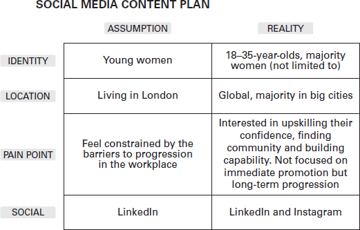
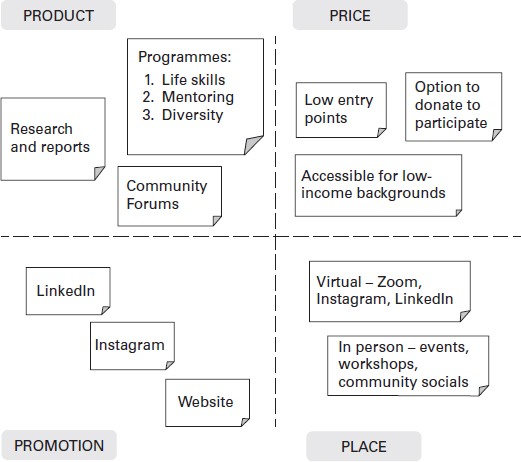
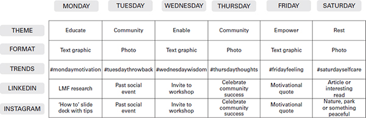

根据 Statista（2021 年）的数据，2020 年一个人每天花在社交媒体上的平均时间为 142 分钟，自 2015 年以来增加了 30%。在 142 分钟内，一个人平均可以跑两次 5000 米，烤四个面包香蕉面包，或从伦敦希思罗机场前往阿姆斯特丹。
鉴于这些数字，我可以大胆声明：没有社交媒体，您的企业就无法繁荣。如果全球 50% 的人口使用社交媒体（Roser 等人，2021 年），您能承受不使用社交媒体的后果吗？
然而，这并不像看起来那么容易。 2019 年，我决定为 LMF Network 启动和管理 Instagram 频道。我兴奋地进去，我精疲力竭地走出去。我做得很糟糕。
我太糟糕了，以至于 LMF 句柄甚至被阻止了——可能是因为该帐户没有明确的用途。我想，‘社交媒体有多难？’这很难，因为我不知道自己在做什么。
最终，在 2020 年 1 月，我们以新的品牌和团队重新启动了该帐户（更多内容请参见第 6 章）。
以下是我从艰难中学到的三个社交媒体课程：

1. 拥有清晰的品牌叙事，否则人们可能不会相信您的业务是真实的。
2. 了解客户的问题，并交流您的企业如何帮助解决问题。
3. 确定一个明确的成功指标，它超越了追随者的数量——并非所有追随者都能转化为客户。

这些平台上的社区参与可以吸引一群忠诚的客户，他们在帐户之外关心您。客户行为发生了变化——我们在线上，以更短的块消费信息，并通过数字内容冲动地做出决策。
本章是关于使用社交媒体作为与客户会面的工具并建立强大的品牌影响力以实现客户忠诚度。将社交媒体视为您的品牌与客户之间的桥梁。

## 我应该相信社交媒体的炒作吗？

根据 SWEOR (2021)，企业有大约 2.6 秒的时间使用视觉社交媒体内容给人留下深刻印象。炒作是真实的。

## 上网的目的是什么？

没有目的的商业社交媒体帐户是浪费时间和资源。通过定义您希望通过社交媒体实现的目标，您可以将其编织到您的营销策略中，并将其与关键绩效指标 (KPI) 作为成功指标相关联。
在线的主要目的是：进行市场研究、确定趋势、建立品牌知名度、增加流量、产生潜在客户、推动销售和建立社区。

### 进行市场研究并确定趋势

进行市场调查是在线建立品牌的第一步。社交媒体使您能够跟踪当前和新兴趋势。一种方法是监控当前的主题标签或跨平台趋势的主题。在推出 LMF Network 的新 Instagram 之前，我花了几周时间关注相关主题标签，以了解其他品牌在做什么。这些主题标签包括#community、#business、#motivation、#diversity 和#mentoring。我故意让他们宽泛地欣赏正在共享的所有内容。
我们使用 Instagram 民意调查来了解我们的新品牌调色板是否受到社区的青睐，并使用 LinkedIn 民意调查来确定我们的生命应该有多长。从这些民意调查中，我们决定采用更深的粉红色和 30 分钟的 LinkedIn Lives。
您还可以通过关注社交媒体渠道上的热门话题，或使用 Google Trends 等工具或其他基于趋势的免费数据站点（如 Sprout Social、Hootsuite 或 Buffer）来识别趋势。

### 建立品牌知名度

品牌知名度是客户能够识别或回忆您的品牌的程度。几乎具有普遍品牌知名度的品牌包括可口可乐、苹果和星巴克。
一旦客户与您的推文或 Instagram 帖子互动了几次，他们就会开始了解访问您的社交媒体页面时会发生什么——无论是设计、语气还是其他方面。我在社交媒体帖子、研讨会培训台甚至书的品牌中尝试了红色、粉红色和黑色。跨帐户使用相同的调色板，我能够区分自己作为一个品牌。

### 推动流量并产生潜在客户

在社交媒体上发帖会将人们吸引到您的网站、注册表或您想要的任何其他在线目的地。流量创造了潜在客户。确保流量的一种方法是在社交媒体帖子中链接您的网站或业务页面。
你如何驱动流量？

- 创建与您的受众相关的内容；
- 以明确的行动号召宣传此内容；
- 使用您认为目标市场会寻找的相关主题标签或搜索词。

我在 Instagram 上创建了一个名为“如何克服冒名顶替综合症”的卷轴。我将其发布到网上是因为我在社交媒体和社区团体中看到的对话比在现实生活中发生的要多。它似乎正在影响我的目标人群之一——工作场所的女性。
该卷轴有 30,000 多人观看，并在三个月内转变为三个委托研讨会。
这种形式的初级研究也让我能够与他人分享我的专业知识。最终，许多查看我帖子的人发消息询问他们是否可以在他们的业务中分享它，以及我是否能够就该主题进行工作场所培训。这导致了与 Bocan 豪华服装的 Instagram Live 和与宝马总部的两个车间。

### 将潜在客户转化为销售
一旦您鼓励您的受众查看您的产品或网站，现在是时候将该潜在客户转化为购买了。这种类型的转换是营销漏斗的一部分。与初创公司和企业家合作的营销和运营专家索菲亚吉布森解释说：“营销漏斗由五个阶段组成——意识、兴趣、欲望、行动和忠诚度。在宣传您的产品或服务时，您需要尽可能多的知名度。这是因为当我们沿着漏斗向下工作时，阶段的大小开始减小。意识越高，采取行动的机会就越大。
您如何转换潜在客户？

- 与您的消费者建立关系；
- 提供奖励、促销或突出您的优惠；
- 指导他们购买。

英国企业主和营销专家 Natalie Furness 表示，可以使用 HubSpot 或 MailChimp 等客户关系管理 (CRM) 工具捕获潜在客户。她分享了“CRM 系统是所有以客户为中心的业务的核心，包含每个客户的个人信息”。
为了便于共享和访问，Natalie 建议使用“基于云的 CRM 系统”。确保每个客户记录都保持更新。支持人员使用 CRM 来解决客户查询。营销团队使用 CRM 来个性化与客户的沟通。销售团队使用 CRM 来识别销售机会，客户团队使用它们来识别和追讨逾期付款。
对于 LMF 网络，我们通过 Wix、Flo 时事通讯和 Eventbrite 等平台使用 CRM 工具来跟踪客户及其参与度。

### 建立社区

通过建立社区，您可以创建一个论坛来进行创新、分享想法和获得反馈。参与社区还可以帮助您改变观点并建立品牌忠诚度。品牌忠诚度可以带来口碑推荐、推荐和回头客。社区建设的概念仍然相对较新，将在下一章深入讨论。
如何建立社区：

- 确定哪个平台最适合您的特定受众；
- 邀请成员加入社区，并将其作为一个具有明确指导方针的团体进行推广；
- 开始对话，跟进评论并参与共享的内容。

Babes on Waves 的创始人 Jasmine Douglas 使用 Instagram 作为她建立社区的主要工具。她告诉我，‘观众是由你与之交谈的人组成，而社区是一群人，他们自己参与你的内容并相互交谈。 Instagram 是我使用的工具，因为那是我的观众所在的地方。在邀请这些人加入论坛、活动或会员俱乐部之前，我会分享内容并产生新想法。
当社交媒体是您的主要关注点时，它更容易管理。但是，作为企业家，您的时间有限。您可能会发现自己被社交媒体淹没，不确定从哪里开始或如何开始。为了让事情更容易，我鼓励以下步骤：

1. 根据您认为最忠实的客户所在的位置，确定您的主要和次要社交工具。例如，我会使用 LinkedIn 和 Instagram 作为我的个人品牌。 LinkedIn 因为它是最大的商业平台，而 Instagram 因为它与我公司的 18-35 岁的目标受众相关。
2. 概述社交媒体使用的两到三个目标并使其保持 SMART：具体、可衡量、雄心勃勃、现实和时间可控。例如，这可能是每季度将关注者数量增加 25%。
3. 在检查结果之前，给自己八周的时间来建立和保持一致的社交媒体存在。如果您给自己足够的时间来建立品牌，社交媒体分析会更加丰富。

与商业中的任何事情一样，您会在社交媒体上出错，这没关系。最好是快速失败并快速学习。

### 我如何选择我的主要社交工具？

有数百种社交媒体应用程序和工具可用。根据您所在的国家或城市，您甚至可能拥有每个主要站点的本地化版本。我已经确定并分类了当前存在的五种类型的网络以及它们如何影响您的业务。

## 社交五

**社交网络**是流行的网络工具，例如 Facebook、Twitter 和 LinkedIn。社交网络通常被称为“关系”网络，用于在线与人和品牌建立联系。他们帮助建立一对一的联系并建立社区。
商业企业家丽贝卡佩奇通过 Facebook 将她对缝纫的热情从零开始转变为一项业务。她的故事强调了当您花点时间倾听人们的需求并利用社交媒体的力量直接与他们分享您的信息时，社区和企业的发展速度有多快。 Rebecca 使用 Facebook 来“启动她的业务并了解其他人想要从头开始缝制产品时的做法，并成立了一个小组来分享见解”。最初，群组邀请发给了她认识的人，然后他们邀请了他们网络中的其他人。她继续解释说，“经过有机增长期后，该业务通过提供免费试用模式产生了新的潜在客户，鼓励新粉丝分享他们的设计，并将他们介绍给分享他们创作的品牌大使”。作为对全职业务的热情项目，丽贝卡告诉我，到 2021 年，“这个社区很快就会增长到 700,000 多名成员，并成为忠实的商业客户”。
**社交媒体平台**主要关注图像和视频内容。其中包括 YouTube、TikTok、Snapchat 和 Instagram。这些网络用于查找和共享实时内容、摄影媒体和视频。
Lara Sheldrake 领导在线社区 Found & Flourish (F&F)。这个社区是在劳拉休产假并担心重返工作场所时在 Instagram 上创建的。 Found & Flourish 为创业女性提供社区、联系和资源。 “最初，F&F 是 Instagram 上的一个社区，将有抱负的企业家与鼓舞人心的女性创始人联系起来，”Lara 解释道。两年之内，Lara 将社区转变为会员订阅模式。 F&F 的成功体现在它“使用 Instagram 建立品牌知名度，通过讲故事的力量增加观众以及通过离线和在线社交活动产生潜在客户”。 F&F 还分享了有关 Covid-19 大流行期间工作与生活平衡、自由职业和母性等热门话题的励志图片和视频。
**论坛**是您可以查找、讨论和了解热门新闻和问题的论坛。例子包括 Reddit、Mumsnet、Hacker News 和 Quora。
讨论论坛在推动趋势方面具有巨大的力量，可以为市场研究提供信息。 2021 年初，Reddit 平台上的一群贡献者推高了美国销售游戏和电子产品的高街零售商 GameStop 的股价。两周内，该股从 4 美元飙升至 200 美元（Finnis，2021 年）——这一切都归功于 Reddit 上的共同努力。
**客户评论网络**聚合客户评论并可以突出客户体验。其中包括 Yelp、Tripadvisor 和 Google Review。
Curate Beauty 的联合创始人 Margot Vitale 表示，“作为一个在线平台，我们非常依赖客户的信任”。在 Covid-19 大流行期间，Curate Beauty 被迫关闭其在伦敦的快闪店并转向网上。面对面的客流量消失了，但 Margot 解释说，积极的评论有助于推动事情的进展：“Google 评论让我们可以窥探其他客户的体验，让新客户对我们的业务主张和实践产生信任。”
**博客**和发布网络用于发布、发现和评论内容，包括 WordPress、Tumblr、Substack 和 Medium。
The Happiness Planner 的创始人 Mo Seetubtim 最初以博客的形式开始创业，以激励人们保持动力。随着它越来越受欢迎，她将其转换为时事通讯，以及包括生产力期刊在内的许多其他产品。 “通过这种方式，我能够捕获数据并产生潜在客户，”Mo 解释说。“我在我的内容和客户群的支持下集思广益地构思了一种商业模式，今天已经建立了一个拥有 500,000 多个关注者的业务，创建自定义Netflix、Deloitte 和 Bobbi Brown 等公司的期刊。
她解释说，“博客工具是一种无需任何承诺即可进入文字世界的好方法，因为它们是免费的。一旦你让自己写作和分享，你永远不知道它会带来什么机会，因为你永远不知道谁在阅读。

### 社交工具的未来是什么？
在我看来，数字营销平台正在发展和变革我们处理品牌知名度、社交媒体社区和营销的方式。例如，在 Covid-19 大流行期间，我们看到视频内容和基于音频的应用程序呈指数级增长。两个赢家（在我看来）是 TikTok 和 Clubhouse。
TikTok 允许您向全球市场分享长达 15 秒的视频内容。据 MediaKix (nd) 称，该平台主要由 16-24 岁的人使用，平均用户在该应用程序上花费 32 分钟。 TikTok 在 Covid-19 大流行期间蓬勃发展，每月用户增长超过 8 亿（Reitere，2021 年）。能够有效利用该平台扩大用户群的品牌包括 Gymshark 和 UEFA。品牌可以使用 TikTok 来创建和投放广告，并生成标签挑战，通过相关趋势生成社交内容。
根据影响者营销中心 (2021) 的数据，Clubhouse 在 12 个月内从 1,500 名用户增长到 100 万。该平台仅提供音频，汇集了来自世界各地的对话。
Immortal Monkey 的创始人 Estelle Keeber 分享说，她开始使用“2021 年 2 月有意向的平台”。她告诉我，作为企业主，为了充分利用该应用程序，请花一些时间“研究平台上的不同房间和思想领袖”。了解您使用该平台的原因：学习、教育或聆听。设置一个时间限制，这样你就不会被平台消费，并在不同的时间继续它，因为用户在世界各地都很活跃。“作为一名职业母亲，Estelle 发现使用社交应用程序与专家建立联系的好处比如《神偷奶爸》的制作人约翰·科恩。对于新创业者，如果你想看到投资回报，埃斯特尔说要“持续互动和参与，分享价值和知识并建立关系”。
我必须承认，在写这本书时，我尽力不使用该应用程序，但发现自己在 2021 年 3 月借了一部 iPhone 来享受互动。在我看来，最初只对 iPhone 用户开放的事实是一个很好的营销策略，因为它建立了对错过的恐惧（FOMO）。然而，另一方面，这意味着应用程序本身并不具有包容性。
与 Estelle 类似，我限制了我在应用程序上的时间，每天只分配 15 分钟两次。我会在最初的几分钟内探索房间，看看哪些话题是有趣的，演讲者的人数有限，这样我就可以在舞台上尝试我的机会。一旦上台并分享信息，我会跟随其他演讲者并邀请观众跟随我。为了将这些基于应用程序的人脉转化为潜在客户，我会在 LinkedIn 上找到他们并发送友好请求，提醒他们我们在 Clubhouse 见过面。通过这些互动，我能够与来自美国和亚洲的 CEO 一起虚拟咖啡，找到潜在的品牌合作伙伴，并提高我作为企业家的知名度。
我认为数字社交平台对于建立和发展您的业务至关重要。可以通过触手可及的交互式工具生成和验证商业创意——而且这些工具只会变得更加精确。

## 让社交媒体为您的企业和品牌服务
社交媒体的核心目的是提升营销。 营销是任何鼓励消费者购买您的产品的活动。 在本节中，我们将介绍您的品牌标识、四个营销 P（新旧）以及数据如何推动您的决策。

## 谁是你的客户，他们在哪里？

当我第一次启动 LMF 网络时，我认为在进行任何市场研究之前我已经了解了我的人口统计信息。 这可能就是我们开始不强势的原因。 图 4.1 列出了我对目标人群与现实情况的假设。

假设和现实的细节分别如下：身份，年轻女性和18-35岁，多数女性（不限于）； 位置，居住在伦敦和全球，大部分在大城市； 痛点，感到受到工作场所进步障碍的束缚，并有兴趣提高他们的信心，寻找社区和建立能力。 不着眼于眼前的晋升，而是着眼于长期的进步； 社交、LinkedIn 和 LinkedIn 和 Instagram。

识别和验证目标市场的练习有助于建立和改进我们的社交营销策略、调整目标和启动网络。

## 什么是营销组合？
营销组合 (4Ps) 是由 E Jerome McCarthy (1971) 和 Philip Kotler 创建的经典营销理论。它定义了营销您的业务和品牌所需的核心要素：产品、价格、地点和促销。营销组合应该能让您在合适的时间、合适的地点以合适的价格与客户见面并解决合适的问题。然而，营销组合是在数字营销和在线论坛之前创建的。以开放的心态对待营销组合很重要。
最简单形式的产品是满足客户需求的物品（有形或无形）。建议对您的产品进行广泛的研究，以确保最终产品符合要求。
价格是客户为享受产品或服务而支付的费用。定价很重要，取决于您的业务。如果您是一名社会企业家，您的定价可能是免费的或负担得起的，以确保每个人都可以加入并创建一个更具包容性的社区。
地点是指产品或服务的分销地点，从店内到 Etsy、亚马逊和 Depop 等在线渠道。地方随着互联网发生了巨大的变化。 Covid-19 大流行改变了食品和饮料的分配方式，许多不提供送货服务的品牌都在网上进行了封锁以适应封锁，例如麦当劳、肯德基和南多。
促销是客户了解您的产品或服务的方法。传统上，这可能是通过店内广告以及电视和广播广告来实现的。今天，我们看到通过社区团体、社交媒体、付费广告、博客、时事通讯、有影响力的营销和播客进行推广。
以下 P 是 Dave Chaffey 和 PR Smith（2017 年）添加的混合扩展，考虑了数字时代。
人们直接或间接参与产品或服务的制作——您的团队。他们确保产品被看到和购买，并且可以包括生产、营销、开发、分销和交付。
“人”元素扩展到流程中。流程是产品在到达最终消费者之前经过的各种系统。这可以包括直接或间接活动，例如反馈请求、后台管理和服务支持。作为一个崭露头角的企业家，这个过程很可能是你自己和你能找到的任何备用手来支持你和你的品牌。流程应该简化并记录在案，以便为加入的新员工提供参考点，或者如果您需要提醒自己处理事情的最佳方式。这也确保您能够将无效的区域迭代到有效的区域。
实物证据是指您的客户在与您的品牌互动时所看到的一切。这包括您提供服务的环境、布局或设计、包装和品牌。此元素还可以指您的员工、他们的着装方式和行为方式。
最后一个 P 是伙伴关系。这包括两家企业之间的战略品牌合作伙伴关系。对于小型企业而言，当资源有限时，这是增长的关键因素。
在图 4.2 中，您可以看到 LMF 网络的营销组合。

四个象限的详细信息如下：
价格：低进入点，可以选择捐赠参与并且适用于低收入背景
产品、研究和报告、方案、1、生活技能； 2、辅导； 3、多样性； 社区论坛
推广：LinkedIn、Instagram、网站
地点：虚拟、Zoom、Instagram、LinkedIn 和面对面、活动、研讨会、社区社交。

## 内容路线图
构建社交媒体内容最有条理的方法是创建内容路线图或日历，这将有助于组织您的社交媒体和商业活动。您可以从笔和纸或 Excel 电子表格开始。然后可以将您的计划上传到内容工具，例如 Buffer、Hootsuite 或 Later。
为了获得最大的影响，我建议每隔一周投入几个小时来计划、构建和安排下一周的内容。我每周日花三个小时为 LMF 网络和我的个人品牌构建内容。
我花时间在以下五个方面：
设置行动号召——你希望别人怎么想、感受或做什么？
确认审美策略——内容在您的提要上的外观和感觉如何？
寻找趋势 - 哪些趋势正在推动社交媒体内容并与您的品牌相关？
组织内容 - 将所有内容整理到一个文件或文件夹中，以便更轻松地上传。
创建字幕——根据观众和意图个性化每个字幕。
图 4.3 是 LMF 网络内容日历的一个示例，在我们的许多章节中使用它来确保我们的一致性和以客户为中心。

周一至周六的日历详情分别如下：
主题：教育、社区、赋能、社区、赋权和休息
格式：文字图形、照片、文字图形、照片、文字图形和照片
趋势：标签星期一动机，标签星期二回归，标签星期三智慧； 星期四的想法； 周五的感觉和周六的自理
LinkedIn：LMF 研究、过去的社交活动、受邀参加研讨会、庆祝社区成功、励志名言和自然、公园或宁静的地方。

内容被上传到这些工具并设置为自动发布。发布后，我每天花 15 分钟处理评论、点赞和查询。
考虑到已经存在的大量内容，我曾经有过一些时刻，我会发现社交媒体不堪重负，并且对发布什么感到困惑。制定一个清晰的计划有助于消除头脑中的阴霾并让您集中注意力。
数据分析
每个主要的社交媒体平台都有自己的免费内部数据分析平台。八周后，您应该已经分享了足够的内容以获得有价值的见解。您正在寻找的最重要的项目包括内容参与度，例如喜欢或评论的数量、通过粉丝增加带来的品牌增长，以及通过转化或购买的项目实现的页面连接和实际销售额。 Instagram 等平台也将能够分享与您的内容互动的用户类型的基本信息，包括性别、估计年龄和位置。同样，LinkedIn 将分享他们的头衔。在评估您的社交影响力、了解您的目标是否已实现以及制定未来的增长计划时，这些将增加价值。
在 LMF Network，我们意识到我们的 LinkedIn 追随者由通常持有预算并可以做出决策的高级利益相关者组成。在 Instagram 上，我们的追随者主要是年轻的专业人士。对于 2021 年的指导计划，我们从 LinkedIn 招募了导师，从 Instagram 招募了学员。这一举措帮助我们启动了英国最大的指导计划，有来自 14 个国家/地区的 600 多名参与者，如 TechRound（Dolden，2021 年）的特色。
今天，我们在线，以更短的块消费信息并冲动地做出决定。作为新的和小型企业主，我们必须有明确的信息、以客户为中心的内容和明确的价值主张。建立社交媒体形象需要时间、奉献精神和数据。这是一个全职角色，您必须能够每天投入几个小时。不要害怕测试、试验和挑战社交媒体规范，以发展您的业务、品牌和老板地位！

**案例研究** Chanelle Mauricette
我们的社交媒体企业家是 Chanelle Mauricette。 Chanelle 是社交媒体品牌专家、商业心理学家和影响力机构 Novus Via Management 的创始人。在 Covid-19 开始时，Chanelle 专注于通过她的平台提供激励性的商业内容，并在 12 个月内将她的平台从 3,000 名粉丝增加到近 50 万。这种增长使她能够辞去日常工作并经营自己的企业。
**你上网的目的是什么？**
最初，我并没有过多地考虑将社交媒体作为产生商业对话或品牌影响力的工具，因为我投资于在企业界发展自己。然而，一旦 Covid-19 大流行来袭，我看到更多人依靠社交媒体寻求社区和建议。拥有商业心理学家的背景，我想帮助人们了解世界上正在发生的事情，我们如何利用时间将我们当前的生活方式重新调整为我们想要的生活方式，最重要的是，让社区充满信心会没事的。
**你的目的是如何转变的？**
一旦我开始发布以标题为主导的励志内容，我的关注者和参与度都在慢慢增加。了解了销售的基本概念后，我花了一些时间来了解哪些趋势正在增长，以及在大流行期间普通人的担忧是什么。我假设我的核心人群是需要在线支持、社区意识和赋予日常生活能力的女性。
**您使用什么策略将您的 Instagram 粉丝增加到超过 50 万？**
我制定了一个简单的内容计划并坚持了几个星期，看看它是否有效。大约八周后，我使用 Instagram 上提供的免费分析来查看哪些内容的参与度最高，哪些无效。我意识到我能够专注于时尚服装中基于商业内容的帖子获得了最高的参与度。从这里开始，我将我的策略转移到用我自己穿着时尚服装的高分辨率图像创建内容，同时将标题集中在感兴趣的主题上，例如商业、授权、品牌、社区和正念。
**你是如何从全职员工变成全职企业家的？**
我的品牌的增长是自然的，业务的增长也是如此。通过分享内容，有人联系我领导有关个人品牌的培训，公司联系我成为付费影响者，并被许多人询问我如何进入影响者营销的世界。从这些对话中，我发现影响者营销的市场正在增长；然而，代理商并没有尽可能多地与多样化的候选人或微观影响者合作。这是我看到的利基和商机。我试图在后台建立我认为可以作为社会影响者机构运作的机构，联系其他微型影响者，看看他们是否有兴趣成为我们的人才，并与我的商业伙伴就工作实践达成一致，我' d 通过社交媒体和在线社区了解。这自然是在反复试验中成长起来的，这就是创业的美妙之处。
**您如何通过社交媒体产生新业务？**
社交媒体的强大之处在于，一旦您有了明确的信息和相关内容，就可以通过他们的消息工具或电子邮件地址来接触品牌。我估计我 90% 的业务来自 Instagram，10% 来自 LinkedIn，这是在明确识别我的客户市场、他们的位置并使用该平台建立可以与他们分享的活动的背后。将其视为您的实时投资组合。
**您希望人们了解社交媒体的一件事是什么？**
算法总是在变化。因此，不要仅根据以下内容将您的内容与其他人的内容进行比较。转化比关注你的人数更重要。在您尝试将他们转化为付费客户之前，与您的关注者互动并建立一个社区。
**当您在网上遇到问题时会发生什么？**
没有。人们一直害怕在网上出错，但事实是，你必须做错事情才能知道什么是对的。有很多例子表明我误读了房间、观众或关注者，以及分享的内容，这些内容并没有体现我的成功标准。社交平台的伟大之处在于它们拥有免费的洞察力，因此请使用您的数据来推动所有决策，并反思哪些有效、哪些无效以及哪些有效。

## 事后总结

通过正确使用社交媒体，香奈儿已经能够与Simply Be 和I Saw It First 等大型时尚品牌以及Lanistar 等科技公司合作。 作为领导者，我们有时必须训练我们的大脑根据业务逻辑而非情绪进行思考（更多内容请阅读第 7 章）。 如果您不与客户交谈，您怎么知道您真的在交付产品或满足他们的需求？

> 练习
> 在您进入关于社区和网络的下一章之前，我希望您确定您的两个主要社交平台并构建一个适合您客户需求的内容日历。 不要担心弄错了。 这是过程的一部分。 随着您成为企业家，不断迭代和发展您的社交媒体形象。

