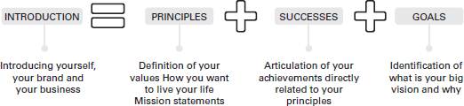

没有客户和社区，企业和品牌将无法生存。新的创业方式是像培养想法和技能一样培养人际关系。这是我与之交谈的许多企业家中的一个持续主题。如果没有我们的社区，我们的业务将无法维持任何增长。
然而，许多企业家解释说，他们最大的障碍是建立自己的社区并将周围的人转变为消费者。这些人将实际使用、分享和支持您的业务，无论是专业社区，它将您与未来的合作伙伴、导师和员工联系起来，或者是您的第一批客户，他们非常喜欢您的产品，因此他们会与朋友分享.该社区将让您了解他们不断变化的需求，帮助您迭代您的产品或服务。
合适的社区也可以发展您的业务。我相信，在 2021 年，只有在查看与业务相关的体验后，某人更有可能成为客户，也许是通过查看在线评论平台或对品牌社交资料的评论，或询问他们的朋友。
本章说明了三个 C——客户、社区和对话——的重要性，并探讨了如何与社交媒体一起处理它们。这将使您的业务更上一层楼。

## 使用互联网寻找社区

### 在 MSN Messenger 上开始对话

1999年，当我父母买了一台家用电脑时，我只被允许使用纸牌和画图等离线游戏。我和我的兄弟姐妹不被允许上网，每天只能进行一个小时的活动。
直到我进入中学，我才能够享受早期在线和与朋友联系的体验。 2004年，我开始就读当地的一所女子学校。每天，我的一群朋友放学后都会跑回家，只是为了上网，继续通过MSN互相交谈。在网上认识你的朋友比发短信更容易、更便宜。读这本书的你们中的一些人不会知道，但在英国，“当时”，你是按文本收费的。电话只是用来挂断某人的电话，希望他们能给你回电——真正的对话发生在网上。朋友通常会将您添加到与其他人的群组中，讨论类似的话题，例如 GCSE 考试或音乐。这些对话会慢慢演变成社区论坛、计划好的讨论会，并转化为公园或图书馆的线下聚会。
当我不在时，我还使用 MSN 保持联系。作为一个家庭，我们经常在国外度假。在此期间，MSN 使我能够与朋友和我的网络保持联系，让我第一次体验到无论身在何处都可以维护社区。
MSN Messenger 是我第一次尝试在世界各地建立关系。这是作为企业家使用和发展的一项关键技能。

### 如何找到你的社区

超过 60% 的全球人口可以访问互联网（DataReportal，2021）。现在是在网上找到您的员工、您的圈子和您的客户社区的最佳时机。
每个企业的社区都是不同的，并且经过精心设计以适应其需求。
LMF Network 在向世界开放之前是一个封闭的团体。起初，我们设想了一个早午餐俱乐部，将女性聚集在一起。在两次失败之后，我们取得了一些成功；例如，了解到我们的社区存在于 LinkedIn 之外，并且对培养他们的能力感兴趣，而不仅仅是进行对话。最终，网络本身作为早午餐俱乐部感到多余，因为我们可以提供更多！提供的服务慢慢地从围绕桌子的对话转变为真正的教育研讨会，以建立能力和培训以培养包容性文化。通过这次转变，我意识到我们成立的原因与业务原因或目标并不完全一致。例如，我们想要做更多的事情并将产品商业化，以便所有收入都可以再投资到社区论坛中，以产生更多吸引人的活动。随着我们逐渐成为一个多元化网络，它将社区基础与业务基础相结合，我们找到了自己的利基和力量。我们的目标从一件事发展成为可以以不同方式支持人们的东西，从教育内容到可访问的社区活动和讨论论坛。一旦我们的目的被确立并传达出来，我们就会茁壮成长！

### 谁是你社区的一部分？

随着您变老、更聪明（希望如此！）并成长为企业家的角色，评估您当前的圈子与您想要的圈子很重要。您的直接社区是您网络的延伸；它是您所珍视的圈子或您积极选择与之交往的一群人。如果你被有毒的人包围，你的机会将是有害的。如果你周围的人有相似的道路，你的机会就会增加，新的机会会出现，你会蓬勃发展。
当我的朋友和同事第一次提出 LMF 网络的想法时，很多人都笑了，或者误解了它的目的。这让我感到困扰吗？当然。想象一下你最近的圈子告诉你这个想法不好或不值得考虑。这是我们太多人的现实。
随着种子变成一个想法，我越来越需要让那些理解我的使命并能够支持我的人围绕在我身边。我决定让那些比我更成功、更博学的人包围自己。作为商业世界的新手，我想学习。幸运的是，我在开始对话、建立联系和形成社区时依赖于技术。这包括简单的事情，例如遵循正确的主题标签、与鼓舞人心的企业家建立联系或在社区内建立联系。从那些在 MSN Messenger 上分享我年轻时的日常活动，到一个使用 LinkedIn 和 Instagram 之类的网站建立联系的成年人，我似乎已经回到了原点。
您可能听说过“社区高于竞争”这句话。这在 2020 年被证明是正确的。随着全球 Covid-19 大流行，在线社区聚集在一起相互支持。我被邀请为不属于我的企业的决策流程提供支持，在其他人扩大团队时作为外部面试官做出贡献，并在我遭受与大流行相关的损失后被介绍给潜在客户。您的网络真的物超所值！

## 您的网络真的是您的净资产吗？
励志演说家吉姆·罗恩 (Jim Rohn) 表示，“你是与你相处时间最长的五个人中的平均值”（Groth，2012 年）。
问你自己：

- 最亲近的五个人是谁？
- 您在寻找哪些机会？
- 这五个人会支持你实现你的目标吗？

将此与您当前的网络一起考虑。当我转向“自雇”时，我意识到我不知道从哪里开始。幸运的是，我已经能够建立一个我可以接触到的网络。我问了关于创办新公司的所有问题，从寻找新业务到报税。从这些对话中，我意识到我早期犯的错误之一是没有确定明确的成功指标。我的社区团结在我周围，并召开会议来指导我了解如何经营企业的基本知识。在几周的时间里，一位朋友带我练习如何进行艰难的商业对话，另一位朋友通过 Twitter 联系我询问我是否愿意使用她的办公空间。不久之后，另一位朋友带我去参加庆祝早午餐，并教我如何填写费用表。在四个月内，我结识了新的商业朋友，了解了基本的商业运作，并了解了我的社区如何帮助我维持生计。准备成为企业家需要了解您自己的知识差距，并要求人们支持您弥合这些差距。提出问题并不可耻。如果你不问，你就不会知道。
一旦我的网络出现，我的生活就改变了。如果你是你周围的五个人的总和，那么我非常幸运能和我的网络在同一个圈子里。我的网络鼓励的最大成就之一就是这本书。这是一个通过社交媒体介绍形式的联系来的机会。商业朋友、同事和社区成员是您的盟友。他们所做的工作是为您提供支持，为您敞开大门，并在需要时提升您的精神。

### 从紧张到网络化的三个步骤
网络对每个人来说都不是一件容易的事。我绝对有闲言碎语的天赋，但这并不意味着我天生就具有社交技巧。以下是我从旅途中学到的三件事：

1. 将您的心态从消极转变为积极。实际上，这意味着从“可能会发生什么”到“我会失去什么？”
2. 不要试图同时成为所有人的一切。有意识的婴儿步是在尝试跑步之前建立牢固基础的最佳方式。为自己设定一些可以实现的小目标，例如每个月请一个人介绍，或者联系那些激励你喝咖啡的人（亲自或虚拟地）。
3. 在开始对话之前先确定您的目标。拥有明确的原因或议程点可以更轻松地发送请求、跟进询问并将其转换为对话。

### 网络带来机会

网络可以揭示公共论坛上不存在的商业机会。研究表明，所有机会中有 70% 未公开发布，而其中多达 80% 的机会是通过个人和专业关系获得的（Freeland Fisher，2020 年）。
网络不需要只是事务性的。改变叙述和网络以给予而不是获得。我将网络视为“倾听、学习和倾向于解决某人问题的艺术”。当您建立网络时，您会立即获得三项好处：

1. 建立牢固联系的能力，可以导致诸如伙伴关系和导师之类的事情。
2. 与他人公开交流、交换想法以及分享目标和失败的能力。
3. 通过一致的目标支持您的业务和您的关系业务增长的机会。

在我的第一份“真正的”专业工作中，我记得我非常害怕网络，以至于我发现自己一个人吃午饭。我总是因为说错话而感到紧张。和我一起工作的人很难开始对话，因为我害怕不够聪明。我觉得自己像个“冒名顶替者”。
回想起来，我的自尊和身份让我缺乏自信。我意识到我的焦虑来自于不确定自己、我的价值以及真正让我与众不同的东西。
真正需要的只是改变我的心态。在每种情况下，我都试图将网络变成我的核心优势之一——一种我不相信自己拥有的才能。我已经摆脱了网络的压力，而是专注于开始对话和倾听。即使在周末，你也会发现我进入某人的 DM（直接消息）并开始对话。我每天通过 Twitter、LinkedIn 或 Instagram 与至少五个新人进行对话。
在 2020 年初和我的全职创业之旅中，我对来自阿姆斯特丹的一个人的 LinkedIn 帖子发表了评论。我同意他们提出的话题并分享了我的经验，并提供了一个清晰的电子邮件地址，以防有人想与我取得联系。一家初创公司的公关负责人看到了那个帖子，然后他委托我为其他四家初创公司进行了培训。
如果我没有冒险，我可能会错过回报。

## 个人品牌和网络携手并进
### 让你的价值观说话

在建立网络之前，评估您的个人和职业价值观很重要。这些也将与您的业务目标保持一致。
Daphna Oyserman 将价值观定义为“内化的认知结构，通过唤起对是非基本原则的感觉、优先级感以及创造意义和看到模式的意愿来指导选择”（Oyserman，2015）。你的价值观应该是你的指导原则。
为了理解您的价值观，请考虑以下陈述：

- 您的最终目标是什么，或者您希望由于您的业务而在世界上看到什么变化？
- 什么让你感到快乐？
- 什么让你感到满足？

现在，花点时间深入了解一下。你的答案之间有联系吗？
例如：

- 我的最终目标是确保每个人都可以创业。
- 当我与新朋友交谈时，我很高兴。
- 当我能够与我的网络分享我的学习时，我感到很满足。

通过这个练习，我了解到我的共同点和核心价值观是可访问性、诚实和教育。这些是我的业务、品牌甚至本书所建立的三个核心道德。
了解您的核心价值观是过滤机会的健康练习。我们在第 2 章中谈到了您的业务价值，同样的模型可以为您和您的个人品牌复制。如果提案与您至少 60% 的价值观不一致，请将其传递给您的网络。这样，您就会专注、有动力并意识到您的品牌。
定义价值观也是制定个人战略的关键组成部分。这些价值观可以帮助您规划下一步行动，带领您的企业取得成功，并定义具有影响力的衡量标准。这是一项长期战略。创业是一场马拉松，而不是短跑。

### 定义您的附加值

许多企业主不愿在网上分享他们的故事。原因包括不知道如何，以及不认为这很重要。但是，客户会购买故事。在社交媒体上，为了利用您的网络并将其转化为参与社区，您必须开始对话。一种方法是讲述你的故事并用它来确定你的价值观。
在商业中，“独特卖点”一词通常用于指代不同的事物或有形产品，并且是服务或产品的关键差异化因素。
我希望您将自己视为该业务、服务或产品。您的“独特卖点”可能是您的创造性愿景、同情心的能力、耐心的天性或真实的声音。我的独特卖点是我能够全面了解社区、公司和未来能力，了解缺乏社区可以为信心带来什么，公司如何不具有包容性以及未来需要哪些能力。
我通过在线分享我自己的负面经历和学习过程来发展我的社区。我接受了 200 多家公司的委托，因为我能够使用社交工具以有利于企业和多元化的方式表达我的想法和论点。

### 介绍自己、您的品牌和您的业务

我们已经涵盖了社区、网络和价值观的基本概念。真正的挑战是将这些浓缩成一个有影响力的介绍，供您在遇到新朋友时使用。
在我的商业之旅开始时，我曾经把我能做的一切都塞进 30 秒的演讲中，并希望其他人能跟上。我曾经认为我能覆盖的越多，我的声音就越好。然而，事实并非如此。这是关于质量而不是数量。要介绍自己，您需要知道自己想以什么出名。
想一想你想要为人所知的三个核心原则、你最近的成功和荣誉，以及你想通过新关系实现的目标。这就是你的音调。我已经在图 5.1 中说明了这个过程。

### 熟能生巧

第一次介绍自己可能会令人生畏和困难。 你可能会滑倒，想知道你说得太多还是不够。 别担心。 这是正常的。 在镜子前练习、录制自己的视频或参加随机的在线网络研讨会并通过聊天功能开始练习。 它只会变得更容易。

## 互联网是一个奇妙的事物和人的网络
在没有明确定义成功的情况下进入任何情况都是大企业的禁忌。
你是一名商人，你必须在工作的各个方面都像一个人一样思考。如果我们借鉴精益画布模型（第 2 章），我们首先要考虑我们的客户、我们的价值主张和我们的大局。下一步是确保您的品牌和老板地位。
技术掌握在我们的手中，因此应被视为搜索、互动和建立新联系的绝佳工具。自从在线开展业务以来，我学到的最重要的技能之一就是如何建立网络。仅在 2020 年，我就如何有效地将 Linkedin 用作一种网络工具，提高了 2,000 多人的技能。通常，这里的任务是转变您的思维方式，并使用互联网作为产生新机会的一种方式。
与这么多人分享我的经验和专业知识后，我已经能够收集有关网络、使用技术和让自己置身其中的最常见问题。我在这里包括了其中的一些。

### 传统的联网步骤是什么？

1. 自我介绍;
2. 进行交谈；
3. 找到一个共同的话题/线索；
4. 联系（通过名片或在 LinkedIn 上/通过社交媒体渠道）；
5. 跟进;
6. 喝杯咖啡（虚拟或面对面）并讨论如何相互支持。

### 我为什么要联网？
品牌知名度和曝光率。尽管品牌知名度和曝光度可能难以衡量，但品牌计划提高其品牌知名度以吸引更多客户。
机会。当您的网络中的某人被要求推荐或推荐时，您希望确保您是最重要的。
访问资源。网络带来的好处包括教育和新的思维方式。它们可以为您可能不熟悉的工具、资源和框架打开大门。
联系人。网络鼓励结识新朋友。一个新的网络是一个更大的联系人池，他们知道你、你的名字和你的业务。这在产生销售线索或与他人合作的时候是有益的。

### 如何礼貌地拒绝连接请求？

我不得不拒绝你的提议，因为我不确定这对我们双方有什么好处。
不，谢谢。我限制我的在线连接。
不幸的是，我认为我们无法相互支持，所以我不得不说不。
没有必要为此感到内疚。

### 如果我被拒绝了怎么办？

这发生了，没关系。 2020 年 2 月，我坐在市长办公室的咖啡厅里等待我的下一次会议。有一位女士坐在我对面，我们开始交谈。我们通过领导无障碍计划谈论教育和改变生活。我以为我们在讨论相似的观点时进行了很好的交谈，所以在她离开之前，我询问了她的 LinkedIn 详细信息。她直视我的眼睛，善意地拒绝了，说她无能为力。那可能是第一次有人拒绝在线连接。这是一次令人谦卑的经历，提醒您有时事情不按照您的计划进行也没关系。

### 我是一个内向的人，我如何社交？

当我采访 Chanelle Mauricette（第 4 章）时，她提到她认为自己是一个内向的人，这意味着她在处理某些场景时更有可能保持矜持、评估和谨慎。她将“网络”视为“可以打开和关闭的角色”。她建议按照你自己的条件建立网络，而不是别人的条件。如果你性格内向，在进入任何社交场合之前管理好你的时间和谈话要点；领导议程，在回答之前不要害怕反思。

### 我从来不需要联网，那有什么需要呢？

网络应该嵌入到您的日常实践中。我们不断地与人交谈，而网络只是下一步；将这种对话转变为具有建设性且能够支持和实现您的目标的对话。

### 我是一名大学生。网络适合我吗？

网络是大学生的基础。在大学期间，我参加了英国最大的咨询公司之一的开放日。下午茶歇期间，我与当地员工就技术和数据进行了交谈。他们给了我一些关键信息，这让我获得了一个我关注的角色的面试机会。

### 我如何介绍我的想法，尤其是在早期阶段？

商业的美妙之处在于没有任何想法是 100% 完整的。如果是这样，就不会存在新的模型和升级。从你的概念和它试图解决的问题开始对话。只要你能清楚地定义问题陈述，那么你就已经介绍好了。

### 我需要名片吗？

这个问题没有正确或错误的答案。在一些国家，名片是首选。在其他情况下，这是老派和浪费纸张。我建议打印 100 份，并始终在口袋里放一把，以防万一。
重要提示：LinkedIn 有一个二维码功能，可以通过搜索栏访问，你可以用它来扫描某人的 LinkedIn 代码或他们的 LinkedIn 代码，作为名片的替代品。

### 面临哪些常见的障碍或挑战？
我们为自己制造的常见障碍包括认为对方不会回应、害怕被拒绝以及感觉自己像个冒名顶替者。这些感觉是很自然的，但不要让你内在的障碍阻止你与其他人见面。

### 有哪些对话障碍需要避免？

如果您想要建设性的对话和联系，请避免以下情况：
继续您的业务、品牌或自我。
在不解释您的立场的情况下做出明确的陈述（例如“必须这样做”）。
一边听一边多任务处理（例如，一边听一边查看手机信息）。
翻白眼或展示其他不感兴趣的肢体语言（例如交叉双臂）。

### 企业如何将对话转化为潜在的潜在客户和客户？

将所有电子邮件添加到 CRM 系统。
每月组织与前十名联系人的追赶电话，看看他们需要什么支持。
在收取全价之前提供免费或品尝产品。

## 使用模板建立您的净资产
在线网络变得特别容易，因为现在有机会使用模板发送介绍，以及制定回复的时间。这里有一些我以前用过的，它们让我得到了介绍、对话甚至客户。

### 开始对话

***在线的***
你好 _____。我的名字是 _____，我在 _____ 工作。我今天来到这里是因为我有兴趣更多地了解 _____ 或与 _____ 行业中我可以帮助 _____ 的人建立联系。很高兴和大家一起参加这个在线论坛！

***发送连接请求到：***
你在活动中遇到的人
嗨 _____，很高兴在 _____（活动/研讨会/网络研讨会名称）见到你。关于_____的谈话真的让我更多地思考_____！我很想保持联系，听听你在做什么。

***思想领袖或行业专家***
嗨 _____，我一直在关注你的内容，你所做的一切都给我留下了深刻的印象。我最近阅读/听了一个采访/观看了你的视频，我很想更多地了解你的工作并支持你！

***招聘人员或与工作相关的联系***
嗨 _____，我知道你为 _____（招聘/职业介绍所的名称）工作。我想伸出援手，因为我目前正在探索新的机会。我一直在 _____（行业名称）专业工作 _____（年数），我已经准备好迎接下一个重大挑战了！如果你有时间，我很想谈谈我的背景是否会让我适合你的任何空缺。谢谢！

***要求喝咖啡/聊天***
你好 _____。感谢您的联系！我看过你的作品，觉得很有启发！我有兴趣了解更多有关 _____ 的信息，所以想请问您能否安排下周 15 分钟的虚拟/面对面会议？ _____（天）在_____（时间）对您有用吗？如果是这样，请告诉我您的电子邮件地址，我可以分享日历邀请。

### 案例研究 Kanwal Ahmed
我在 2020 年通过 Twitter 认识了 Kanwal。我通过我的母亲听说了她和她的社区 Soul Sisters，她通过 Facebook 参与进来并在在线论坛中找到了安慰。当她通过转推在我的屏幕上弹出她的 Twitter 句柄时，我决定滑入她的 DM。可能发生的最坏情况是什么？
你好，希望你一切都好。我叫Sonya Barlow，是英国LMF Network（@LMFnetwork）的创始人，类似于PK中的Soul Sisters。我从我妈妈那里听说了很多关于你们社区的事，我很喜欢你们在 PK 中有所作为的事实！我也在通过 LMF 提高对社会问题的认识，现在想以某种方式回馈 PK 社区。想知道我能帮上什么忙，你有空聊聊吗？谢谢你，索尼娅

她在几天内回复了我的消息，我们计划打电话。从那以后，我们互相支持，并在分享社区成功和失败中找到了安慰。
Kanwal Ahmed 是一位巴基斯坦企业家，她于 2013 年在网上建立了她的社区。她使用 Facebook 寻找巴基斯坦面临社会问题的女性之间的相似之处，创建了一个私人小组来开始讨论，使用 Meetup 式活动启用社区，并最终改变了她的私人社交论坛变成了企业。她的扩张模式包括向全球品牌收取费用以分享产品、举办信息丰富的活动以及在 YouTube 上展示她的脱口秀。 Soul Sisters 社区网络在五年内从 0 名贡献者增长到 300,000+，并成为当今许多社区会员网站的灵感来源。
**你是如何创造灵魂姐妹的？**
我通过我自己的 Facebook 发表了一条评论，这吸引了很多人的参与和关注。我意识到这可能是等待进行的更广泛的对话，因此创建了一个封闭的 Facebook 群组，最初只邀请我的联系人。一旦谈话开始，他们就开始邀请他们的朋友，因此，它滚雪球。社区有机地成长。
你是如何建立你的社区和网络的？
一开始，我的网络主要由化妆师和类似领域的人组成，因为我的日常工作是化妆师。我创办了 Soul Sisters 后，网络开始增长，因为有一个共同的兴趣话题，私人社交环境欢迎日常对话。由于“没有什么是离题的”方法，womxn 会加入小组并开始对话，参与评论并自我介绍。社交媒体使您可以轻松、安全地在线接触更多受众。

**你是如何建立你的社区和网络的？**
一开始，我的网络主要由化妆师和类似领域的人组成，因为我的日常工作是化妆师。我创办了 Soul Sisters 后，网络开始增长，因为有一个共同的兴趣话题，私人社交环境欢迎日常对话。由于“没有什么是离题的”方法，womxn 会加入小组并开始对话，参与评论并自我介绍。社交媒体使您可以轻松、安全地在线接触更多受众。
**在线联网时，您最担心的是什么？**
鉴于我们的客户群，谈话领域在南亚社会通常是禁忌和通常不受欢迎的，而南亚社会是我们的核心受众。因此，人们明显担心这些信息会去哪里，谁能看到它，将如何处理它？但是，我一直在努力使其成为一个值得信赖的论坛，领导决定拒绝巨魔账户，阻止负面情绪并审核进入的人。尽管现在互联网上有足够的信息，但对在线网络的恐惧仍然归结为假新闻和假人。组织和组织者有责任打击这些并创造舒适感。
**网络如何支持您的业务增长？**
拥有、创建和维护网络是灵魂姐妹的诞生和发展的基础。如果没有网络，我们就不会在这里。一个简单的例子是几年前，网络的一位密友分享了 Facebook 资助申请，并鼓励我申请。尽管最初感觉像个冒名顶替者，好像我们没有什么可提供的，但我就常见的拨款错误向网络寻求帮助，并在最后一刻申请了。从字面上看，在截止日期前几分钟。我没有立即收到录取通知书，因为它掉进了垃圾邮件文件夹，但是一旦收到，它重申了这个社区的需要，因为 Facebook 为我们提供了他们的第一个社区赠款和一个参与该计划的地方！这些资金帮助我创建了面对面的活动，即我们脱口秀的第一季，并聘请了支持人员来审核和发展社区团体。
**为什么形成和规范社区意识如此重要？**
社区是我们做人的基础。感觉被包容，好像我们属于我们一样，最重要的是，被听到是拥有生活和过上你想要的生活之间的区别。灵魂姐妹组织帮助女性度过困难时期、离婚、婚外情、死亡、事业和孤独。社区规范很重要，因为“老男孩”网络的存在是为了支持男性，所以我想打破这种规范，帮助女性。
**您是如何从 Facebook 群组转变为企业的？**
直到几年后我才意识到这个群体的力量！我们开始让巴基斯坦的企业与我们联系，分享产品样品，与我们的会员交谈并参与其中。鉴于小组的保密性，我不想让任何人进入。因此，我将谈话视为新的商业机会，与营销部门交谈并确保我们认为互惠互利的参与。例如，一家领先的巴基斯坦美容品牌向我支付了一定金额的费用，以允许我进入该集团并向其成员提供免费或打折的样品产品。尽管他们收集的数据是他们自己使用的，但对话将保持私密和安全。最终，其他品牌纷纷采用这种方法，在我意识到之前，我们已经成长为一种商业模式。那时我不得不认真考虑如何才能把这份全职工作变成一项创收业务。
**你如何接触新的人脉？**
这很有趣，因为人们认为我有人在我的社交媒体上工作。我是我自己的品牌和公关人员。因此，话虽如此，我会不断检查我的消息并回复那些发消息的人，以及给其他人发消息。我通过以下两种方式之一接触新的人：直接或通过可以介绍我的共同朋友。
**你有哪些挣扎？**
作为单独的创始人，您要对业务、品牌和副产品负责。 2015 年，我在生女儿的同时在小组内扑灭社区火灾。那时，我意识到我正在建立的品牌的重要性以及它带来的责任。我不断学习成为更好的企业主、社区建设者和品牌大使。
给新企业创始人的重要提示？
不要害怕开始并违背常规。

## 事后总结

我很欣赏 Kanwal 采取的措施，将禁忌对话带到桌面上。这些是南亚社区不常谈论的话题。我听说过她的平台如何使那些没有空间或安全的人积极受益的轶事。她解释说，建立和倾听社区是她的业务蓬勃发展的一个主要原因。她的故事中有一个令人欣慰的元素——没有人准备好成为一名企业家，有时你甚至不知道有商机。它通常始于您自己需要的机会，而其他人最终会加入。
成为一名企业家并在网上推出自己的业务和品牌，既令人恐惧又令人满足。一个想法可以改变你的生活，这真是太神奇了。这个过程中最好的部分是我的社区，其中包括支持、体贴、聪明的人，他们愿意在我需要时伸出援手，反之亦然。在我迈出这一步之前，我确实感到孤独，经常用 Ben & Jerrys 冰淇淋和 R&B 音乐来安慰自己。现在，我有了一种社区意识，一个经历过类似经历的朋友网络，以及分享自己见解的信心。对于任何犹豫是否开始的人，请记住，您的经验可以教育他人，并且通常可以使您的企业焕发生机。没有我的人脉或社区，我就不会成为今天的企业家的一半。

> 练习
> 2019 年，我创建了 3-2-1 规则，这是建立网络信心、建立社区支持和练习业务介绍的指南。我把它变成了一个受欢迎的月度挑战，许多人发现它很有成效。你的任务是接受这个挑战六个月，并在社交媒体上用标签#321rule 分享你的结果
> 每个月，您必须执行以下操作：
> 安排一个更长的介绍电话或与一个人喝咖啡——考虑分享你为什么想要谈话，它会给你带来什么好处或发送此请求时的讨论主题。
> 在社交媒体上与三个人中的两个人联系——联系意味着积极交换业务细节并跟进。
> 与三个新人开始三个对话——使用本章中的模板、使用网络研讨会聊天或向您的网络询问介绍。
> 在六个月的时间里，您将进行 18 次对话； 18 位新人将了解您和您的业务目标；您将获得 12 个新人脉，并与 6 个人深入讨论您的业务。到本练习结束时，您的圈子将扩大，您的网络将扩大，您的社区将更强大！

