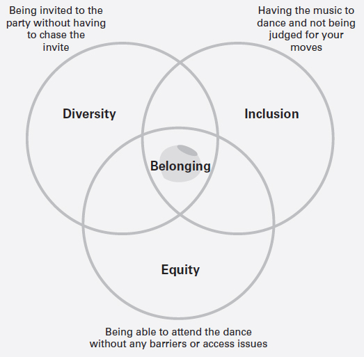

决定成为一名企业家是很容易的部分。当您试图招募员工并建立团队时，困难就出现了。
就我而言，我发现团队成长为社会企业家会带来一些独特的挑战。社会企业家的使命是推动变革朝着有利于社会的事业发展。然而，通常情况下，这项任务不会带来稳定的收入或捐款，因此很难雇用和支付员工工资。
在 LMF Network 之外，我正在建立自己的商业咨询公司，包括设计和举办关于领导力、创业精神和包容性工作场所文化的研讨会。 2020 年 3 月，我将我的咨询公司注册为有限公司，同月，LMF Network 成为社区利益公司 (CIC)。作为两者中唯一的永久员工，我教会了我所拥有的技能以及需要外包的技能。它训练我在邀请人们加入时考虑他们的需求，考虑他们想要什么，并深入思考他们如何增加价值。
发展团队就是让人们参与您的愿景，让他们能够增强并进一步发展它。
你的生意就是你的宝贝。放弃控制权并将任务委派给他人是一项挑战，在创始人故事中并不经常讨论这一点。我很难交出对社交媒体、时事通讯甚至研讨会的控制权。有时这是因为我认为我最了解。其他时候，是因为我没有把我的愿景完全传达给我的队友。有一次，一位团队成员给我发了最后通牒：要么我让他们拥有自主权，要么他们离开。
成为领导者并发展您的团队会带来许多艰难的教训。但是一旦学会了，它们就可以让您和您的企业更高效、更善解人意。

## 是时候壮大你的团队了

在我的创业之旅几个月后，我意识到我需要支持。您不仅是创始人 – 您还是自己的私人助理、营销经理、内容创建者、销售生成者、财务总监、品牌个性、网络营销人员、社交媒体策略师、运营助理和啦啦队长。
这是大量的角色和责任！您需要壮大您的团队，因为您正处于精疲力竭的边缘；你一天只有24小时。团队合作成就梦想。
您创业之旅的下一步是管理您的工作量，确定您的任务的优先级并委派其余的工作。您的团队需要相信您的愿景和使命，但最重要的是您。没有任何产品、服务或产出可以保证成功。成功之路需要对待团队中的每个成员，就好像他们和你一样关心业务——每个人都是你的利益相关者。
我不是告诉过你，创业狂是有方法的吗？

## 工作的未来：功能性和灵活性

有几种不同的方式来发展您的团队。我得到的最好建议是，一起工作是约会的延伸。双方都必须投入时间和精力使事情顺利进行——否则，不匹配可能会导致后果。
雇员是在相当长的一段时间内获得报酬并为企业工作的人。然而，如今，员工的固定性降低了，而是存在于更具延展性的工作场所中。弹性工作制使员工可以根据自己的需要和可交付成果调整工作时间。英国政府网站 (Gov.uk, nd) 概述了不同类型的灵活工作安排，包括：
角色共享——两个人做一份工作，分工。
远程工作——在雇主办公室以外的任何地方完成工作。
弹性工作时间——在“核心时间”左右工作所需的小时数，例如每天上午 10 点到下午 4 点。
Roleshare 的联合创始人索菲·斯莫尔伍德 (Sophie Smallwood) 大力倡导分享工作技能，以此推动多元化、幸福感和绩效。她告诉我，灵活的工作“允许平等机会，促进包容，并使人们能够实现可持续和充实的工作与生活的平衡”。
在我看来，2020 年证明灵活工作对企业是积极的，它允许企业雇佣更多国际化、多元化的劳动力，而不受地域和传统工作时间等因素的限制。有才华的人遍布世界各地。
在您开始发展您的团队之前，请花点时间了解为什么 - 为什么您需要他们，为什么他们应该与您合作以及为什么这将是业务的最佳步骤。

## 发展团队的七种方法
志愿者在您的企业或组织内工作，以换取技能分享和机会。技能共享是做你擅长的事情，以换取你本来必须支付的服务。这是一种双向交易，因此您需要的是自己缺乏的技能。对于 LMF 网络，我们可能会请一名志愿者来支持数字营销，以换取演讲技巧和简历写作方面的帮助。通常，志愿者专注于获得经验和他们将创造的影响。时间承诺通常由志愿者决定，应该受到尊重。对企业的好处包括了解新观点、获得支持和交易技能。
学徒受贵公司的合同聘用，被视为全职员工，享有带薪、退休金和年假等福利。他们将同时受雇和学习以获得外部专业资格。在雇用学徒时，确保他们被视为享有福利的团队成员。在英国，想要雇用学徒的企业需要获得政府计划的批准，并且必须确保他们遵守英国政府的建议 (Gov.uk, 2021) 的监管程序。作为一名企业家，您的好处包括获得一名新的团队成员、教给经验不足的人以及获得新的观点。
承包商或自由职业者是按固定期限或项目受雇的人。他们可能有投资组合的职业并拥有特定的技能。这些类型的角色可以通过联系您的网络，或使用诸如 Fiverr 或 Freelance UK 之类的网站来寻找自由职业者来填补。在大多数情况下，自由职业者按小时收费，平台会收取费用。对您的业务的好处包括与具有广泛经验的人合作，并且在大多数情况下，不需要额外的团队福利，例如保险。
全职员工是指在您的企业永久雇用直到他们辞职或被解雇的人。他们很可能已经申请了该职位，通过了正式的面试程序并获得了永久工作。与目前讨论的其他人员配置选择相比，全职员工需要更多的福利，包括养老金计划、医疗保健、法定病假工资和进步计划。对您的好处包括忠诚度、长期增长和委派能力。
我们将讨论的接下来两种类型的员工通常与小企业主有关，特别是如果您是独立企业家。
联合创始人头衔的存在是为了给予两个（或更多）一起创业的人同等的荣誉。他们可能从一开始就成为初创公司愿景的一部分，或者他们可能是由原始创始人很早就带来的。他们很可能是在您缺乏并需要支持的特定专业领域中表现出色的人。与其他员工不同，联合创始人有保证的股份或股权。在 LMF Network 成立之初，我发消息参加社交活动的朋友就是支持我推出这个想法的朋友。 Jui Joshi 和我一起上大学，有着相似的职业抱负，所以我知道她会相信这个愿景。她是一名连续创业者，并在全职工作期间成功创办了两家企业。在我们旅程的开始，Jui 是我认为的联合创始人；她支持所有的计划、战略和销售对话。随着我们作为社区和最终业务的发展，Jui 提升了她的联合创始人地位，担任顾问委员会主席。

顾问委员会为您的企业管理提供不具约束力的战略建议。与董事会相比，咨询委员会的非正式性质在结构和管理方面提供了更大的灵活性。寻找顾问的过程因企业而异。最佳实践会鼓励您对顾问的预期任务、预计的会议时间、参与决策的程度以及他们将从安排中获得的内容进行类似工作的描述。在大多数情况下，顾问委员会是一种无偿约束关系。
发展团队的最后一种方法恰好是发展我的商业模式、品牌和社区的最重要决定。
特许经营权被松散地定义为出租企业、品牌或名称。我使用“松散”这个词是因为传统的特许经营是一种通过合法合同来分配业务和建立品牌影响力的方法，该合同将双方的初始费用、版税和权利绑定在一起。然而，通过 LMF 网络，我帮助我们的多伦多分会创始人比尼什赛义德创建了一个特许经营权，合同是我写的，并由我们网络中的律师检查过。如果您想扩大业务，或者同样引入另一个人来经营自己的分支机构，那么值得考虑特许经营模式。特许经营的好处包括成为更大事物的一部分，体验企业家精神，同时得到已经存在的模型或品牌及其学习的支持，并且仍然能够行使创作自由。

### 我的团队成长经历
与任何事情一样，团队成长是一个学习过程。以下是我发展团队的三个例子。
发展顾问委员会
2019 年，我们发现可以通过由在业务增长方面更有经验的个人组成的顾问委员会来填补我们的技能差距。
采取了哪些措施？
通过我们的网络收集信息——最初，我在 LinkedIn 上联系了我的网络并阅读了在线容易获得的材料，以了解更多关于通常如何选择和构建顾问委员会的信息。
确定角色和创建职位描述——我改编了三个职位描述以适应我的业务需求，并在 LinkedIn 上分享这些内容，这是我接触最多的社交平台。除了支付旅行和费用外，这些角色没有任何报酬。所有角色的形成都是为了补充我的技能并为业务指明方向。
面试潜在候选人 - 一周内，我们收到了 30 份申请，远超预期！所有申请都经过筛选和面试。为确保流程公平，在 Google 文档中对访谈进行了总结，每位受访者在五个主要领域（热情、经验、专业知识、技能和社会责任感）上打分（满分 5 分）。
2019 年 9 月，我们宣布了我们的前三名顾问，他们与我们一起工作了 18 个月。

### 反思
我发现有一个顾问委员会很困难，因为有时我不确定要向他们发送什么。我觉得我给他们带来了负担，并专注于分享结果，而不是让他们参与建设工作。 2021 年底，我们的顾问委员会已经卸任，因为他们已经服务了 18 个月，是时候进行更新了。我采纳了他们的反馈意见，并以此来改善我与团队成员的关系。他们的建议很简单，“领导者必须沟通，安排定期会议，并有需要帮助的地方”。事后看来，我比应有的时间更早地成立了一个顾问委员会，因为我觉得被困住了。一旦您建立了业务基础并确定了他们可以支持的差距，最好考虑成立一个咨询委员会。

### 发展特许经营权

2019 年，Beenish Saeed 通过一位共同的朋友找到了我们。她表达了她对让社区国际化的兴趣。
采取了哪些措施？
介绍对话——一开始，比尼什和我会定期通过电话讨论我们的意图、想法和愿景。这是我们双方了解对方动机以及我们是否可以一起工作的练习。
与顾问委员会讨论——将计划和动机提交给顾问，他们能够提供他们的知识和专业知识，同时提出有时被兴奋的创始人忽视的相关问题。
合同创建和协议——因为我没有受过法律教育，我联系了网络的朋友并请求支持，以创建一份概述期望、条款和条件的合同。这是与比尼什共享的，以检查并同意。
2020 年 1 月，LMF Toronto 软启动，Beenish 作为我们在英国以外的第一个分会创始人领导了这项任务。自成立以来，Beenish 发展了品牌，招募了志愿者，与 Catalyst 和 General Assembly 等公司合作，并监督了我们第一个大学社团 LMF Queen's 的成立。 LMF 女王大学协会由化学系学生 Shanzeh Chaudry 创立，她希望弥合女性学习 STEM 与学生如何进入企业界之间的知识差距。她分享说，“随着我们的大学生活和常态被 COVID-19 打乱，与其他学生联系和互动的需求变得更加明显。 LMF 提供了一个榜样社区、围绕职业选择的教育以及让事情变得更好的灵感。我希望为我在皇后大学的同龄人提供同样的机会。

### 反思

我认为运行特许经营模式会一帆风顺。 然而，我没有考虑的是如何解决冲突，在业务发展如此之快的情况下保持透明并保持动力。 在很多情况下，比尼什和我有不同的看法。 作为创始人，我认为我有权做出决定。 然而，考虑到我们的价值观是在考虑社区和合作的情况下形成的，我不得不远离我的自我并邀请另一种意见。 比尼什充满激情，补充了我的技能，并拥有我所不具备的地理知识。 特许经营的小型企业必须为初期阶段的品牌资产、标识、沟通方式和服务的讨论做好准备。 例如，当 LMF Toronto 逐渐发展为举办多元化研讨会时，我们是时候回到合同并进行修正了。

### 志愿者的成长

一旦我们决定将网络作为一家社会企业推出，就该扩大团队了。根据过去与志愿者合作的经验，我发现志愿者或实习生在前往新牧场之前的最佳停留时间是三个月。这个时间段来自于对我们组织工作的分析，特别是因为许多人在工作中进行技能交换或学习新技能。
采取了哪些措施？
确定角色并创建职位描述——对于每个支持领域，包括营销、项目管理和运营，我研究了市场上可用的典型职位描述，并对其进行了调整以适应我们的业务需求。对于每个人来说，这些不过是几句话。我们通过电子邮件地址在 LinkedIn、Instagram 和 Twitter 上分享了这些机会。
面试潜在的志愿者——一天之内，我们通过电子邮件收到了 30 份附有简历的申请。我通过我们的 Calendly 链接安排了面试时间，并与潜在的候选人分享了这些预约。
灵活的合同和价值建立——在三周的时间里，我与 30 多人交谈，了解他们的动机，建立联系并询问我们如何在金钱之外补偿他们。
2021 年初，我们招收了三名实习生，分别负责运营、营销和公关。尽管没有即时资金，我还是能够用最低工资补偿他们的时间，并支持他们实现我们商定的目标。

### 反思

邀请志愿者和实习生加入这个行业是非常有益的。我已经能够从新的观点和做事的方式中学习，同时让志愿者能够实现他们的目标。然而，我没有考虑的领域包括严格的入职会议、绩效评估和定期追赶。入职是至关重要的，因为它提供了对业务的共同理解、对其他团队成员的介绍以及对所用软件或工具的邀请。在某人的工作生涯开始时定期跟踪他们的信心和能力，可以让您看到他们的进步或缺乏进步。
技能共享和技能交换是未来工作的核心，因为它们允许个人在承诺之前测试这是否是他们真正想做的事情。例如，一名志愿者介入管理我们的网站。三个月后，她意识到她讨厌在网站和用户体验设计方面工作，但喜欢内容创作。这种新发现的热情使她从技术转向电影制作和设计。
运营团队还需要保持动力、管理进度并专注于您的愿景。有时这不会发生，或者您的团队成员的输出不会令人满意。管理困难的对话是每个领导者都必须学习的技能。
作为创始人，我记得让我的情绪驱动对话，而不是逻辑。在处理困难的对话时，重要的是要了解您的理想结果是什么，对数据点或证据持开放态度，并启用双向对话。尤其是当团队成员经验不足时，值得考虑的是，他们可能需要更多时间来吸收和剖析信息、反馈或疑虑。
Huckletree 的创始人加布里埃拉·赫沙姆 (Gabriela Hersham) 在 Instagram 直播中告诉我，在 Covid-19 大流行期间，她不得不“将团队规模减少 50%”，因此对话“非常困难且非常坦率”。创业是一条坎坷的道路——在不那么好的时候，“领导者自己有责任以坦诚、透明的方式分享坏消息”。 Gabriela 继续分享她的经验，她很乐意将高影响力的任务委派给其他团队成员，因为她确信我们在业务愿景和价值观方面都是一致的，这些价值观将指导我们如何到达那里。当你有高度的一致性时，你不需要指导你的团队成员到某个点——你提供尽可能多的背景，但你授权他们，作为他们领域的专家，做出所有关键决策。

| 未来 18 个月的目标             | 你能做什么/你有什么？ | 你需要/不能做什么                    | 总结成技能                     | 我们需要谁？       |
| ------------------------------ | --------------------- | ------------------------------------ | ------------------------------ | ------------------ |
| 获得 2 万英镑的慈善资金        | 人际网络 访问资金门户 | 申请时间授予写作背景                 | 资助写作筹款 术语理解          | 筹款助理或赠款作家 |
| 虚拟设计和提供四种生活技能课程 | 了解想要的主题        | 是时候组织活动、发送通讯和跟进营销了 | 虚拟活动的运营项目管理营销经验 | 活动和运营主管     |

## 你的团队能找到你吗？
现在您已经确定了您要找的人以及原因，是时候制作招聘广告了。作为新的企业主，您很可能没有资源与顶级招聘公司合作或增加职位。我不认为它们是必要的。传统的就业途径不再是当今唯一可用的途径。为了确保多样化的申请、同事和团队，我们必须确保我们的招聘实践也是多样化、包容和公平的。
波士顿咨询集团在 2018 年进行的一项研究发现，多元化的团队可以将公司盈利能力提高 19%（Lorenzo 等人，2018 年）。 McKinsey & Company 在 2018 年分享了类似的结果，他们表示多元化的团队可以将生产力提高 33%（Hunt 等，2018）。如果其他原因都没有引起共鸣，那么这些研究从纯粹的财务角度来看具有令人信服的证据。在创业者开展和发展业务时，多样性需要成为他们的首要考虑因素。
找到您的团队的一些方法包括：
联系您的网络；
在不同的社区平台或社交媒体上分享招聘信息；
与大学和教育机构合作；
与加速器/孵化器计划合作或参与其中。

### 良好的工作描述对于优秀的团队成员至关重要
职位描述描述了该职位的任务、期望和职责。这既是为了公司的利益，也是为了您未来的同事。研究表明，较短的职位描述收到的申请要多 8.4%，大多数人会花 14 秒来决定是否要申请（迈凯轮，2019 年）。

#### 如何写一份工作描述

工作描述没有对错之分，只有清晰或混乱。
让我们做一个好的工作描述：
介绍业务 - 业务的简短摘要，概述您的故事、成功和未来计划。
工作总结——用几句话来总结这个角色的要求、期望和未来的范围。
工作职责——将这些职责保持在最多五个，并用明确的可交付成果进行清晰概述。
工作资格 - 将这些限制在最多 5 分，并且仅限于您绝对需要的东西，而不是那些很好的东西。
好处——列出企业提供的服务的几句话或要点，例如远程工作、技术访问、技能分享、午餐等。
联系信息——清晰的链接，指向如何申请以及在哪里可以找到更多信息，以及指向您的社交平台的链接。
后续步骤 - 分享预期的回复时间、面试进行的时间以及某人对流程的期望。
职位描述中的所有语言都应不分性别，邀请任何人申请。性别术语是语言的一部分，经过巧妙的性别编码；社会对男人和女人的样子有一定的期望，这渗透到我们使用的语言中。这会对申请动机、感兴趣的候选人数量产生负面影响，并限制了包容性。一些性别术语包括“专横”、“支配性”或“竞争性”。我的建议是检查你的工作；在任何工作描述外出之前，让您的团队成为第二双眼睛，并使用 Grammarly 等在线插件工具获得额外支持。

### 您如何筛选候选人并进行面试？
面试和筛选候选人的任务可能会让人筋疲力尽。请记住在分配的时间范围内安排面试，使用 Google 表格等免费工具做笔记，并使用记分卡进行面试。记住，公司是人。围绕您的商业价值提出问题，以了解潜在候选人是否与您更广阔的视野保持一致。
我经常发现组织想要招聘适合文化的人，希望有人能顺利地与现有同事合并。但是，这种方法会影响您雇用外观和感觉相同的人，从而限制团队中观点和经验的多样性。
您可以采取哪些措施来确保公平招聘？
准备一致的评估 - 无意识偏见是对特定人群的社会信念，人们在没有意识到的情况下形成。例如，与有经验但没有学位的候选人相比，更青睐拥有学士学位但没有经验的候选人。或者，假设一个女人想要孩子，尤其是在订婚或结婚的时候。或者，有“英文”名字的人比没有名字的人更有可能了解市场并表现得更好。确保作为面试官，您的判断是公平的，提出相同的问题并消除无意识的偏见。
留出时间提问——邀请候选人询问更多关于业务、角色和未来的信息。
邀请不同的面试官加入——如果你的企业已经有一个顾问委员会、同事或合作伙伴，问问他们是否可以和你一起参加面试，或者谈谈你认为合适的筛选候选人。
反馈 – 跟进电子邮件和后续步骤。即使有人无法通过下一轮，也要向他们发送反馈。考虑花在申请和研究面试上的时间——你至少可以确保获得公平的反馈。这将确保您以良好的条件离开对话并支持某人的发展。
作为小企业主，您没有时间对每个人进行多次面试，尤其是当您招聘的职位是自愿或短期职位时。我建议坚持在短时间内进行两轮面试。

## 为什么多元化和包容性招聘对发展您的业务和团队很重要？
多样性和包容性认识到人们是不同的，他们的经历是独一无二的。 这对于让人们茁壮成长很重要，而无需遵循或改变他们的身份。
Netflix 多元化和包容性负责人 Verna Myers 有句名言：“多元化正在被邀请参加聚会。 包容被要求跳舞”（Sherbin 和 Rashid，2017 年）。
图 6.1 建立在她的工作基础上，我对其进行了进一步的开发：
多样性正在被“邀请参加聚会”。
包容是“有音乐跳舞”。
公平是“能够无障碍地跳舞”。
这三大支柱为归属感奠定了坚实的基础，并有助于营造健康的工作环境。

三个相交圆圈的维恩图代表多样性，被邀请参加聚会而不必追逐邀请； 包容，让音乐跳舞，而不是评判你的动作和公平，能够在没有任何障碍或访问问题的情况下参加舞蹈。 所有三个圆圈的交点代表归属感。

作为一名公司员工，我感到不幸的是我不属于自己。我什至在合同到期前离开了两个雇主。我带着很高的期望进入工作场所，但对他们对员工缺乏投资感到沮丧。此外，围绕多样性和包容性的教育是有限的。
为了了解有关多样性和包容性的知识，LMF 网络进行了研究，并于 2021 年发布了初步报告（Khan 和 Barlow，2021 年）。我们发现“不到 50% 的人知道多样性和包容性如何影响他们的日常生活”，并且“78% 的员工认为他们公司的多样性和包容性举措只是为了满足需求，而不是创造真正的改变”。
从根本上建立纯粹的实践对您的整个企业来说是必不可少的。我经常使用的一个比喻是“请确保您的房子地基牢固，然后再请其他人喝茶”。如果您想更多地了解业务中的多样性、包容性和公平性，请随时与我联系或通过我的网站与我联系，我有更多可用资源。

## 发展业务和团队时要考虑的五件事

以下是一些需要考虑的其他事项：
在壮大您的团队时，请记住所有实践都应符合合同并遵守可交付成果。
绩效评估应定期进行，并围绕薪水、职责和进展进行讨论。
实习生和志愿者的短期轮换工作比长期工作更好，并鼓励不断发展的角色和提高技能。
定期分享业务更新并邀请员工参与讨论。如果您发送订单但不允许公开交流，这可能会令人沮丧。
如果感觉不对，或者您觉得自己没有尽最大努力，请不要害怕暂停招聘。
如果您在本章涵盖的任何领域中遇到困难，请向您的社区求助。请随时与我联系，我可以邀请您加入 LMF Network Slack 社区。
移交对您的业务的控制权可能是一项艰巨的任务，但您必须考虑。企业主认为他们可以与他们的业务互换——这不是真的，无论是你的第一个还是第五个业务。壮大我的团队一直是我业务中最好的事情。我受到了挑战，改变了观点，并加入了将我的愿景视为自己的延伸的团队成员。给团队成员时间探索所有选项，并邀请他们提出自己的观点。如果您能够真正投资于他们的学习、潜力和领导力，您的团队将会创造奇迹。

#### 案例研究比尼什赛义德
比尼什·赛义德（Beenish Saeed）是巴基斯坦作家、屡获殊荣的演讲者和 LMF 多伦多的特许经营创始人。她于 2019 年底创立了该分会，并于 2020 年初作为 LMF Network 在英国以外的第一分会启动。比尼什在欧洲、北美和亚洲的八个城市生活和工作，推动了她在社会、技术和法律方面的工作。
您为什么决定在多伦多推出 LMF？
我一直认为包容是一种增长策略。这种信念推动了 LMF 在多伦多的启动，因为我看到作为第一代移民的加拿大社会经济问题有两个方面：对于一个以其自由移民政策而自豪的国家，加拿大需要为自己的工作做很多工作市场。每年约有 300,000 名新移民移居加拿大，主要是通过技术工作和教育流。由于缺乏“加拿大”工作经验，他们大多失业。随着人口老龄化，如果没有为新移民提供足够的就业支持，加拿大未来可能会面临巨额移民债务。其次，对于 30 岁以下的居民来说，在他们所培训的领域积累经验是一项艰巨的任务，以寻求就业。 LMF Toronto 专注于提供网络以建立正确的联系，学习制胜技能以缩短求职过程的时间，并让个人获得真实的加拿大工作经验。
远程与团队合作是否很困难，如果是，您采取了什么措施来克服这些挑战？
远程工作使我们能够快速失败并快速学习，从而得出一个简单的公式：
多种技术选择 + 情感支持和鼓励 = 快乐的远程团队

我本可以在公式中提到“成功”而不是“快乐”，但团队的快乐对我来说是第一位的，尤其是当你在有意识地合作推进边缘化社区的事业时。我们使用电子邮件、电话、短信和 Slack 消息来组织我们的会议并保持联系。我们多说话，多寻求帮助，像一群朋友一样行事，因为我们都是企业家。随着我们的成长，我计划纳入幸福指标以了解我们团队的幸福感并为我们所有人制定薪酬计划。支持性参与在激励我们合作开展全球活动和设计经济有效的技能研讨会方面大有帮助。
您是如何为您的企业寻找、招募和留住团队成员的？
LMF Toronto 在成立之初是一个精益组织，因为它由我领导。仅仅两个月后，我就举办了我们的第一个 LinkedIn 成功研讨会，该研讨会吸引了大约 2,000 名与会者，并成为我们最成功的活动之一。通过这个单一的研讨会将我们的足迹扩展到近 200 个北美城市是一个里程碑。暖心的消息和 LinkedIn 的请求很棒，但让我感到高兴的是，我收到了三位很棒的女性的电子邮件，她们受到鼓舞加入我。这些女性成为了我们的第一批 LMF 多伦多志愿者。
留住团队是倾听、学习和领导的结合。倾听他们想要什么以及如何帮助他们；了解他们为业务带来的各种观点，并战略性地领导业务（和团队）以满足我们的 KPI。
我们的流程不是正式的，而是结构化的。团队拥有创作自由，因此，我很享受我们的创业精神和冒险精神。我们花时间相互理解，并以诚实和鼓励的方式相互包容。我们相信维持我们的关系是一场马拉松而不是短跑。我们对整合（而不是隔离）的共同兴趣非常令人信服，我可以自豪地说，我信任他们并没有错。

您发现扩大和建立一个试图在不同地点建立自己的品牌有哪些好处？
在多伦多建立和发展 LMF 一直是实验性的、复杂的，甚至令人沮丧，但在不同地点实现可重复性的动力有助于我们利用学习曲线效应。与多伦多相比，伦敦有数百家公司提供积极的在职培训和包容计划。我们很快就明白，虽然包容性在多伦多并不是一个禁忌话题，但它被大多数企业视为成本中心，除了与加拿大企业有广泛联系的传统非营利组织。多伦多的高增长创业公司还有很长的路要走。
耐克的例子从鞋类扩展到球类、设备和高尔夫服装，在国内很受欢迎。我们已经改变了我们核心章节的方法，以达到可重复性的最佳公式。我们还分析了接触大量需要职业帮助的人的最佳途径，因此通过一次改变一件事，我们采取了邻接行动，以增加我们的足迹，而不会给整个集体带来压力。我们正在创建一个新的 CEO School 系列，以培训下一代 C 级高管，以便与不同的消费者社区进行有效沟通，并熟悉谈论不断变化的文化人口统计数据。我们也处于独特的地位，可以在像多伦多这样的国际大都市进行针对移民的研究，因为我们的移民心态运动得到了积极的支持，这些运动受到古巴裔美国企业家、演讲者和畅销书作家 Glenn Llopis 的极大启发。随着我们改进这一点，在我们在加拿大社区的代言人的帮助下，我们的速度和战略清晰度将提高

## 事后的总结

与比尼什一起工作并发展团队使我成为更好的领导者，因为我明白分担工作量、寻求帮助和寻求新观点的重要性。最初，当我启动 LMF Network 时，所有重大决策都由我决定。它限制了我们的进步。 Benish 加入球队促使我做出改变。比尼什领导了几项在英国不可用的新服务，我不得不相信她最了解什么适合她的市场。起初我是防御性的，但很快意识到包容对所有垂直行业都很重要。最终，我开始意识到我必须指明方向并相信我的同事会带路。如果团队没有壮大，企业就不会蓬勃发展。是的，放弃控制很难，但没有回报就没有风险。