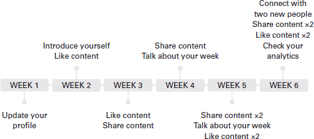

我经常被告知我有一个令人难忘的存在。 20 年来，我在课堂上、在商店的互动或我们曾经的谈话中遇到过记得我的人。我的性格一直是快乐、活泼和有竞争力的。我是那种会挑战自己的人，看看我是否可以实现某事，只是看看它是否可能。然而，在大学和我最初的几份公司工作之间的某个时间里，我失去了自我意识，适应了别人对我的看法。我变得不确定自己，缺乏身份感。
一旦我离开企业界开始我的事业，我意识到我可以自由地做我自己并探索我自己的领导风格。我还意识到，我之前在我周围看到的领导风格并不适合我的个性——它们并没有激励我变得更好或更努力地工作。我基本上只是为了薪水而出现。我有一些领导者没有激励我，告诉我尽管雇用了我但我还不够好，并且不断地放下我的想法，只是在会议上重新提出他们的想法。
自从成为我业务的领导者以来，我接受了自己的个性，并不断努力每天变得更好。我要求我的同事挑战我，让团队参与战略讨论并定期发送更新，以便他们了解幕后发生的事情。我的事业蓬勃发展的原因是我让自己变得真实。我分享好的、坏的和丑陋的，以及胜利和斗争。我坚信人们会买进人。问题是——你是谁？
这个问题将帮助您成为一名更好的领导者，并将教您如何接受领导力的三个 P：人、权力和目标。我们将确定如何克服冒名顶替综合症，并使用 LinkedIn 作为我们的首选工具在线建立您的品牌。

## 什么是领导力？

在 2020 年的 Medium 文章中，作者 Jacob Morgan 写道，他采访了多位领导者，询问他们对“领导力”的定义。在大多数情况下，迎接他的是尴尬的停顿。他引用了雅虎前首席执行官 Marissa Mayer 的话说，她的定义是“领导力有助于相信比今天更美好的明天或更好的结果”，而万事达卡首席执行官 Ajay Banga 则建议“领导者”是能够进行战略思考，简化战略，以便组织中的每个人都能理解它并以简单、热情和关怀的方式传达该战略的人。”对我来说，成为领导者并不一定要有直接下属。成为企业的领导者就是成为企业发展的公共驱动力，成为企业的代言人和体现企业愿景的人。当您的团队成长时，成为领导者也是您指导他人为该使命服务的方式，但您不必拥有员工来确保您的老板地位！
在南亚文化中长大，领导力通常与年长的人联系在一起。我从来没有被告知领导者必须具备哪些特征，但那些年长的人会自动获得一个头衔：“阿姨”或“叔叔”或“bhai”或“baji”，意思是兄弟或姐妹，应该受到尊重。这意味着没有回应，没有眼神交流，也没有直呼他们的名字。要尊重领导者，不能挑战他们的观点，而只需说“jee”（是）然后走开。
以这种方式长大，我最初发现很难在公司环境中提出疑虑或与高级利益相关者进行激烈的对话。我经常低头看他们的衣领，而不是看着他们的眼睛，这并没有让我看起来很自信，尽管这是对我出身的尊重的表现。
事后看来，正是这些领导者变成了糟糕的管理者，他们没有跨文化知识，也不知道如何激励员工。一个优秀的领导者会积极主动地自我指导以改善他们的员工，以组织的宗旨激励他人，并了解他们的员工来自哪里。自从经营我的初创公司并成为自己的老板以来，我将领导力与年龄或经验分开，并将其定义为指导、影响和激励他人的能力。

## 你是什么类型的领导？
决定您想成为哪种领导者的第一步是确定影响您生活的领导者。
2021 年，当我回顾过去的一年时，我在 LinkedIn 上写了一篇博客，标题是“不良的氛围不会带来健康的生活”。我认为，我在糟糕领导下的经历是我成为一名优秀领导者的动力。糟糕的领导可能是那些不鼓励或增强你的优势、经常让你失望或不让你成长的人。相比之下，我的许多成功都是因为优秀的领导者支持我。这些领导者是真正的盟友，他们努力确保他们的社会权力可以帮助我在可能的情况下提升我的地位。我定义了积极的领导特质，比如同理心、诚实和支持，受到老师、主管和朋友的启发。
成为领导者时，自我反省是一个关键特征。它可能意味着简单领导的领导者与影响、鼓励和激励他人相信他们的使命的领导者之间的区别。
四种类型的领导人格
你认为自己有竞争力还是富有同情心？有影响力的人还是容易受到影响的人？在进入领导风格之前，让我们花点时间了解一下我们与生俱来的个性风格。
个性风格是个人在不同背景下的一致特征和偏好。您的个性是您自己独有的动态个人特征和行为模式。
最著名的企业性格风格测试之一是 DiSC (DiSC nd)。
DiSC® 是一种个人评估工具，用于改善团队合作、沟通和生产力。它改编自威廉·莫尔顿·马斯顿 (William Moulton Marston) 于 1928 年创建的概念。 根据他的研究，马斯顿使用四个标签对一个人对自我与环境关系的看法进行了分类：
支配（D）——直接、支配、驱动、意志坚强。
诱导（I）——影响、互动、活泼、健谈。
服从（S）——稳定、包容、体贴、耐心。
遵从 (C) – 谨慎、纪律严明、批判、质疑。
虽然这种测试风格已被证明从长远来看不是具有代表性的评估，但随着人们的风格和个性随着时间的推移而适应，它确实可以让您了解您的基本个性特征。自 1928 年构思以来，该模型已得到重新审视和发展。
当我为领导者或有抱负的领导者举办研讨会和培训时，我会要求他们花点时间反思这些类别，并确定他们认为最适合的领域。这是一种直觉反应，而不是经过认证的测试结果。
使用您的直觉，在以下情况下，哪个 DISC 特征在您的决策中具有优先权？
您正在与国际地点的客户重新谈判您的合同。
您的团队成员在您的日历中安排了一次会议来讨论晋升和薪酬问题。
您的同事表示，尽管这是他们日常工作的重要组成部分，但由于高度焦虑，他们在社交媒体上遇到了困难。
答案或您作为领导者的方法没有对错。作为一名企业家，在不知不觉中您将被视为领导者，因此了解您想积极成为什么样的领导者非常重要。了解您的领导风格的一种方法是向您的同事、朋友和业务合作伙伴询问他们可能提供的任何反馈。 360 度反馈是从许多人那里收集的反馈，以提供有关您是谁以及他人如何看待您的整体视图。收到此反馈后，请花点时间反思信息并确定需要继续改进的领域。将此反馈与您的业务目标保持一致，优先考虑您的领导风格并发展您的业务！

## 领导者是天生的还是后天培养的？
学术界的 ResearchGate (2017) 讨论得出的结论是，没有唯一的答案。 Kirkpatrick 和 Locke (1991) 认为“仅拥有某些特质并不能保证领导力的成功”，但有证据表明有效的领导者在某些关键方面与其他人不同。他们发现，关键的领导者特质包括：“驱动力、动力、诚实、认知能力；和业务知识”。另一方面，Black 等人 (1999) 的研究表明“领导者是天生的，然后被塑造”。根据他们的调查结果，他们指出，您作为领导者的影响力和能力来自“有能力和兴趣；一个总是在开拓前沿、挑战现状并展示更大图景的人。”
你周围可能有一些人，包括你自己，他们自然会更自在地领导、影响和分享。在我看来，这仅意味着您拥有成为一名优秀领导者所需的基础。经营自己的企业，建立品牌后，我认为每个人都应该参加领导力培训，领导者不应该没有培训就升职，领导力培训模块应该在学校进行。我们从小就成为领导者并调整我们的风格，很遗憾我们没有培养这些技能。
以下是我在我周围看到的六种领导风格：
权威的领导者强加期望并定义结果。这种领导风格侧重于规则、流程和结构。虽然这是一种有效的领导风格，可以减少关键决策的时间并强调指挥链，但它也会限制创造力和协作。

参与式领导植根于将人们聚集在一起做出集体决定。这种领导风格更喜欢让团队成员参与所有决策，因此，团队通常更强大，更有动力。然而，这也可能意味着决策过程本身很耗时，可能会延迟结果。
委派型领导者专注于将计划和任务委派给团队成员。这种领导风格更喜欢建立团队创造力并利用经验。然而，这种风格在适应变化时也会带来困难，并在创建清晰的指挥和沟通结构时带来额外的工作层。
交易型领导者是一个被视为提供给予和接受的人。这种领导风格制定了可实现的特定时限目标，创建了清晰的沟通链并鼓励员工选择奖励制度。然而，这种风格也会限制创新，并被视为将员工视为追随者，而不是提高他们的领导素质。
变革型领导者是用愿景激励追随者或社区并赋予他们实现愿景的领导者。这种领导风格侧重于高度重视愿景，通过激励追随者利用他们过去的经验来获得他们的信任，并鼓励他们的投入。然而，这种风格也可能偏离协议，需要同事或社区的一致反馈。
教练领导者是识别每个成员的个人优势并培养他们的人。这种领导风格侧重于使他们的团队能够更好地单独和协同工作的策略。这可以通过使技能与任务保持一致、确保成员的多样性以相互补充和不断的反馈来实现。但是，这种风格也可能非常耗时，难以管理，尤其是在您快速增长的情况下，并且可能意味着在某些时候，业务中不再需要某些技能。
您的领导风格将根据您的情况和情况进行调整和转变。考虑到他们的个性和沟通方式，有些人会发现领导更容易；其他人可能会因为自己的保留而回避任务。
OMD 的首席客户官 Jess Roberts 将领导者定义为“能够让他人做到最好的人，能够释放每个人的潜力。一个有同理心、善于倾听并能够建立多元化的高绩效团队来创造价值的人。” Jess 领导着欧洲、中东和非洲地区的数百人，并处理与商业客户的关系。我问她管理远程团队的领导者如何授权其他人做到最好，她回答说“找到方法让他们发声，而不依赖于他们在 Zoom 电话中发言，分享内容以供人们自己的反馈为一对一对话创造更多空间来获得他们的观点”。在全职工作期间开始了我的激情项目，我直接了解企业如何不准备支持他们的员工提出创业想法，这可能会导致优秀人才流失。 Jess 回应了这种观点并解释说，在她看来，“我们为人们的成长创造空间很重要，这包括支持副业，这通常是他们热衷的领域。让人们在工作周有时间远离电子邮件和会议，将时间花在个人发展和成长上。如果组织能够支持副业并鼓励同事追随他们的商业梦想，那么帮助组织培养这个人的技能和优势只会使组织受益，这将不可避免地转化为办公环境。”杰斯的评论回应我自己的想法——领导力不是在特定情况下提供某种回应，而是微调你真正的优势，以激励、激励和赋予他人权力。作为一名企业家，就像一名经理，你没有一本关于如何成为一名优秀领导者的手册。这是一个迭代过程，随着您的构建而发展。

## 了解您的团队成员
作为领导者，我收到的最好的建议之一就是创建备忘单。
一位领先的初创公司创始人分享说，每次她有新加入者时，她都会要求他们创建一个简短的“工作方式”文档，可以与其他团队成员共享。这让这个特定的人感到参与，同时使领导者能够最好地激励他们的团队。
这是一个示例版本：

>我的名字是 _____
>我认定为_____
>我的核心工作时间是_____
>我更喜欢以下列方式工作：
>
>_____
>
>_____
>
>_____
>
>给我发送电子邮件时，我更喜欢以下_____
>在争取截止日期时，请注明_____
>如果你看到我 _____ 请知道我实际上是 _____
>如果您想讨论除此之外的工作方式，请通过_____ 直接与我联系，我的工作时间是_____，我更喜欢将_____ 分钟的会议直接安排在我的日历中，并有明确的议程要点。

有时您可能会怀疑自己和自己的能力。这个练习非常适合你确定你如何工作得最好，哪种工作环境可以促进你的成长，以及如何最好地利用你的时间。与您的同事沟通以确保您了解如何最好地支持他们，这可能是一种人们可以茁壮成长的创造性和包容性文化，或者一种人们受苦的文化。
领导者并不意味着一切都在掌控之中，而是可以找到创造影响力和效率的方法。有时您可能会感到沮丧或怀疑自己的领导能力，但这是很自然的。

## 你有没有觉得自己配不上金星？
在小学，如果学生做对了事情、为课堂做出贡献或表现出主动性，他们通常会获得金星作为奖励。金星很容易被认为是对做“正确”事情的奖励。然而，随着时间的推移，我们似乎开始感觉到我们不配拥有这些金星。
今天，我们中的许多人都有认为自己不配获得荣誉的时刻。您可能会说服自己，甚至不是您完成了任务，或者您不应该获得全部荣誉。
在我创业的头两年里，我一直觉得自己像个冒名顶替者。当我被授予奖项时，我会列出其他五个更应得的人；当有人来参加我的研讨会时，我会感到震惊，认为没有人会感兴趣。 LMF 网络社区是从我的一个想法发展而来的，但有时我必须提醒自己，这个想法是我自己的。其他人提供的认可永远不足以与您需要的认可相匹配。
当我的出版商确认这本书被批准时，每次我坐下来写作时，我都觉得自己像个冒名顶替者。我意识到我在努力成为另一个人——我不是作家，他们不想要作家——他们想要一个有生活经验的真人来分享他们的故事。如果你觉得自己像个冒名顶替者，那么你就是一个很好的伙伴。一些最聪明的人也是如此——多达 70% 的人在某个时候经历过类似冒名顶替的感觉（Sakulku 和 Alexander，2011）。

## 什么是冒名顶替综合症？
冒名顶替综合症是指您因为运气而不是资格而获得成功或获得条纹的想法。这个概念最初是由心理学家 Pauline Rose Clance 和 Suzanne Imes 在 1978 年发现的（Templar，2021）。这是一种不够的感觉，感觉自己什么都没有取得，并不断怀疑自己。一个例子是，当你面试了一个工作角色并进入了第三轮，协商了你的薪水，但在第一周内，你仍然认为你不应该被录用，因为你周围的人更聪明，更有能力或更合格。
当您感觉自己像个冒名顶替者时，您可能会想到的一些事情：
我不认为我配得上我所获得的成功。
我感觉像个骗子。
我觉得很难接受赞美。

### 冒名顶替综合症的五种类型

完美主义者为自己设定了过高的目标，当他们达不到这些目标时，他们会经历自我怀疑和担忧。这种类型的冒名顶替者也可以更具控制力，并且倾向于自己执行任务。这种冒名顶替者必须学会从容应对错误。从来没有一个“完美的时间”开始你的工作，错误是不可避免的。
超人觉得与同事或同行相比，他们更小，因此更努力地工作以达到标准。这可能意味着在办公室呆得更久，在一天中的奇数时间查看电子邮件或被视为工作狂。这种冒名顶替者必须学会赞美自己而不是寻求外部认可，培养内在的信心并建设性地而非针对个人地接受批评。
天生的天才觉得他们天生擅长某事，所以如果某件事需要更长的时间才能掌握，就会引起不良情绪。这种类型的冒名顶替者设定了很高的标准，然后根据完成任务的尝试次数来判断自己。这种冒名顶替者必须学会将自己视为正在进行中的工作，磨练有影响力的技能并将任务重新调整为优势。
独奏者是宁愿自己完成任务的人，因为寻求帮助可能会导致必须证明自己的价值或被发现是骗子。这种类型的冒名顶替者认为他们可以独自完成所有事情。这种冒名顶替的人必须学会在这个过程中包括人，并学会寻求帮助是可以的。
专家是根据他们知道或可以做什么和多少来衡量他们能力的人。这种类型的冒名顶替者认为他们永远不会知道足够多，因此害怕被暴露为不知情。这种冒名顶替者必须学会在需要时学习技能而不是囤积知识，提醒自己任务会发生变化，所需的特征也会发生变化，并且可以承担额外的责任，例如指导或志愿服务，与他人分享知识并学习.
无论你认为如何定义你，在自信中挣扎是一种我相信每个人在他们的生活中至少经历过一次的感觉——所以你并不孤单。
Mamta Gera 是一位领导力教练和顾问，她已经在她的许多客户身上发现了冒名顶替综合症，并与他们合作克服了它。 Mamta 认为“冒名顶替综合症的影响是巨大的”。它阻止领导者申请晋升、在会议上发言和做出积极的改变（例如换工作或开办新企业）。”Mamta 认为管理这些的第一步是“有自我意识”。了解您可能患有的冒名顶替综合症的类型以及触发它的情况很重要。一旦你意识到，你就可以改变和管理它。这可以通过自我疏远和富有表现力的写作等技巧，或者寻求进一步的帮助，例如指导。 指导是一种实践，其中更有经验或训练有素的专业人士支持您提高表现。认识到冒名顶替综合症对她的客户的影响后，Mamta 创建了一个关于 Skillshare 的全球课程，以积极影响尽可能多的人并帮助他们发挥潜力。

### 克服冒名顶替综合症的三个S

作为领导者，人们正在向您寻求建议、重点和方向。这并不意味着你不能有糟糕的日子。
如果我们大多数人都觉得自己像冒名顶替者，我们该如何解决？
2019 年是我战略性地跨越它并挑战自己成长的一年。然而，我说是的次数越多，我的生活就越嘈杂。据我的导师说，我对所有事情都说“是”，而我的个人使命却被淡化了。作为这次谈话的结果，我开发了三个 S——一个简单而有效的方法来重新调整你的优势和技能，并提醒你你所创造的影响。

> 练习
> 技能或优势——技能和优势——写下你认为自己拥有的所有技能和优势的清单。
> 成功故事——对于确定的每个特征，记下你成功使用这项技能或力量的故事。
> 所以呢？ – 对于每个成功故事，记下它的影响或由它驱动的结果。
> 我鼓励你定期做这个练习。不断更新此文档并将其视为您的个人简历或跟踪器。当您心情不好时，或者在参加商务会议之前需要来接我时，请参考此文档！ 

## 在线打造您的老板品牌
是时候使用所有这些信息来建立您的品牌了。在前面的章节中，我们讨论了您企业的品牌塑造。现在是你的品牌——老板！
您的个人品牌是使您成为自己的技能和经验的组合。这是你展示自己的方式，是什么让你与众不同，以及为什么有人应该信任你。亚马逊的创始人杰夫·贝佐斯 (Jeff Bezos) 曾说过一句著名的话，那就是你的个人品牌是“当你不在房间里时人们对你的评价”。
记住，人们买进人。为了发展您的业务、您的品牌以及您作为领导者的身份，您必须在线上和线下一样像老板一样。
选择您的主要平台
谈到您的个人品牌，我会推荐以下渠道：LinkedIn、Instagram 或 Twitter。这些平台中的每一个都可以根据您的服务或产品提升您的品牌并分享您的商业故事。我将专注于使用 LinkedIn 建立您的个人品牌，但您可以将以下指南用于任何社交媒体工具。

#### 确定个人品牌的目标

在进入建筑业并成为老板之前，让我们记住为什么你应该做这个练习。您的个人品牌最初应用于以下四个目标之一：
创造收入——创造更多客户、获得新关系或寻找机会。
寻找朋友和社区——建立关系或发展你的网络。
教育或学习——学习新技能、获得新观点或教育自己。
被视为专家或思想领袖——分享知识并教育他人。
我的建议是在网上建立你的老板地位时坚持一两个目标。

### 如何通过 LinkedIn 取得成功
我不是 LinkedIn 的品牌大使或影响者（尽管如果他们的团队正在阅读这篇文章，请随时给我留言），但我已经看到我的生活通过使用和滥用这个平台而改变。
我于 2019 年 1 月开始了我的 LinkedIn 之旅，当时我对该平台一无所知。通过学习如何最好地优化 LinkedIn，我受邀发表了两次 TEDx 演讲，在全球范围内创造了我 85% 的商机，被 Monki 等领先品牌发掘以支持他们的性别平等运动，并被称为正在崛起的社会企业家的明星。

#### 验证建立品牌的目的

您的 LinkedIn 个人资料应反映您的愿景、使命和原则声明。这三个概念将帮助您建立清晰且相关的品牌。
愿景声明是您未来想要达到的目标。这是你的大局和你的梦想目标。
例如，写一本关于你的创业旅程的书。
使命陈述列出了可以帮助您实现该愿景的里程碑。为了从您的使命中受益，协调时间表是有效的。使用 SMART 目标来定义您的里程碑或迷你目标。
例如，如果在 18 个月内写一本书，有 60,000 字，那么您必须在前 12 个月内每月写 5,000 字，并在最后六个月内积极寻找出版社或编辑。您想在线共享更新和参考。这将有助于提升您在该领域的存在感。
你的原则陈述是你想要为人所知的五个主题，乐于在对话或小组讨论中讨论，并与你的整体知识领域保持一致。
将它们视为您可以并且将用于此目标的五个主题标签。使用相同的示例，您希望以#企业家精神#business #leadership #businessjourney #impostersyndrome 闻名。

#### 优化个人资料的六种方法
LinkedIn 个人资料的上半部分是最重要的。正如我们在第 4 章中讨论的，第一印象很重要。
清晰的个人资料图片 - 确保您的个人资料图片清晰且与您的品牌相关。除非您经营自拍业务，否则没有必要自拍。除非你是投资银行的创始人，否则你不需要西装和领带。您的头像应该是清晰的头像，背景清晰，穿着半职业装或休闲装。
自定义标题 – LinkedIn 有一个默认的纯蓝色标题背景，在您创建个人资料时会出现。使用此空间来定制和展示您的个性或主要优势。使用 Paint 或 Canva 创建标题，例如，如果您的业务所在，则可以是伦敦的图片。我使用 Canva 为我的个人资料创建了一个定制的标题；随时访问我的个人资料以获得一些灵感。
标题中的 120 个字符 - 个人资料图片下方的部分是您的标题，这是您想向观众介绍您自己的地方。考虑使用“创始人”或“企业家”的头衔。如果您是建立业务的副业者，那么从您的付费公司头衔开始，并添加您的业务热情。您有 120 个字符可供使用，因此使用竖线是显示所有这些信息的好方法。例如，我的 LinkedIn 个人资料说：
获奖创始人@LMFNetwork |多元化 (DE&I) 教练 | 2x TEDx 扬声器 | 2020 年 BAME 企业家和玛丽克莱尔未来塑造者 50 强 | ■ 预购：对创业者毫无准备 | @sonyabarlowuk

强大的“关于我”部分——在 LinkedIn 上，人们实际上只能看到“关于我”部分的前三行，而不是整个段落，这需要按下“显示更多”按钮，所以让他们看到数数。我建议用第三人称写作，这样人们就可以将你的名字与你的荣誉联系起来。
填写经验——确保列出您的所有经验，至少包含三个与您的业务、品牌和未来愿景相关的细节。

### 建立品牌参与度的五种方法
LinkedIn 上的参与度会随着时间的推移而出现。就像你在健身房呆了 12 周才看到结果一样，你必须与 LinkedIn 保持一致才能看到结果。为了建立长期价值，被视为思想领袖并引起对您的业务的兴趣，您必须保持一致和相关：
每周至少发布或分享两次内容。
保持所有内容相关并与您的五项原则保持一致；将它们视为“标签”或参考点。
分享和喜欢其他人的帖子。如果您参与其他帖子，该算法对您有利。
使用您的分析和数据来了解哪些内容有效、哪些产品或服务引起了兴趣、您的关注者来自哪里以及您是如何被搜索的。
加入我们在 Slack 上的创始人社区并分享您的内容，以便其他创始人和社区成员可以喜欢、评论和分享。
与第 4 章中为您的企业品牌创建的内容日历类似，我为您的个人品牌创建了一个内容日历，如图 7.1 所示。喜欢内容、分享内容和谈论自己等简单而有效的步骤可以帮助提升您的个人品牌。我建议您将其用作六周的起点，然后在探索了自己的个人风格后创建自己的风格。
创始人的生活有时充满压力，也可能是孤独的。如果你对自己、你的能力和优势有信心，你就能昂首挺胸地从任何情况中走出来，准备好解决问题。通常情况下，作为企业家，我们更关注业务而不是我们自己。但事实是，人们相信人和他们的故事。你在网上展示的越多，你的吸引力就越大。成为老板还需要了解和创造您的品牌、风格和个性。重要的是，一旦您离线建立了个人资料，就可以在线翻译。世界就是你的牡蛎——你为什么不想建立一个强大的个人资料来展示你的目的？

时间线详情如下：
第 1 周：更新您的个人资料
第 2 周：介绍自己，喜欢内容
第三周：喜欢内容，分享内容
第 4 周：分享内容，谈论您的一周
第 5 周：分享内容时间 2，谈论您的一周，喜欢内容时间 2
第 6 周：与 2 个新人联系，分享内容 2，喜欢内容 2，检查您的分析

### 案例研究 Nadia Edwards-Dashti
Nadia Edwards-Dashti 是一位屡获殊荣的企业家。她是伦敦招聘公司 Harrington Starr 的联合创始人，该公司被 Brummell 评为 2019 年城市励志女性 30 强之一，也是名为 The DEI Discussions 的播客系列的创作者。 Nadia 的工作围绕创建包容和公平的领导实践，以确保人们能够在他们的角色中茁壮成长。作为该市最早创办招聘企业的女性之一，Nadia 了解普通人转向创业所面临的问题。我有幸通过 Zoom 采访了 Nadia，她兼顾了经营企业和照顾她一岁的孩子，同时怀着她的第二个孩子。
我没见过很多女性领导招聘公司，是什么促使你进入这个行业？
大学毕业后，我开始从事招聘行业。然而，在早期阶段，这个行业是非常男性主导的，领导风格是专制的。虽然在实践中这意味着有一个结构，但它不是协作或安慰。作为一名女性进入并在工作场所取得进步，我看到我周围的领导者以男性的能量处理情况，这并不支持。我是一个坚强的性格，但不是每个人都是，所以我想改变这一点，随着时间的推移与候选人建立合作招聘关系，而不是一次性的谈话，这可能会也可能不会转化为收入。
你是如何开始 Harrington Starr 并建立/学习如何领导的？
Harrington Starr 是通过我与现在的联合创始人的多次随机对话而创立的。我们都感受到了类似的挫败感，并且知道我们可以做一些不同的事情——但不知道如何迈出这一步。直到托比（我的首席执行官）说“让我们做吧”，我才递交了我的通知，并决定与他一起建立公司。我们对我们想要建造什么以及为什么要建造有一个粗略的想法。我们没有在商业或领导力方面接受过扎实的培训，但身边有很多糟糕的领导者，知道我们不想做什么。
你有没有觉得自己像个冒名顶替者？
是的。尤其是在旅程的开始。我有时觉得自己不够好，否则别人不会认真对待我。我从那种感觉中成长起来的方式是总是回到我的原因——我为什么要这样做，为什么我要给自己一个机会？我也向周围的社区倾斜，分享我的痛点并寻求指导。正是这个弱点帮助我增加了我的客户名单和领导技能，并与冒名顶替综合症作斗争。现在我想，可能发生的最坏情况是什么？试一试吧！
您获得了许多荣誉，您是如何实现这些荣誉的？
作为一名企业家，你必须成为自己最大的啦啦队长。这意味着你必须让自己获得奖项，展示你成功的证据并清晰地建立你的品牌，这样其他人就不会质疑你的经验。我使用 LinkedIn 作为我的主要品牌简介，分享我的工作、我公司的工作以及我通过播客进行的许多采访。作为一名在职母亲和企业家，建立品牌非常耗时，因此我倾向于专注于正确使用一种工具，而不是将自己分散在多个平台上。
新企业家如何让自己成为伟大的领导者？
我认为领导者不是天生的，而是后天培养的。任何人都可以成为领导者，只要他们诚实并努力发展。我开设了一门名为 Empowered 的课程，这是我为领导者创建的，尤其是女性，她们觉得自己不够。 “Empowered”是一个首字母缩写词，每个字母都代表一项可以找到和叙述您的领导风格的任务。例如，E 是与你自己、他人和你的同事互动，而 P 是激情，在你所做的一切中展示这一点，而 D 是展示你的风格和品牌。在所有这一切中，跑步的主题是不要害怕犯错——没有人为你做好领导或创业做准备——所以在船上发表评论，征求反馈并定期教育自己关于良好领导力的知识。

## 事后的总结

成为领导者始于相信自己是领导者。随着业务和团队的发展，企业家会自动成为领导者——然而，这方面的规则手册并不存在。从 Jess 和 Nadia 的例子中，我们可以得出结论，找到你的领导风格的一种方法是排除那些你认为不是优秀领导者的风格。 Nadia 提醒我们，企业家们没有做好准备，这是可以的，甚至是意料之中的。她的建议提醒我们要反思，专注于我们的优势，让其他人参与决策——这可以建立信任和信誉。在我看来，领导力在商业和作为企业家中是一个不断发展的概念，所以如果你没有可靠的领导力类型，我不会太担心，只要你的意图与业务目标和增长指标保持一致.一旦你找到了你的内在动力，就该与他人分享你的经验并建立你的品牌了。请记住，您是企业的代言人，因此您的个性、故事和目标对于吸引新客户、建立关系和推动业务收入至关重要。

