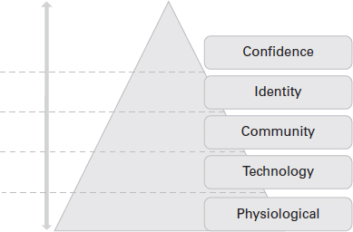

来玩个游戏。规则很简单：仔细阅读下面的列表并大声回答每个问题。每次你说“是”时，喝一口水。
你有没有：

1. 醒来不想动？
2. 结束了漫长的一周并连续睡了 12 个小时？
3. 在散步、播客或听有声读物时迷失了自己？
4. 感觉随时都会摔倒，起不来？
5. 被亲人包围，但仍然感到孤独？

赢得这场比赛没有奖品。所有五个项目都是我们许多人发现自己所处的真实场景的例子。这些真实情况会影响我们实现目标和继续前进的能力。这些经验将出现在企业生活以及企业家的生活中。我们有责任意识到它们何时可能发生，并寻求帮助。
我成为企业家的原因之一是企业界让我感到不适。 2019 年，我从事的日常工作与我的优势和目标不一致。到那年年底，我发现自己请了五周病假，两周的偏头痛变成了丛集性头痛和新发现的口吃。我的情绪和精神心理健康处于最低水平。我迷路了。我决定专注于做我自己的老板，因为它让我可以控制我的日历，调整工作方式以满足我的需求，每天醒来都想做我相信的事情。
然而，创业伴随着自己的心理健康挑战。当我在网上搜索鼓舞人心的创始人故事时，很多时候，每一次旅程看起来都很完美和迷人。当我开始与其他企业家交谈时，我了解到他们没有在主流媒体上分享的是关于在另一个公司工作的同时在您的业务上工作的讨论。从这些对话中，我估计在大多数情况下，普通创始人在成为主流之前至少会从事副业或副业至少 18 个月。我发现许多人都有类似的故事，他们在执行朝九晚五的工作时将自己的积蓄投入到他们的业务中（也称为自力更生），或者因过度工作而筋疲力尽而不得不继续保持外表。这是一个没有人为我们做好准备的创业领域，这可能意味着健康、可持续的企业与企业家精疲力竭后倒闭的企业之间的区别。
照顾好自己，学习把精力放在哪里，确保自己是最好的自己，这些都是创业的重要方面。在整个章节中，我们将听取几位领导人关于他们如何管理自己的心理健康和整体健康的意见。

## 什么是心理健康？
心理健康是我们的情绪、心理和社会福祉的结合。它会影响我们的思考、感受和行为方式。我们与健康的关系决定了我们如何处理自己以及如何管理压力。如果我们患有心理健康状况，可能是由于多种因素造成的，包括生物因素和/或家庭经历。
Mind 慈善机构 (2020) 进行的研究发现，在英国，四分之一的人有心理健康问题，六分之一的人在任何一周内都患有常见的心理健康问题。这些统计数据令人震惊，因为心理健康很少是大学和工作场所的首要议程。
心理健康状况不佳可以通过不同的方式表现出来，例如感觉倦怠、疲劳、内疚以及身心疲惫。我有过两次这样的经历。第一次证明我工作非常努力似乎是一种荣誉徽章。第二次，我意识到我第一次听起来是多么愚蠢，并承诺永远不会再让自己达到那种状态。倦怠仍然是一个敏感话题，因为许多员工、雇主和企业家不愿意承认他们经历过。无论哪种方式，倦怠是我们许多人都经历过的，但直到为时已晚才意识到。尽早进行这种对话很重要，这样我们就不会进入那个阶段。

### 有哪些早期预警信号？

在大多数情况下，症状很少在一夜之间突然发作。会有一些迹象需要注意，其中可能包括：

- 情绪变化——情绪的剧烈变化。
- 睡眠或食欲变化——个人护理和营养下降。
- 退出 - 对您以前喜欢的活动失去兴趣。
- 思考困难——注意力不集中、记忆力减退或精力不足，难以解释。
- 感觉与世隔绝——一种模糊的感觉或脱离现实的感觉。
- 冷漠——失去参与活动的欲望。
- 能量损失——明显疲倦、精力不足或类似的感觉。

虽然这不是各种迹象的详尽清单，但这些是一个很好的起点。当我经历压力的时候，我能感觉到身体在要求我停下来，我的大脑在暗示休息，但我的固执不允许我停下来。在这段不确定的时期，我们在伦敦设计并交付了我们的第一个虚拟现实活动。我花了几个小时才找到动力。我协调了我的衣服，穿着明亮的高跟鞋，涂上我最喜欢的口红来接我。我看起来很棒，但在内心深处，我感到压力很大，很担心，并处于崩溃的边缘。作为创始人，企业的代言人和个体企业家，这并不像请人代替我的位置那么容易。我们花了两个月的时间进行计划、协调和准备。现实情况是，有时我们出现是因为我们必须——而不是因为我们想要。在那些时刻，我们会想起我们在外面看起来有多“好”，这并不能反映内部。
心理健康是许多企业家共同的斗争。 Heights and the Secret Leaders 播客的联合创始人 Dan Murray-Serter 向我讲述了他作为一名企业家与心理健康的斗争。丹强调，心理健康问题也可以通过多种补救措施来解决，并解释说“在经历了几次倦怠和焦虑之后”，他需要“退后一步来照顾自己的健康”。他“正在经历抑郁、焦虑和失眠”。尽管医生嘱咐服用抗抑郁药，但丹查看了科学研究，发现在他的饮食中添加额外的营养素可能是一个好的开始。他分享说，“DHA omega-3、蓝莓提取物和 B 族维生素复合物”是第一个对他的健康产生影响的人——他在十天内从无法入睡到休息，一直睡到早上 7 点。丹建议“企业家应该记住你的大脑是你的事，因此它需要燃料才能继续运行。这种燃料包括健康的生活方式、营养、休息和休息日。”他强调休息的重要性，并且“从根本上说，如果你是你的生意，你不是一台机器”。

虽然这不是各种迹象的详尽清单，但这些是一个很好的起点。当我经历压力的时候，我能感觉到身体在要求我停下来，我的大脑在暗示休息，但我的固执不允许我停下来。在这段不确定的时期，我们在伦敦设计并交付了我们的第一个虚拟现实活动。我花了几个小时才找到动力。我协调了我的衣服，穿着明亮的高跟鞋，涂上我最喜欢的口红来接我。我看起来很棒，但在内心深处，我感到压力很大，很担心，并处于崩溃的边缘。作为创始人，企业的代言人和个体企业家，这并不像请人代替我的位置那么容易。我们花了两个月的时间进行计划、协调和准备。现实情况是，有时我们出现是因为我们必须——而不是因为我们想要。在那些时刻，我们会想起我们在外面看起来有多“好”，这并不能反映内部。
心理健康是许多企业家共同的斗争。 Heights and the Secret Leaders 播客的联合创始人 Dan Murray-Serter 向我讲述了他作为一名企业家与心理健康的斗争。丹强调，心理健康问题也可以通过多种补救措施来解决，并解释说“在经历了几次倦怠和焦虑之后”，他需要“退后一步来照顾自己的健康”。他“正在经历抑郁、焦虑和失眠”。尽管医生嘱咐服用抗抑郁药，但丹查看了科学研究，发现在他的饮食中添加额外的营养素可能是一个好的开始。他分享说，“DHA omega-3、蓝莓提取物和 B 族维生素复合物”是第一个对他的健康产生影响的人——他在十天内从无法入睡到休息，一直睡到早上 7 点。丹建议“企业家应该记住你的大脑是你的事，因此它需要燃料才能继续运行。这种燃料包括健康的生活方式、营养、休息和休息日。”他强调休息的重要性，并且“从根本上说，如果你是你的生意，你不是一台机器”。

### 为什么这次谈话很重要？

关于心理健康的对话很重要，因为一个人很容易挣扎，假设其他人做得很好，并相信你是唯一在挣扎的企业家。通常很容易看到风险投资融资和收购的消息，并假设其他人有一条简单的成功之路。然而，创业者正处于艰难的旅程中，没有成功的保证。许多人昼夜不停地工作，并在此过程中面临着一些挑战——员工流失、投资者和导师的拒绝，或者只是普通的工作压力。
杰西卡·布鲁德 (Jessica Bruder) 于 2013 年在 Inc. 杂志上发表的一篇文章表明，“企业家一直在默默地奋斗。有一种感觉，他们不能谈论它，这是一个弱点”，而在《福布斯》杂志（Bannon，2020 年）中，“从技术上讲，企业家患心理健康问题的可能性比普通人高 50%，并且患抑郁症的可能性增加一倍”。最后一句话让我大吃一惊。很高兴看到七年来围绕创业和心理健康的叙述正在发生变化，但很少有人谈论它，而且围绕它的指导仍然有限。

2020 年初，考虑到 Covid-19 大流行的后果，我意识到越来越多的人对创业感兴趣。一个原因可能是因为人们想要控制并拥有财务独立。另一个可能是对系统的不信任增加，因为一切都关闭了，并不是每个人都得到了帮助。为了支持想要开始创业之旅的人们，我于 2020 年 5 月开设了一个名为“战略性翼”的播客，在那里我采访并揭示了伟大领导者的真实故事——好的、坏的和丑陋的。我还希望表明，包括我在内的每个人都在战略性地支持它。
在一集中，MTArt机构创始人Marine Tanguy分享了她在20出头进入创业世界的经历。 Marine 从小就是艺术家的拥护者，21 岁时管理了她的第一家画廊，23 岁时在洛杉矶开设了她的第一家艺术画廊。 看到传统画廊模式的局限性后，Marine 于 2015 年推出了 MTArt Agency。MTArt 是全球第一家视觉艺术家人才经纪公司。她告诉我，她花了数年时间建立自己的资源和网络，并在事业腾飞之前克服了挑战。尽管她取得了成功，但MTArt Agency 的早年充满挑战，她发现自己在精神上非常困难，因为传统艺术部门对变革非常抗拒。在我们的谈话中，她分享说她每天都遭受欺凌和不公平竞争。在这段时间里，Marine 必须学会照顾自己的心理健康，她的建议包括用能激发你灵感的视觉效果围绕自己、与家人共度时光以及不要太认真对待社交媒体。
与此类似，《关于时代》杂志的创始人安吉丽卡·马林 (Angelica Malin) 讲述了她的创业历程，并解释说，有时创业是孤独和不舒服的。她在社交媒体上的大量关注和公众形象使她成为许多对话的中心，这可能会造成精神和情感上的压力。在播客上谈到这一点后，她分享了让自己保持脚踏实地的做法，她练习自我保健，从繁忙的日程中抽出时间与亲人共度时光，并尽量不担心犯错。
我鼓励任何遭受痛苦的人与专家联系，他们将能够了解他们的症状并帮助他们好转。如果您不确定从哪里开始，请与我联系，我将帮助回答任何疑问或为您与合适的人联系。我的电子邮件是 hello@sonyabarlow.co.uk。

## 工作文化
作为创始人，您的工作文化对您的成功和健康起着重要作用。在较小的层面上，它是您的办公桌空间、椅子和个人时间表。但这也是您为自己和团队创造的文化。我知道很多人会一大早就到办公室参加早餐会议，直到深夜才离开。我们在同一个办公室里谈了 12 个小时，在同一家公司，你每天只签约 7 到 9 个小时。我也曾为那些拥有虚假灵活工作文化的公司工作，这意味着他们在工作描述中引用了“灵活工作”，但实际上，选择在家工作或全天午休是不受欢迎的。正是通过这些例子，我很早就决定我想要创造的工作文化将是可访问的、包容的和健康的。
我为自己实施的工作文化包括关闭所有技术并停止所有与工作相关的对话，至少在一顿主餐中，每周至少休息半天，并将我的电话时间减少到每次通话 30 分钟。老实说，我也限制了我每个月周期的工作量，因为再加上我的慢性偏头痛，它可能令人难以忍受并且难以集中注意力。我将同样的精力投入到自己的事业中；我积极鼓励灵活工作，例如选择一周中可以工作的日子（只要任务在截止日期前完成），并提倡每月休息一天，作为心理健康或康复日。
在公司的全职工作中，有几天我每天要花四个小时从一个会议到另一个会议。大多数这些会议可以通过电话或在线会议室进行。当我质疑这些做法的逻辑时，它被证明是“我们一直做事的方式”。正如爱因斯坦的名言所说，“疯狂就是一遍又一遍地做同样的事情，却期待不同的结果”。拥有有毒的工作文化，专注于时间表而不是产出，然后期望健康和幸福的环境，是矛盾和不合理的。
作为创始人，您必须考虑要实施的工作文化。它对企业、团队的心理健康和整体生产力的好处是无法估量的。这种文化是你必须自己生活的东西，以证明它是可能的，然后再加入团队。你就是企业——你需要成为最好的自己，企业才能成为最好的自己。

## 与社交媒体建立健康的关系
你有没有上网一分钟，呆一个小时？
Netflix 纪录片《社会困境》（2020 年）向消费者介绍了社交平台的工作方式。他们分享说，每个平台都有一组心理学家，他们的主要目标是让你重新上网。脸颊！雇佣人故意让我们重新上线，鼓励我们滚动几个小时，结果却因所见所闻而心灰意冷。对于任何社交媒体用户来说，这都非常有意义。当您使用 Facebook、Twitter 或 Instagram 提要时弹出的通知，您在另一个标签中看到的衣服突然以促销和主题标签的形式出现，然后您可以关注它们，分享让您想阅读更多内容的内容。它令人上瘾，是营销人员和销售人员的梦想。
我曾经在一家洞察机构工作，为零售商制作和销售媒体广告，零售商通过在杂志上购买媒体空间、通过社交媒体推广他们的商品以及委托有影响力的人分享他们的经验来鼓励消费者购买他们的产品。因此，我从第一手经验中了解到了解您的客户及其习惯并分享相关内容以吸引他们回来的努力和精确度。 尽管知道交易技巧，但每当我回到网上时，我会沉浸在饲料中。圣诞节假期的一天，我决定删除我所有的社交渠道，找到了纯粹的幸福。原来，世界并没有结束。
社交媒体采用这种方式在简短的标题或图像中展示成功。当您已经度过了糟糕的一天时，滚动浏览这些内容并不有趣或令人鼓舞。我记得坐在那里将自己与平台上的其他人进行比较——熟人、朋友和社区成员。我会质疑为什么有人在帖子上获得的点赞数比我多，为什么品牌赞助别人而不是联系我，以及是什么让一项业务比另一项更具吸引力。我经常在社交媒体上出现阶段，当它们消耗我的生活或分散我享受这一刻的注意力时删除它们。但是，如果我说我一直都是这样或立即理解其影响，那我就是在撒谎。只有当我的朋友和家人过去对我不断滚动我们的午餐日期感到恼火时，我才知道我必须停下来。
Hersha Patel 是一位电视节目主持人、女演员、企业家和喜剧演员，她在伦敦和我一起喝咖啡，讨论她与心理健康的关系。她分享说，她通过素食主义、锻炼和专注于精神健康来滋养身心，找到了恢复健康的方法，并开始减少对事业和社交媒体的依赖来确定自己的自我价值。当她离开网络的那一刻，当喜剧演员兼 YouTube 用户 Nigel Ng 取笑她的视频时，她不知不觉地成为了全球羞辱的受害者。该视频风靡全球并迅速获得数百万次观看；她被无情地控制，感觉受到了攻击。她没有关闭她的帐户“这是我的第一直觉”，而是自己尝试改变叙述，并取得了巨大成功“我真的相信我设法将它从消极转变为积极，因为所有的精神我对自己所做的工作。我有工具来应对强烈的压力和焦虑，这是一种非常真实的在线角色暗杀和欺凌，可能会破坏我的心理健康。”为了迎合她的心理健康和幸福，赫莎建议“依靠坚持数字例程，在网上发布之前多天创建内容，而不用担心立即成功，因为成功的定义因人而异，你可能一夜之间不知不觉地走红。”她还分享了照顾你的思想，灵魂和身体，即使这意味着抽出时间远离一切，也是个人可以为自己和企业的未来做的最好的事情。

以下是我可以分享的四件事，它们对我有帮助：

- 管理您的日历——为不同的重点领域分配不同的日子。例如，星期一可以是行政，星期二是团队会议，星期五可以是财务。除此之外，对您的日历会议进行颜色编码，以确定哪些是高优先级的，即紧急的，哪些是低优先级的，也就是说，如果不满足这些要求，您的业务就不会崩溃。最后，每天预订 1 小时的午餐和 15 分钟的步行时间，以便您可以休息一下。
- 确定关键业务任务的优先级——在一天开始时列出所有任务，并按高、低和中优先级排序。在完成高优先级和中优先级任务之前，不要查看通知和社交媒体平台。
- 安排内容——这可以是在前一天晚上安排第二天出去的电子邮件，或者像我们在第 4 章中讨论的那样规划社交媒体内容。我发现自己忘记回复电子邮件，所以每隔一个星期天我就会花一个小时来浏览每周的会议、写回复和安排电子邮件，以便在周一早上第一件事就是出去。
- 不要比较——你必须提醒自己，网络世界不是现实，而是某人生活的快照。不要陷入与他人比较的陷阱，因为事实是，正如其他人不知道您每天要跨越的许多障碍一样，您也不知道他们的。我经常发现自己在媒体上滚动数小时进行比较和对比。一旦我有意识地看到自己这样做，我就会关掉手机，专注于我的工作。

没有人会回头问你是否在做这项工作并检查你是否还好。作为领导者，您必须确定什么时候出现问题，什么地方不起作用，并找到真正的解决方案。

## 处理孤独
在企业家面临的无数心理健康和健康相关问题中，孤独是我发现自己要处理的问题。根据由 Thomas J Saporito 于 2012 年领导的 CEO 快照调查，近 70% 的首次担任 CEO 的人感到孤独，61% 的人认为这会影响他们的绩效（Saporito，2012）。尽管数据本身已有几年历史，但这种情绪感觉很重要。无论您是组织的高层还是首次创业者，独自一人都很难。这是一个没有人为您准备的创业领域。感觉就像没有人理解你，没有人在那里倾听你的想法，你被在一天结束之前完成的任务压得喘不过气来。你的消极想法从很小的时候开始，就像种子一样，然后在你的脑海中成长为大植物。
孤独来自缺乏归属感，这是心理学家亚伯拉罕·马斯洛创造的一个术语。马斯洛的需求层次理论（1954 年）是最早分享的理论之一，即在一个人的自尊或自信成长之前，他们需要感受到爱和归属感（McLeod，2006 年）。一个人没有这种满足感的时间越长，他们就越渴望它。归属感是层次结构的第三个层次，在基本心理和安全需求之后引用。在这种情况下，它被定义为人际关系和感觉就像你是一个群体的一部分。
2019 年，考虑到数字时代和互联网带来的变化，我提出马斯洛的层次结构本身需要进行调整。一旦基本的心理需求得到满足，技术就会成为帮助人们找到社区并最终建立信心的推动力。我在图 8.1 中解释了这个模型。
2019 年，在我的第一个 TEDx 演讲“请上网”中，我分享了孤独是我创立 LMF 网络的原因之一。对我来说，孤独与缺乏目标和缺乏友谊有关。人们普遍认为，全球 90% 的人口都在寻求连通性（Gevelber，2013 年），我相信技术可以通过帮助我们访问新网络来支持我们。与此同时，我们必须反思我们的感受以及我们为什么想要与他人建立关系。孤独并不总是与人有关，而是与我们独处时与自己的关系有关。我有时无法忍受孤独，但一旦我找到了我的目标，情况就慢慢不再如此了。

一旦我能够克服最初在寻求帮助时感到羞耻的障碍，我发现自己不再感到孤独或不属于自己。 我已经接受了在困难时期我可以寻求帮助并依靠他人。 许多企业家都经历过同样的过程，因此有很多轶事可以分享。 企业家精神可以让您以许多其他角色所没有的方式依赖您的社区。
您今天可以做的一些事情来减轻孤独感，包括：
在线与其他企业家联系；
安排共同工作会议或虚拟咖啡会议；
冥想以控制你的消极想法；
允许自己哭泣或感受情绪；
说出来。
和任何事情一样，时间是一个很好的治疗师。 因此，请对自己和所走的旅程充满信心。

## 作为企业家如何处理你的心理健康问题

心理健康问题是真实存在的，现在是我们给予他们应有的关注的时候了。本章是关于改变围绕开放式心理健康讨论的叙述，以便您和您的团队能够成长。
以下是您可以应对心理（和一般）健康状况的十种方法：

1. 识别体征和症状。找到解决方案的第一步是确定您的体征和症状。列出您认为自己的感受，记录示例或此类情绪加剧的时间，并跟踪您的进度。
2. 网络以找到您的社区。为您的企业和您自己使用第 5 章中分享的网络工具和社区概念。通过搜索“企业家聚会”、在 LinkedIn 上分享帖子或加入我们的 Slack 频道来寻找您的人。
3. 改变你的工作文化。如上所述，您的风格和工作场所可能会导致您没有考虑到的心理健康状况。花点时间审核您的工作文化——它是否健康、高效和繁荣？如果没有，你知道该怎么做。
4. 找一个辅导小组。一个被低估的发展领域是指导。指导是两个或两个以上的人之间的关系，他们通过既定的目标分享知识、理解和支持彼此。小组是保密和安全地分享问题的好方法，每个成员都希望为解决问题做出贡献。
5. 为自己和所爱的人腾出时间。您的理智、自我保健和与亲人在一起的时间可以被视为您业务的“心理健康基础”。作为一名企业家，您可能会迷失在自己的世界中。为自己腾出时间，沉迷于与工作无关的活动，并在工作空间之外的环境中与亲人共度时光。
6. 锻炼或投资于更健康的日常生活。他们说“吃什么就吃什么”，因此通过投资包括水果和蔬菜的健康膳食计划，并花时间锻炼或冥想，您可以锻炼身体内的所有肌肉并培养它们，让您坚持更长时间.例如，研究表明蓝莓非常适合保持低血压，并有助于维持大脑功能（Harvard Health，2019 年）。一个重要的提示是，每次你的大脑徘徊时，走一点路，即使它在你的生活空间周围，让血液流动。
7. 限制您的数字设备和在线时间。互联网是信息和错误信息的门户。通过安排空闲时间来限制您的屏幕时间，使用 Calendly 等免费插件来管理您的日历，并在需要时从您的手机中删除社交应用程序。作为尝试过这些东西的人，我可以告诉你，这是对我提供最大支持的变化之一。
8. 反思你的目标和成功。有时，我认为我们的心理健康状况会恶化，因为我们已经失去了对重要的事情、我们的目标以及我们已经走了多远的关注。花点时间反思您的目标，记录您迄今为止取得的成就，并为自己的成就表扬自己。
9. 得到帮助。治疗有一个禁忌，尤其是在南亚和黑人社区。治疗并不是软弱的表现。如果可以，请通过治疗师、辅导员或免费帮助热线获得帮助，让自己摆脱这种问题状态。
10. 休息一下。有时，您只需要休息一下。停下来，预订假期，休假，享受成为企业家的灵活性。

心理健康问题没什么好害怕的。有时，这是一个很好的提醒，你有一颗心，也是人。我们越多的人开始这个对话，就越容易。您可能会想要放弃，并且需要休息——请假，放松一下，然后精神焕发地回来。一旦你克服了你的障碍，剩下的就变得容易了。

### 案例研究 Hussain Manawer
Hussain Manawer是英国诗人、表演者和制片人。他是一位著名的心理健康活动家，因其永恒的才能将耻辱踢和尖叫拖入光明中的能力赢得了评论界的赞誉。自从他最初开始创业以来，侯赛因失去了他的母亲，这使他的职业生涯从娱乐转向教育。 Hussain 的工作提高了人们对心理健康和社区的认识。他目前是著名的伦敦国王学院的荣誉院士，获得牛津布鲁克斯大学的荣誉博士学位，并于 2017 年创造了世界上最大的心理健康意识课程的吉尼斯世界纪录。
Hussain's House 于 2013 年推出。这项业务背后的目的是什么？
Hussain's House 是我将每个人聚集在一起并围绕我们传统上没有讨论的话题打开空间的方式。在伊尔福德长大，我没想到我可以与凯文哈特等电视名人见面或交谈，但我想尝试一下。除了与他谈论他的职业、娱乐和作为一个有色人种创意人之外，别无其他。最初的平台是 YouTube，因为它允许我上传视频内容，而且是免费的。
您是如何获得对话或客户的？
老实说，我列出了我想采访的人的名单，找到了他们的经纪人并向他们发送了电子邮件。这种方法看起来很老派，但冷呼叫和冷电子邮件对我有用。一开始我没想到这么大牌会回应，但同时我也没有什么可失去的。这一切都是为了让自己和您的愿景一展身手！
自从侯赛因之家，你已经进入了诗歌和心理健康领域，请你解释一下这个支点是如何形成的？
心理健康是我一直很认真的事情，尤其是因为它不是亚洲家庭的中心话题。不幸的是，我母亲几年前去世了，这震惊了我的系统。我感到失落和孤独。物质的东西并不重要，因为我意识到生命和家庭是多么宝贵。长话短说，我变得沮丧和不适。通过这次经历，我没有回避，而是开始记录我通过 Instagram 和 Twitter 等平台变得更好的旅程。通过这些内容，我能够产生新的认识并在主流媒体上曝光这些主题，这现在是我工作的基础。
自从开始将正念置于物质之上的旅程以来，您学到了什么？
我有意识地采取措施来保持自己的健康。这包括关注我的饮食、吃正确的营养、锻炼和让自己远离社交媒体。作为一个企业和品牌，很容易迷失在社交媒体的影响力中，感觉自己总是必须在线。实际上，如果您不在网上发帖，没有人会想念您，如果您感觉不好，您的业务也不会是最好的。
对于发现自己在在线和保持理智之间取得平衡的企业家，您有什么建议？
专注于你的原因——你的企业为什么存在，你的品牌为什么重要，你为什么做你正在做的事情？任何时候你有消极或糟糕的时刻，回到你的原因并提醒自己你的目的。从发展大量追随者和社会影响力的经验来看，人们对您的看法或看法与您无关——带领您的企业走向成功才是。总而言之，作为一名企业家，您的心理健康比什么都重要，因为如果没有您的精神健全和肌肉，您将一无所有。而那一无所有，是很寂寞的。

## 事后总结

心理健康和创业精神齐头并进。满负荷工作而不给电池充电对您的身体或业务都没有好处。 Hussain 概述了我们应该优先考虑自己，并始终回到我们的“为什么”。同样，Hersha 提到，在她精疲力竭之后，正是她的“为什么”让她继续前进并保持健康。根据我作为创始人的经验，对心理健康的讨论还不够多，但我们作为企业主可以控制我们的日历——这很强大。如果我们有能力确定优先级，那么是时候专注于我们的大脑 100% 为我们工作，而不是追逐无关紧要的事情。

> 练习
> 这个练习将帮助你优先考虑你的工作量和你的健康。
>
> 1. 对日历进行颜色编码，用不同的颜色标识优先会议和任务，并移动那些与您的业务优先事项不一致的项目。
> 2. 将自动外出消息添加到您的电子邮件中，链接到任何有用的资源并设置期望（或界限），以便有人可以期待回复。
> 3. 每天在日历中安排 15 分钟散步，远离所有技术和媒体。

